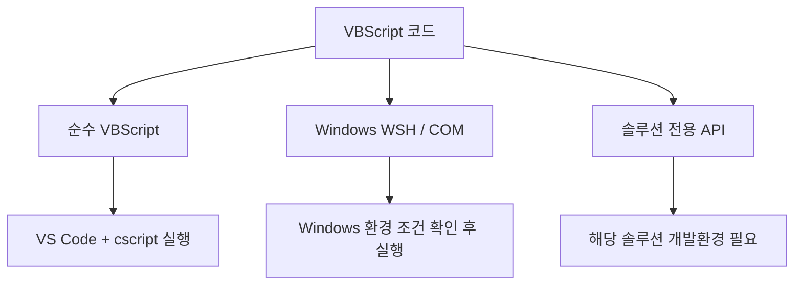

# 문제 해결 및 운영 기준

## 1. 목적

이 문서는 Windows 11 Pro + VS Code VBScript 실행 환경에서 자주 발생할 수 있는 문제와 확인 방법을 정리한다.

문제가 생기면 아래 순서로 범위를 좁힌다.

```text
Windows
  ↓
cscript.exe
  ↓
.vbs 단독 실행
  ↓
VS Code Terminal
  ↓
tasks.json
  ↓
현재 .vbs 코드
```

VS Code 설정부터 무작정 수정하지 말고 **어느 단계에서 문제가 발생하는지 먼저 확인**하는 것이 중요하다.

---

## 2. `cscript.exe`를 찾을 수 없는 경우

PowerShell에서 확인한다.

```powershell
Get-Command cscript.exe
```

또는:

```powershell
where.exe cscript.exe
```

일반적인 경로:

```text
C:\Windows\System32\cscript.exe
```

확인되지 않는다면 Windows의 VBScript/Windows Script Host 관련 기능 상태를 확인한다.

---

## 3. VBScript Engine 관련 오류

VBScript Script Engine을 사용할 수 없다는 유형의 오류가 발생하면 먼저 Capability 상태를 확인한다.

관리자 PowerShell:

```powershell
Get-WindowsCapability -Online |
    Where-Object { $_.Name -like "VBSCRIPT*" }
```

필요하면 Windows 설정에서:

```text
선택적 기능
```

을 검색하여 VBScript 상태를 확인한다.

DISM 사용이 필요한 경우:

```cmd
DISM /Online /Get-CapabilityInfo /CapabilityName:VBSCRIPT~~~~
```

설치:

```cmd
DISM /Online /Add-Capability /CapabilityName:VBSCRIPT~~~~
```

---

## 4. `Can not find script file` 오류

다음 유형의 메시지가 발생할 수 있다.

```text
Input Error: Can not find script file ...
```

확인 항목:

1. `.vbs` 파일을 저장했는가?
2. 실제 파일이 존재하는가?
3. 확장자가 `.vbs`가 맞는가?
4. 현재 실행 중인 파일이 맞는가?
5. 파일명이 `hello.vbs.txt`처럼 저장되지 않았는가?

Windows에서 파일 확장자를 표시하도록 설정하면 확인하기 쉽다.

---

## 5. `Ctrl + Shift + B`가 동작하지 않는 경우

폴더 구조를 확인한다.

```text
vbscript-lab
│
├─ .vscode
│   └─ tasks.json
│
└─ hello.vbs
```

특히 파일명이 정확해야 한다.

정상:

```text
tasks.json
```

잘못된 예:

```text
task.json
tasks.js
tasks.json.txt
```

그리고 VS Code에서 `.vbs` 파일만 단독으로 연 것이 아니라 프로젝트 폴더를 Workspace로 열었는지도 확인한다.

---

## 6. 다른 파일이 실행되는 경우

`tasks.json`의 `args`를 확인한다.

정상:

```json
"args": [
    "//nologo",
    "${file}"
]
```

다음처럼 특정 파일명을 고정하지 않는다.

```json
"args": [
    "//nologo",
    "hello.vbs"
]
```

`${file}`을 사용해야 **현재 활성화된 Editor 파일**이 실행된다.

---

## 7. 수정한 코드가 반영되지 않는 경우

먼저 저장 여부를 확인한다.

```text
Ctrl + S
```

실행 프로그램은 VS Code Editor의 아직 저장되지 않은 메모리 내용을 실행하는 것이 아니라 디스크에 저장된 파일을 실행한다.

따라서 기본 습관은 다음과 같이 잡는다.

```text
코드 수정
   ↓
Ctrl + S
   ↓
Ctrl + Shift + B
```

---

## 8. 상대 경로 파일 처리가 이상한 경우

`tasks.json`에 다음 설정이 있는지 확인한다.

```json
"options": {
    "cwd": "${fileDirname}"
}
```

이 설정은 실행 중인 `.vbs` 파일이 있는 폴더를 Current Working Directory로 사용한다.

특히 `FileSystemObject`를 사용해 상대 경로 파일을 읽거나 쓸 때 중요하다.

---

## 9. 한글 출력이 깨지는 경우

처음 환경 검증은 영문으로 수행한다.

```vbscript
WScript.Echo "Hello VBScript"
```

영문은 정상인데 한글만 깨진다면 실행 엔진 문제와 **파일 인코딩/콘솔 문자 인코딩 문제를 분리해서 확인**한다.

!!! tip "문제를 한 번에 여러 개 해결하지 않는다"
    환경 구성 초기에 한글 출력 문제까지 동시에 다루면 원인 파악이 어려워질 수 있다.

    먼저 영문 코드가 정상 실행되는지 확인한 후 인코딩 문제를 별도로 다룬다.

---

## 10. `WScript.Echo`와 `MsgBox` 차이

콘솔 결과 확인:

```vbscript
WScript.Echo "Hello"
```

팝업 확인:

```vbscript
MsgBox "Hello"
```

학습 중 Terminal에서 결과를 반복 확인하려면 `WScript.Echo` 사용을 권장한다.

---

## 11. `Option Explicit` 사용

학습 코드는 가능하면 다음 문장으로 시작한다.

```vbscript
Option Explicit
```

예:

```vbscript
Option Explicit

Dim userName
userName = "Kim"

WScript.Echo userName
```

`Option Explicit`을 사용하면 선언하지 않은 변수 사용을 빠르게 발견할 수 있다.

---

## 12. 보안 주의사항

VBScript는 단순한 문법 학습을 넘어 Windows 자원에 접근할 수 있다.

예:

```vbscript
CreateObject("Scripting.FileSystemObject")
```

```vbscript
CreateObject("WScript.Shell")
```

이러한 객체를 통해 파일 시스템, 프로그램 실행 등과 관련된 작업을 수행할 수 있다.

!!! warning "출처를 알 수 없는 `.vbs` 파일을 바로 실행하지 않는다"
    인터넷, 이메일, 메신저, 외부 저장소에서 받은 스크립트는 내용을 확인한 후 실행한다.

    학습 환경에서는 직접 작성한 코드 또는 내용이 명확히 검토된 코드 위주로 실행한다.

---

## 13. 어떤 코드를 이 환경에서 실행할 수 있는가

모든 VBScript 관련 코드를 `cscript.exe`에서 동일하게 실행할 수 있는 것은 아니다.

### 13.1 순수 VBScript

예:

```text
변수
If
Select Case
For
Do While
Function
Sub
Array
String
Date
```

실행:

```text
VS Code + cscript.exe
```

직접 검증 가능하다.

### 13.2 Windows Script Host / COM

예:

```vbscript
CreateObject("Scripting.FileSystemObject")
CreateObject("WScript.Shell")
CreateObject("Scripting.Dictionary")
```

Windows에서 해당 COM 객체를 사용할 수 있다면 테스트할 수 있다.

### 13.3 특정 제품 또는 솔루션 전용 코드

특정 화면 개발 솔루션이 제공하는:

- 전용 화면 객체
- 컴포넌트 API
- 화면 이벤트
- 데이터셋 객체
- 트랜잭션 API

등은 일반 `cscript.exe` 환경에서 실행되지 않을 수 있다.



---

## 14. 권장 문제 해결 순서

실행 오류가 발생하면 다음 순서로 확인한다.

### STEP 1. `cscript.exe`

```powershell
cscript.exe //?
```

### STEP 2. 가장 단순한 파일

```vbscript
WScript.Echo "Hello"
```

직접 실행:

```powershell
cscript.exe //nologo .\hello.vbs
```

### STEP 3. VS Code Terminal

```powershell
cscript.exe //nologo .\hello.vbs
```

### STEP 4. VS Code Task

```text
Ctrl + Shift + B
```

### STEP 5. 실제 학습 코드

기본 환경이 정상임을 확인한 후 실제 코드의 문법 및 로직 오류를 확인한다.

---

## 15. 최종 환경 점검 체크리스트

- [ ] Windows 11 버전을 확인했다.
- [ ] `Get-Command cscript.exe`가 정상 동작한다.
- [ ] `cscript.exe //?`가 정상 동작한다.
- [ ] VBScript 선택적 기능 상태를 확인했다.
- [ ] PowerShell에서 `hello.vbs` 직접 실행에 성공했다.
- [ ] VS Code에서 `vbscript-lab` 폴더를 열었다.
- [ ] VS Code Terminal에서 `hello.vbs` 실행에 성공했다.
- [ ] `.vscode/tasks.json`을 생성했다.
- [ ] `${file}` 설정을 사용하고 있다.
- [ ] `${fileDirname}`을 작업 디렉터리로 사용한다.
- [ ] `Ctrl + Shift + B`로 현재 파일 실행에 성공했다.
- [ ] `hello.vbs`와 `loop_test.vbs`가 각각 정상 실행된다.
- [ ] 코드를 수정한 후 `Ctrl + S`로 저장하고 실행한다.

모든 항목이 완료되었다면 **VS Code에서 VBScript 학습 코드를 직접 실행하고 검증할 수 있는 기본 환경 구성이 완료된 것**이다.

---

## 16. 관련 문서

- [VBScript 실행 환경 구성 가이드](vbscript_execution_environment.md)
- [Windows VBScript 실행 기능 확인](windows_vbscript_runtime_setup.md)
- [VS Code 작업 환경 구성](vscode_workspace_setup.md)
- [VS Code 실행 Task 구성](vscode_task_setup.md)
- [스크립트 실행 및 검증](vbscript_run_verification.md)
