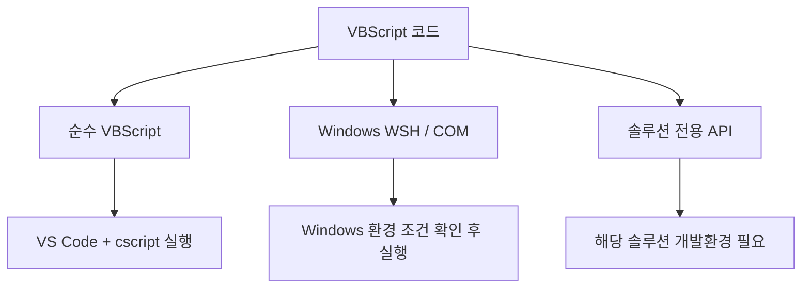

# 문제 해결 및 운영 기준

## 1. 목적

이 문서는 Windows 11 Pro + VS Code VBScript 실행 환경에서 자주 발생할 수 있는 문제와 확인 방법을 정리한다.

문제가 생기면 아래 순서로 범위를 좁힌다.

```text
Windows
  ↓
VBScript Feature 상태
  ↓
cscript.exe
  ↓
.vbs 직접 실행
  ↓
VS Code Terminal
  ↓
Workspace / .vscode/tasks.json
  ↓
현재 .vbs 코드
```

!!! tip "문제 해결 원칙"
    VS Code 설정부터 무작정 수정하지 않는다.

    **어느 단계까지 정상이고 어느 단계부터 실패하는지** 확인하면 원인을 훨씬 빠르게 찾을 수 있다.

---

## 2. `cscript.exe`를 찾을 수 없는 경우

PowerShell 또는 VS Code Terminal에서 확인한다.

```powershell
Get-Command cscript.exe
```

또는:

```powershell
where.exe cscript.exe
```

일반적인 경로:

```text
C:\Windows\System32\cscript.exe
```

실행 자체도 확인한다.

```powershell
cscript.exe //?
```

확인되지 않는다면 Windows의 VBScript 기능 상태를 확인한다.

---

## 3. `Get-WindowsCapability` 권한 상승 오류

일반 권한 PowerShell에서 다음 명령을 실행하면:

```powershell
Get-WindowsCapability -Online |
    Where-Object { $_.Name -like "VBSCRIPT*" }
```

다음 오류가 발생할 수 있다.

```text
Get-WindowsCapability : 요청한 작업을 수행하려면 권한 상승이 필요합니다.
```

이는 명령 자체의 오류가 아니라 관리자 권한이 필요한 명령을 일반 권한으로 실행했기 때문이다.

VS Code를 일반 권한으로 유지하면서 해당 명령만 관리자 권한으로 실행하려면:

```powershell
sudo powershell.exe -NoProfile -Command "Get-WindowsCapability -Online | Where-Object { `$_.Name -like 'VBSCRIPT*' }"
```

정상 결과 예:

```text
Name  : VBSCRIPT~~~~
State : Installed
```

---

## 4. Windows Sudo가 비활성화되어 있는 경우

다음 메시지가 표시될 수 있다.

```text
Sudo가 이 컴퓨터에서 사용하지 않도록 설정되어 있습니다.
```

Windows 설정에서 Sudo를 활성화한다.

```text
설정
  ↓
시스템
  ↓
고급
  ↓
Enable sudo
```

!!! warning "회사 PC"
    조직의 보안 정책으로 Sudo가 비활성화되어 있다면 정책을 우회하지 않는다.

    이 경우 관리자 권한 PowerShell 사용 등 허용된 방법을 따른다.

---

## 5. Sudo 실행 창이 바로 닫히는 경우

`sudo` 실행 시 별도의 관리자 PowerShell 창이 열렸다가 명령 실행 직후 닫힐 수 있다.

Sudo가 `forceNewWindow` 모드로 설정되어 있을 가능성이 높다.

VS Code Terminal 안에서 결과를 확인하려면 `normal` 모드를 사용할 수 있다.

```powershell
sudo config --enable normal
```

!!! warning "`normal` 모드"
    현재 콘솔과 관리자 프로세스의 입출력을 연결하는 방식이므로 보안 정책이 적용된 환경에서는 조직 기준을 우선한다.

---

## 6. `-like` 또는 `VBSCRIPT*` ParserError가 발생하는 경우

다음 형태의 오류가 발생할 수 있다.

```text
'-like' 연산자 뒤에 값 식을 제공해야 합니다.
```

또는:

```text
식 또는 문에서 예기치 않은 'VBSCRIPT*' 토큰입니다.
```

PowerShell 안에서 다시 PowerShell을 실행하면서 따옴표나 `$_`가 바깥쪽 PowerShell에서 먼저 해석된 경우다.

다음 명령을 그대로 사용한다.

```powershell
sudo powershell.exe -NoProfile -Command "Get-WindowsCapability -Online | Where-Object { `$_.Name -like 'VBSCRIPT*' }"
```

핵심:

```powershell
`$_.Name
```

`$` 앞의 백틱(``)은 바깥쪽 PowerShell이 `$_`를 먼저 해석하지 않도록 한다.

패턴 문자열:

```powershell
'VBSCRIPT*'
```

은 작은따옴표로 전달한다.

---

## 7. VBScript Feature가 설치되지 않은 경우

다음 명령으로 상태를 확인한다.

```powershell
sudo powershell.exe -NoProfile -Command "Get-WindowsCapability -Online | Where-Object { `$_.Name -like 'VBSCRIPT*' }"
```

정상 설치 상태:

```text
Name  : VBSCRIPT~~~~
State : Installed
```

`Installed`가 아니라면 Windows 설정에서 다음을 검색한다.

```text
선택적 기능
```

또는:

```text
Optional features
```

목록에서 `VBScript`를 찾아 설치한 후 다시 상태를 확인한다.

!!! note "설치 방법"
    본 가이드에서는 VBScript 상태 확인은 `Get-WindowsCapability`, 설치는 Windows의 **선택적 기능 화면**을 기준으로 한다.

---

## 8. `Can not find script file` 오류

예:

```text
Input Error: Can not find script file ...
```

확인 항목:

1. `.vbs` 파일을 저장했는가?
2. 실제 파일이 존재하는가?
3. 확장자가 `.vbs`가 맞는가?
4. 경로가 올바른가?
5. 파일명이 `hello.vbs.txt`처럼 저장되지 않았는가?

예:

```text
C:\projects\vbscript-doc\labs\hello.vbs
```

Windows에서 파일 확장자를 표시하도록 설정하면 확인하기 쉽다.

---

## 9. `No build task to run found`가 표시되는 경우

`Ctrl + Shift + B`를 눌렀을 때 다음 메시지가 나올 수 있다.

```text
No build task to run found.
Configure Build Task...
```

이 오류는 현재 Workspace에서 VS Code가 **기본 Build Task를 찾지 못했다는 의미**다.

정상 구조:

```text
C:\projects\vbscript-doc
│
├─ .vscode
│   └─ tasks.json
│
└─ labs
    └─ hello.vbs
```

확인 항목:

- `C:\projects\vbscript-doc` 자체를 VS Code에서 열었는가?
- `.vscode`가 프로젝트 루트 바로 아래에 있는가?
- 파일명이 정확히 `tasks.json`인가?
- `tasks.json`을 저장했는가?
- 다음 설정이 있는가?

```json
"group": {
    "kind": "build",
    "isDefault": true
}
```

!!! tip "Workspace 루트가 중요"
    `labs` 폴더만 VS Code에서 열었다면 VS Code는 다음 위치를 Task 설정 위치로 판단한다.

    ```text
    C:\projects\vbscript-doc\labs\.vscode\tasks.json
    ```

    본 프로젝트에서는 다음 위치를 사용하므로:

    ```text
    C:\projects\vbscript-doc\.vscode\tasks.json
    ```

    프로젝트 루트 전체를 Workspace로 연다.

---

## 10. `Ctrl + Shift + B`는 동작하지만 다른 Task가 실행되는 경우

`tasks.json`에서 기본 Build Task 설정을 확인한다.

```json
"group": {
    "kind": "build",
    "isDefault": true
}
```

`isDefault: true`로 지정된 Task가 `Ctrl + Shift + B`의 실행 대상이다.

!!! note "Build와 Run의 차이"
    `Ctrl + Shift + B`는 공통 Run 단축키가 아니라 **기본 Build Task 실행 단축키**다.

    본 프로젝트에서는 VBScript 실행 Task를 기본 Build Task로 등록했기 때문에 현재 `.vbs` 파일 실행에 사용한다.

---

## 11. 현재 파일이 아닌 다른 파일이 실행되는 경우

`tasks.json`의 `args`를 확인한다.

정상:

```json
"args": [
    "//nologo",
    "${file}"
]
```

다음처럼 파일명을 고정하면 안 된다.

```json
"args": [
    "//nologo",
    "hello.vbs"
]
```

`${file}`을 사용해야 **현재 활성화된 Editor 파일**이 실행된다.

---

## 12. 수정한 코드가 실행 결과에 반영되지 않는 경우

먼저 저장 여부를 확인한다.

```text
Ctrl + S
```

`cscript.exe`는 VS Code Editor의 아직 저장되지 않은 메모리 내용을 실행하는 것이 아니라 **디스크에 저장된 `.vbs` 파일**을 실행한다.

기본 습관:

```text
코드 수정
   ↓
Ctrl + S
   ↓
Ctrl + Shift + B
```

---

## 13. 상대 경로 파일 처리가 이상한 경우

`tasks.json`에 다음 설정이 있는지 확인한다.

```json
"options": {
    "cwd": "${fileDirname}"
}
```

이 설정은 현재 실행 중인 `.vbs` 파일이 있는 폴더를 Current Working Directory로 사용한다.

특히 `FileSystemObject`를 이용하여 상대 경로 파일을 읽거나 쓸 때 중요하다.

---

## 14. 한글 출력이 깨지는 경우

처음 환경 검증은 영문 문자열로 수행한다.

```vbscript
WScript.Echo "Hello VBScript"
```

영문 출력은 정상인데 한글만 깨진다면 실행 엔진 문제와 **파일 인코딩 또는 콘솔 문자 인코딩 문제를 분리해서 확인**한다.

!!! tip "문제를 하나씩 분리"
    먼저 영문 코드가 정상적으로 실행되는지 확인한다.

    실행 환경이 정상임을 확인한 후 한글 인코딩 문제를 별도로 다루는 것이 좋다.

---

## 15. `Option Explicit` 관련 오류

학습 코드에서는 가급적 다음 문장으로 시작한다.

```vbscript
Option Explicit
```

정상:

```vbscript
Option Explicit

Dim userName
userName = "Kim"

WScript.Echo userName
```

다음처럼 선언하지 않은 변수를 사용하면:

```vbscript
Option Explicit

Dim userName
userName = "Kim"

userNmae = "Lee"
```

오류가 발생한다.

```text
Microsoft VBScript runtime error
Variable is undefined: 'userNmae'
```

이 오류는 `Option Explicit`가 변수명 오타나 선언 누락을 정상적으로 잡아낸 결과다.

!!! tip "`Option Explicit`를 제거해서 해결하지 않는다"
    단순히 오류를 없애기 위해 `Option Explicit`를 삭제하기보다 변수 선언과 변수명을 올바르게 수정한다.

---

## 16. `WScript.Echo`와 `MsgBox` 차이

Terminal 결과 확인:

```vbscript
WScript.Echo "Hello"
```

Windows 팝업:

```vbscript
MsgBox "Hello"
```

학습 중 Terminal에서 결과를 반복 확인하려면 `WScript.Echo`를 권장한다.

---

## 17. 보안 주의사항

VBScript는 파일 시스템, 프로그램 실행, COM 객체 등 Windows 자원에 접근할 수 있다.

예:

```vbscript
CreateObject("Scripting.FileSystemObject")
```

```vbscript
CreateObject("WScript.Shell")
```

!!! warning "출처를 알 수 없는 `.vbs` 파일을 바로 실행하지 않는다"
    인터넷, 이메일, 메신저 또는 외부 저장소에서 받은 VBScript는 내용을 확인한 후 실행한다.

    학습 환경에서는 직접 작성한 코드 또는 내용이 명확하게 검토된 코드 위주로 실행한다.

---

## 18. 어떤 코드를 이 환경에서 실행할 수 있는가

모든 VBScript 관련 코드를 `cscript.exe`에서 동일하게 실행할 수 있는 것은 아니다.

### 18.1 순수 VBScript

예:

```text
변수
If
Select Case
For
Do While
Function
Sub
Array
String
Date
```

실행 환경:

```text
VS Code + cscript.exe
```

직접 검증 가능하다.

### 18.2 Windows Script Host / COM

예:

```vbscript
CreateObject("Scripting.FileSystemObject")
CreateObject("WScript.Shell")
CreateObject("Scripting.Dictionary")
```

해당 COM 객체를 Windows에서 사용할 수 있다면 테스트할 수 있다.

### 18.3 특정 제품 또는 솔루션 전용 코드

특정 화면 개발 솔루션에서 제공하는:

- 전용 화면 객체
- 컴포넌트 API
- 화면 이벤트
- 데이터셋 객체
- 트랜잭션 API

등은 일반 `cscript.exe` 환경에서 실행되지 않을 수 있다.



---

## 19. 권장 문제 해결 순서

### STEP 1. Windows 실행 프로그램 확인

```powershell
Get-Command cscript.exe
cscript.exe //?
```

### STEP 2. VBScript Feature 상태 확인

```powershell
sudo powershell.exe -NoProfile -Command "Get-WindowsCapability -Online | Where-Object { `$_.Name -like 'VBSCRIPT*' }"
```

### STEP 3. 가장 단순한 파일 직접 실행

```vbscript
WScript.Echo "Hello"
```

```powershell
cscript.exe //nologo .\labs\hello.vbs
```

### STEP 4. VS Code Terminal 확인

동일한 명령이 VS Code Integrated Terminal에서도 정상인지 확인한다.

### STEP 5. VS Code Task 확인

```text
Ctrl + Shift + B
```

### STEP 6. 실제 학습 코드 확인

기본 환경이 정상임을 확인한 후 실제 코드의 문법과 로직 오류를 확인한다.

---

## 20. 최종 점검 체크리스트

- [ ] Windows 11 버전을 확인했다.
- [ ] `Get-Command cscript.exe`가 정상 동작한다.
- [ ] `cscript.exe //?`가 정상 동작한다.
- [ ] VBScript Feature 상태가 `Installed`임을 확인했다.
- [ ] 관리자 명령이 필요한 경우 `sudo` 사용 방법을 확인했다.
- [ ] PowerShell 중첩 명령의 `` `$_.Name `` 형태를 이해했다.
- [ ] `labs/hello.vbs` 직접 실행에 성공했다.
- [ ] VS Code에서 프로젝트 루트를 Workspace로 열었다.
- [ ] VS Code Terminal에서 `hello.vbs` 실행에 성공했다.
- [ ] `.vscode/tasks.json`을 프로젝트 루트에 생성했다.
- [ ] `${file}` 설정을 사용한다.
- [ ] `${fileDirname}`을 작업 디렉터리로 사용한다.
- [ ] `Ctrl + Shift + B`로 현재 파일 실행에 성공했다.
- [ ] `Option Explicit`를 기본적으로 사용한다.
- [ ] 코드를 수정한 후 `Ctrl + S`로 저장하고 실행한다.

---

## 21. 관련 문서

!!! tip "실행 환경 전체 안내"
    **[VBScript 실행 환경 구성 가이드](vbscript_execution_environment.md)**

!!! tip "Windows 실행 기능"
    **[Windows VBScript 실행 기능 확인](windows_vbscript_runtime_setup.md)**

!!! tip "VS Code 작업 환경"
    **[VS Code 작업 환경 구성](vscode_workspace_setup.md)**

!!! tip "VS Code Task"
    **[VS Code 실행 Task 구성](vscode_task_setup.md)**

!!! tip "실행 검증"
    **[스크립트 실행 및 검증](vbscript_run_verification.md)**
