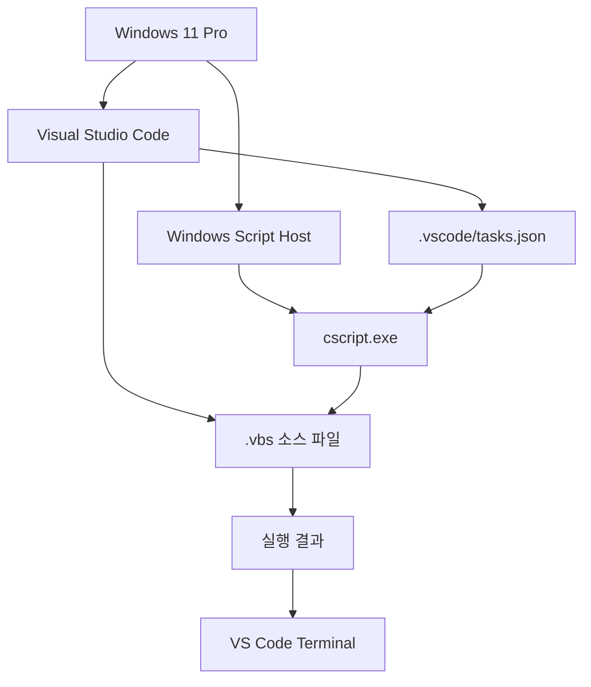

# VBScript 실행 환경 구성 가이드

## 1. 문서 목적

이 문서는 **Windows 11 Pro + Visual Studio Code 환경에서 VBScript(`.vbs`) 코드를 직접 작성하고 실행하기 위한 전체 구성 절차**를 안내한다.

실행 환경은 하나의 긴 문서로 관리하기보다 역할별로 분리하여 구성한다.


처음 환경을 구성하는 경우 위 순서대로 진행한다.

---

## 2. 전체 실행 구조

VBScript는 Java처럼 별도의 컴파일 과정을 거치는 구조가 아니다.

Windows에서 제공하는 **Windows Script Host(WSH)** 가 `.vbs` 파일을 실행하며, 본 학습 환경에서는 콘솔 기반 실행 프로그램인 `cscript.exe`를 사용한다.



실제 사용 흐름은 다음과 같다.

```text
VS Code에서 .vbs 파일 열기
        ↓
코드 작성 또는 수정
        ↓
Ctrl + S
        ↓
Ctrl + Shift + B
        ↓
tasks.json에 등록한 Task 실행
        ↓
cscript.exe가 현재 .vbs 파일 실행
        ↓
VS Code Terminal에서 결과 확인
```

!!! note "`Ctrl + Shift + B`의 의미"
    `Ctrl + Shift + B`는 VS Code의 공통적인 **프로그램 실행 단축키**가 아니다.

    이 단축키는 VS Code의 **기본 Build Task(Default Build Task)** 를 실행한다.

    본 VBScript 학습 환경에서는 별도의 빌드 과정이 없는 VBScript를 편리하게 실행하기 위해,  
    `cscript.exe`를 호출하는 Task를 **기본 Build Task로 등록하여 실행 단축키처럼 사용**한다.

---

## 3. 기준 환경

| 구분 | 기준 |
|---|---|
| 운영체제 | Windows 11 Pro |
| 편집기 | Visual Studio Code |
| 스크립트 언어 | VBScript |
| 파일 확장자 | `.vbs` |
| 실행 환경 | Windows Script Host |
| 기본 실행 프로그램 | `cscript.exe` |
| 결과 확인 | VS Code Integrated Terminal |
| Task 설정 | `.vscode/tasks.json` |
| Task 실행 | `Ctrl + Shift + B` |
| 실습 코드 | `labs/` |

!!! note "VBScript 전용 IDE는 필요하지 않다"
    VBScript 실행 자체를 위해 별도의 컴파일러, JDK 또는 Python 런타임을 설치할 필요는 없다.

    Windows Script Host가 실행을 담당하고, VS Code는 **코드 편집, Terminal 사용, Task 실행 환경**으로 사용한다.

---

## 4. 전체 문서 구성

### 4.1 Windows VBScript 실행 기능 확인

Windows 자체에서 VBScript를 실행할 수 있는지 먼저 확인한다.

주요 확인 항목:

- Windows 11 버전
- Windows Script Host
- `cscript.exe`
- `wscript.exe`
- VBScript Feature on Demand 상태
- `Get-WindowsCapability` 관리자 권한
- Windows Sudo 활성화 및 실행 모드
- `State : Installed` 확인
- `.vbs` 파일 직접 실행

!!! tip "1단계 가이드"
    Windows에서 VBScript 실행 기능이 정상인지 먼저 확인한다.

    특히 최신 Windows에서는 VBScript Feature on Demand 상태를 확인하고, 필요한 관리자 명령만 `sudo`로 실행하는 방법을 함께 확인한다.

    **[Windows VBScript 실행 기능 확인](windows_vbscript_runtime_setup.md)**

---

### 4.2 VS Code 작업 환경 구성

Windows 차원의 VBScript 실행이 정상임을 확인한 후 VS Code 작업 환경을 구성한다.

주요 내용:

- VS Code의 역할
- 프로젝트 폴더를 Workspace로 열기
- `labs/` 실습 폴더
- Integrated Terminal
- VS Code Terminal에서 `cscript.exe` 실행
- VBScript Extension 사용 기준

!!! tip "2단계 가이드"
    Windows에서 `cscript.exe`를 이용한 VBScript 직접 실행이 완료되었다면 VS Code 작업 환경을 구성한다.

    **[VS Code 작업 환경 구성](vscode_workspace_setup.md)**

---

### 4.3 VS Code 실행 Task 구성

매번 Terminal에서 `cscript.exe` 명령을 입력하지 않고 현재 `.vbs` 파일을 Task로 실행하도록 구성한다.

주요 내용:

- `.vscode/tasks.json`
- `${file}`
- `${fileDirname}`
- `cscript.exe`
- Build Task 그룹
- `isDefault: true`
- `Ctrl + Shift + B`
- `No build task to run found` 발생 원인

!!! tip "3단계 가이드"
    VS Code Terminal에서 `.vbs` 파일을 직접 실행하는 것까지 확인했다면 반복 실행을 위한 Task를 구성한다.

    **[VS Code 실행 Task 구성](vscode_task_setup.md)**

---

### 4.4 스크립트 실행 및 검증

Task 구성이 끝나면 실제 예제 파일을 만들어 실행을 검증한다.

주요 내용:

- `hello.vbs`
- `loop_test.vbs`
- 현재 활성화된 파일 실행
- `WScript.Echo`
- `MsgBox`
- `Option Explicit`
- 오류 메시지 확인
- 반복적인 학습 실행 흐름

!!! tip "4단계 가이드"
    `.vscode/tasks.json` 구성이 완료되었다면 여러 VBScript 예제를 실행하여 Task와 실행 결과가 정상인지 검증한다.

    **[스크립트 실행 및 검증](vbscript_run_verification.md)**

---

### 4.5 문제 해결 및 운영 기준

환경 구성 또는 실행 과정에서 문제가 발생하면 증상별로 원인을 확인한다.

주요 내용:

- `cscript.exe` 확인
- VBScript Feature 상태
- 관리자 권한 및 Sudo
- PowerShell 중첩 명령의 따옴표/`$_` 처리
- `No build task to run found`
- `.vscode/tasks.json` 위치
- 현재 파일이 아닌 다른 파일 실행
- 저장되지 않은 코드
- 상대 경로
- 한글 인코딩
- `Option Explicit`
- 실행 가능한 코드 범위

!!! tip "문제 발생 시 참고"
    오류가 발생한 경우 Windows → `cscript.exe` → VS Code Terminal → `tasks.json` → 실제 `.vbs` 코드 순서로 범위를 좁혀 확인한다.

    **[문제 해결 및 운영 기준](troubleshooting_guidelines.md)**

---

## 5. 권장 프로젝트 구조

현재 문서 리포지토리에서 학습 코드를 함께 관리한다면 다음과 같은 구조를 권장한다.

```text
C:\projects\vbscript-doc
│
├─ .vscode
│   └─ tasks.json
│
├─ docs
│   └─ 01_env
│       ├─ vbscript_execution_environment.md
│       ├─ windows_vbscript_runtime_setup.md
│       ├─ vscode_workspace_setup.md
│       ├─ vscode_task_setup.md
│       ├─ vbscript_run_verification.md
│       └─ troubleshooting_guidelines.md
│
├─ labs
│   ├─ hello.vbs
│   └─ loop_test.vbs
│
├─ .gitignore
└─ mkdocs.yml
```

!!! note "`.vscode/tasks.json`은 Git에 포함"
    `.vscode/tasks.json`은 프로젝트의 VBScript 실행 방법을 공유하는 설정이므로 Git에서 관리하는 것을 권장한다.

    반면 MkDocs가 생성하는 `site/`와 Python 가상환경 `.venv/`는 일반적으로 `.gitignore`에 포함한다.

---

## 6. 진행 원칙

처음 구성할 때는 다음 순서를 지킨다.

```text
1. Windows에서 cscript.exe 확인
        ↓
2. VBScript Feature 상태 확인
        ↓
3. 가장 단순한 .vbs 직접 실행
        ↓
4. VS Code Terminal에서 동일 파일 실행
        ↓
5. .vscode/tasks.json 구성
        ↓
6. Ctrl + Shift + B 실행
        ↓
7. 여러 예제 파일 검증
```

!!! warning "Task부터 먼저 구성하지 않는다"
    Windows에서 `cscript.exe`와 `.vbs` 직접 실행이 정상인지 먼저 확인한 후 VS Code Task를 구성한다.

    이렇게 해야 문제가 발생했을 때 **Windows 실행 환경 문제인지, VS Code 설정 문제인지, VBScript 코드 문제인지** 빠르게 구분할 수 있다.
