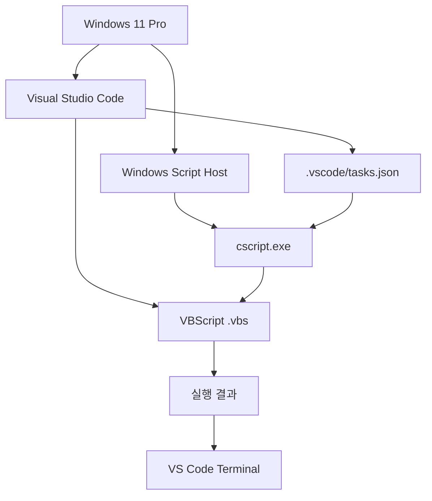

# VBScript 실행 환경 구성 가이드

## 1. 문서 목적

이 문서는 **Windows 11 Pro + Visual Studio Code 환경에서 VBScript(`.vbs`) 코드를 직접 작성하고 실행하기 위한 전체 구성 절차**를 안내한다.

기존의 하나로 긴 문서를 다음과 같이 역할별로 분리하였다.


각 문서는 독립적으로 확인할 수 있지만, 처음 환경을 구성한다면 아래 순서대로 진행하는 것을 권장한다.

---

## 2. 전체 문서 구성

### 2.1 Windows VBScript 실행 기능 확인

먼저 Windows 자체에서 VBScript를 실행할 수 있는지 확인한다.

확인 항목:

- Windows 11 버전
- `cscript.exe`
- `wscript.exe`
- Windows Script Host
- VBScript Feature on Demand 상태
- PowerShell에서 `.vbs` 파일 직접 실행

!!! tip "가이드 진행"
    Windows 11에서 VBScript 실행 기능이 정상적으로 동작하는지 먼저 확인해야 한다.

    위의 내용을 확인한 후 아래 링크의 가이드를 진행한다.

    **[Windows VBScript 실행 기능 확인](windows_vbscript_runtime_setup.md)**

---

### 2.2 VS Code 작업 환경 구성

Windows에서 VBScript 실행이 정상임을 확인한 후 VS Code 작업환경을 구성한다.

확인 항목:

- VS Code 설치 상태
- VBScript 학습 폴더 생성
- VS Code에서 폴더 열기
- Integrated Terminal 실행
- VS Code Terminal에서 `cscript.exe` 실행
- VS Code Extension 사용 기준

!!! tip "가이드 진행"
    Windows에서 `cscript.exe`를 이용한 VBScript 직접 실행이 정상적으로 완료되었다면 VS Code 작업환경을 구성한다.

    위의 설정을 완료한 경우 아래 링크의 다음 가이드를 진행한다.

    **[VS Code 작업 환경 구성](vscode_workspace_setup.md)**

---

### 2.3 VS Code 실행 Task 구성

매번 Terminal에서 명령어를 입력하지 않고 다음 단축키로 현재 `.vbs` 파일을 실행하도록 설정한다.

```text
Ctrl + Shift + B
```

구성 항목:

- `.vscode` 폴더
- `tasks.json`
- `${file}`
- `${fileDirname}`
- `cscript.exe`
- 기본 Build Task 지정

!!! tip "가이드 진행"
    VS Code에서 `cscript.exe`를 이용하여 `.vbs` 파일을 직접 실행하는 것까지 확인했다면, 반복 실행을 편리하게 하기 위한 VS Code Task를 구성한다.

    위의 설정을 완료한 경우 아래 링크의 다음 가이드를 진행한다.

    **[VS Code 실행 Task 구성](vscode_task_setup.md)**

---

### 2.4 스크립트 실행 및 검증

Task 구성이 완료되면 여러 `.vbs` 파일을 만들어 실제 실행을 검증한다.

검증 항목:

- `hello.vbs`
- `loop_test.vbs`
- 현재 활성화된 파일 실행 확인
- `WScript.Echo`
- `MsgBox`
- 반복적인 학습 실행 흐름

!!! tip "가이드 진행"
    `.vscode/tasks.json` 구성이 완료되었다면 실제 VBScript 예제를 실행하여 현재 파일 실행과 Terminal 출력이 정상적으로 동작하는지 검증한다.

    위의 설정을 완료한 경우 아래 링크의 다음 가이드를 진행한다.

    **[스크립트 실행 및 검증](vbscript_run_verification.md)**

---

### 2.5 문제 해결 및 운영 기준

실행 중 문제가 발생했을 때 확인할 내용을 정리한다.

주요 내용:

- `cscript.exe`를 찾을 수 없는 경우
- VBScript Engine 오류
- Script File을 찾을 수 없는 경우
- `tasks.json` 인식 문제
- 수정 내용이 반영되지 않는 경우
- 한글 인코딩 문제
- 보안 주의사항
- 순수 VBScript / WSH / 솔루션 전용 코드 구분
- 최종 점검 체크리스트

!!! tip "문제 발생 시 참고"
    환경 구성 또는 스크립트 실행 중 오류가 발생하거나, 정상적으로 실행되지 않는 경우에는 아래 가이드에서 단계별 확인 방법을 참고한다.

    **[문제 해결 및 운영 기준](troubleshooting_guidelines.md)**

---

## 3. 최종 실행 구조

환경 구성이 끝나면 전체 실행 구조는 다음과 같다.



실제 사용 흐름은 다음처럼 단순하다.

```text
VS Code에서 .vbs 파일 열기
        ↓
코드 작성 또는 수정
        ↓
Ctrl + S
        ↓
Ctrl + Shift + B
        ↓
cscript.exe가 현재 파일 실행
        ↓
VS Code Terminal에서 결과 확인
```

---

## 4. 기준 환경

| 구분 | 기준 |
|---|---|
| 운영체제 | Windows 11 Pro |
| 편집기 | Visual Studio Code |
| 언어 | VBScript |
| 파일 확장자 | `.vbs` |
| 실행 환경 | Windows Script Host |
| 기본 실행 프로그램 | `cscript.exe` |
| 결과 확인 | VS Code Integrated Terminal |
| VS Code 실행 | `Ctrl + Shift + B` |
| 실행 설정 | `.vscode/tasks.json` |

!!! note "VBScript 전용 IDE는 필요하지 않다"
    VBScript 실행 자체를 위해 별도의 컴파일러나 SDK를 설치하는 구조가 아니다.

    Windows Script Host가 실행을 담당하고, VS Code는 **코드 편집과 실행 명령 호출 환경**으로 사용한다.

---

## 5. 문서 진행 순서

처음 환경을 구성하는 경우 아래 순서를 그대로 따라간다.

!!! tip "1단계 - Windows VBScript 실행 기능 확인"
    Windows 11에서 Windows Script Host와 `cscript.exe`가 정상적으로 동작하는지 확인하고, 가장 단순한 `.vbs` 파일을 PowerShell에서 직접 실행한다.

    **[Windows VBScript 실행 기능 확인](windows_vbscript_runtime_setup.md)**

!!! tip "2단계 - VS Code 작업 환경 구성"
    Windows 차원의 VBScript 실행이 정상임을 확인한 후 VS Code에서 학습 폴더를 열고 Integrated Terminal을 이용한 실행 환경을 구성한다.

    **[VS Code 작업 환경 구성](vscode_workspace_setup.md)**

!!! tip "3단계 - VS Code 실행 Task 구성"
    매번 실행 명령을 직접 입력하지 않도록 `.vscode/tasks.json`을 구성하고 `Ctrl + Shift + B`로 현재 `.vbs` 파일을 실행할 수 있도록 설정한다.

    **[VS Code 실행 Task 구성](vscode_task_setup.md)**

!!! tip "4단계 - 스크립트 실행 및 검증"
    여러 VBScript 예제 파일을 실행하여 현재 활성화된 파일이 정확히 실행되고 결과가 VS Code Terminal에 출력되는지 검증한다.

    **[스크립트 실행 및 검증](vbscript_run_verification.md)**

!!! tip "5단계 - 문제 해결 및 운영 기준"
    환경 구성 또는 실행 과정에서 오류가 발생하는 경우 Windows → `cscript.exe` → VS Code Terminal → `tasks.json` → 실제 코드 순서로 문제를 확인한다.

    **[문제 해결 및 운영 기준](troubleshooting_guidelines.md)**

!!! warning "진행 순서"
    VS Code Task부터 먼저 구성하지 않는다.

    **Windows에서 `cscript.exe`로 `.vbs` 파일이 실제 실행되는 것을 먼저 확인한 후 VS Code를 연결**해야 문제가 발생했을 때 원인을 쉽게 구분할 수 있다.
