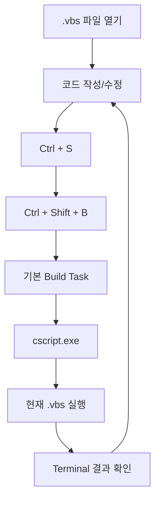

# 스크립트 실행 및 검증

## 1. 목적

이 문서는 구성한 VS Code Task를 이용하여 **VBScript 파일을 실제로 실행하고 현재 활성화된 파일이 정확히 실행되는지 검증하는 과정**을 설명한다.

사전 조건:

- Windows에서 `cscript.exe` 실행 가능
- VBScript Feature 상태 확인 완료
- VS Code Workspace 구성 완료
- `.vscode/tasks.json` 구성 완료
- `Ctrl + Shift + B` Task 실행 가능

!!! tip "사전 확인"
    Task 구성이 아직 완료되지 않았다면 먼저 아래 가이드를 진행한다.

    **[VS Code 실행 Task 구성](vscode_task_setup.md)**

---

## 2. 첫 번째 실행 파일

프로젝트의 `labs` 폴더 아래에 다음 파일을 만든다.

```text
C:\projects\vbscript-doc\labs\hello.vbs
```

내용:

```vbscript
Option Explicit

Dim message
message = "Hello VBScript"

WScript.Echo message
```

파일 저장:

```text
Ctrl + S
```

실행:

```text
Ctrl + Shift + B
```

정상 결과:

```text
Hello VBScript
```

!!! success "첫 번째 실행 성공"
    위 결과가 VS Code Terminal에 나타나면 다음 연결이 정상이다.

    ```text
    VS Code
      ↓
    tasks.json
      ↓
    cscript.exe
      ↓
    현재 hello.vbs
      ↓
    Terminal
    ```

---

## 3. `Option Explicit` 사용

학습용 `.vbs` 파일에는 특별한 이유가 없다면 첫 부분에 다음 문장을 사용하는 것을 권장한다.

```vbscript
Option Explicit
```

`Option Explicit`를 사용하면 모든 변수를 사용하기 전에 `Dim` 등의 선언문으로 먼저 선언해야 한다.

정상 예:

```vbscript
Option Explicit

Dim userName
Dim userAge

userName = "Kim"
userAge = 30

WScript.Echo userName
WScript.Echo userAge
```

### 3.1 `Option Explicit`가 없는 경우

다음 코드에는 변수명 오타가 있다.

```vbscript
Dim userName

userName = "Kim"

' userName을 잘못 입력
userNmae = "Lee"

WScript.Echo userName
```

`Option Explicit`가 없으면 VBScript는 `userNmae`를 새로운 변수로 인식할 수 있기 때문에 오타를 즉시 찾기 어렵다.

### 3.2 `Option Explicit`가 있는 경우

```vbscript
Option Explicit

Dim userName

userName = "Kim"

' 선언되지 않은 변수이므로 오류 발생
userNmae = "Lee"
```

실행하면 선언되지 않은 변수 사용을 오류로 확인할 수 있다.

```text
Microsoft VBScript runtime error
Variable is undefined: 'userNmae'
```

`Option Explicit`는 다음 실수를 빠르게 발견하는 데 도움이 된다.

- 변수 이름 오타
- `Dim` 선언 누락
- 비슷한 변수명을 잘못 사용한 경우
- 코드 수정 과정에서 발생한 변수명 불일치

!!! tip "`Option Explicit`를 기본으로 사용"
    코드가 길어질수록 변수명 오타를 눈으로 찾기 어려워진다.

    학습 예제뿐만 아니라 실제 VBScript 작성 시에도 `Option Explicit`를 기본적으로 사용하는 것을 권장한다.

---

## 4. 두 번째 파일로 현재 파일 실행 검증

다음 파일을 생성한다.

```text
C:\projects\vbscript-doc\labs\loop_test.vbs
```

내용:

```vbscript
Option Explicit

Dim i

For i = 1 To 5
    WScript.Echo "i = " & i
Next
```

저장:

```text
Ctrl + S
```

실행:

```text
Ctrl + Shift + B
```

결과:

```text
i = 1
i = 2
i = 3
i = 4
i = 5
```

이 결과가 나오면 `tasks.json`의 다음 설정이 정상적으로 동작하는 것이다.

```json
"${file}"
```

---

## 5. 현재 활성화된 파일 확인

Explorer 구조:

```text
C:\projects\vbscript-doc
│
├─ .vscode
│   └─ tasks.json
│
└─ labs
    ├─ hello.vbs
    └─ loop_test.vbs
```

`hello.vbs`를 활성화하고 실행:

```text
Hello VBScript
```

`loop_test.vbs`를 활성화하고 실행:

```text
i = 1
i = 2
i = 3
i = 4
i = 5
```

즉 하나의 `tasks.json`으로 여러 스크립트를 실행하며, `${file}`에 의해 **현재 활성화된 Editor 파일이 실행 대상**이 된다.

---

## 6. 기본 학습 실행 흐름

앞으로 가이드 예제는 다음 흐름으로 반복 테스트한다.



핵심:

```text
코드 작성
   ↓
Ctrl + S
   ↓
Ctrl + Shift + B
   ↓
Terminal 결과 확인
   ↓
코드 수정
   ↓
반복
```

!!! note "`Ctrl + Shift + B`"
    이 단축키 자체가 VBScript의 실행 단축키인 것은 아니다.

    본 프로젝트에서 VBScript 실행 Task를 **기본 Build Task**로 지정했기 때문에 현재 `.vbs` 파일을 실행하는 용도로 사용한다.

---

## 7. `WScript.Echo`

학습용 출력은 기본적으로 `WScript.Echo` 사용을 권장한다.

```vbscript
WScript.Echo "Hello VBScript"
```

`cscript.exe`에서 실행하면 VS Code Terminal에 출력된다.

```text
Hello VBScript
```

변수 확인:

```vbscript
Option Explicit

Dim language
language = "VBScript"

WScript.Echo "Language = " & language
```

결과:

```text
Language = VBScript
```

---

## 8. `MsgBox`

다음 코드는 Terminal이 아니라 Windows 대화상자를 표시한다.

```vbscript
MsgBox "Hello VBScript"
```

목적에 따라 구분한다.

### 8.1 Terminal 출력

```vbscript
WScript.Echo "Result"
```

### 8.2 Windows 팝업

```vbscript
MsgBox "Result"
```

기본 문법을 반복적으로 검증할 때는 `WScript.Echo`가 더 편리하다.

---

## 9. 조건문 테스트

`labs/condition_test.vbs`:

```vbscript
Option Explicit

Dim score
score = 90

If score >= 80 Then
    WScript.Echo "PASS"
Else
    WScript.Echo "FAIL"
End If
```

실행:

```text
Ctrl + S
Ctrl + Shift + B
```

결과:

```text
PASS
```

---

## 10. 오류 발생 확인

오류 메시지 역시 Terminal에서 확인할 수 있다.

예:

```vbscript
Option Explicit

Dim message
message = "Hello"

WScript.Echo messages
```

`messages`는 선언하지 않은 변수이므로 오류가 발생한다.

`cscript.exe`는 Terminal에 파일명, 줄 번호, 오류 유형을 출력한다.

!!! tip "오류도 학습 대상"
    정상 코드만 실행하지 말고 일부러 변수명 오타나 문법 오류를 만들어 오류 메시지가 어떤 형태로 표시되는지도 확인해 두는 것이 좋다.

---

## 11. 권장 기본 템플릿

새로운 학습 파일은 다음 형태로 시작할 수 있다.

```vbscript
Option Explicit

' ============================================
' 변수 선언
' ============================================

Dim message

' ============================================
' 처리
' ============================================

message = "Hello VBScript"

' ============================================
' 결과 출력
' ============================================

WScript.Echo message
```

실행:

```text
Ctrl + S
Ctrl + Shift + B
```

---

## 12. 권장 테스트 코드 구조

```text
C:\projects\vbscript-doc
│
├─ .vscode
│   └─ tasks.json
│
└─ labs
    ├─ 01_basic
    │   ├─ hello.vbs
    │   ├─ variable.vbs
    │   ├─ datatype.vbs
    │   ├─ operator.vbs
    │   ├─ condition.vbs
    │   └─ loop.vbs
    │
    ├─ 02_function
    │   ├─ function.vbs
    │   └─ sub.vbs
    │
    ├─ 03_array_object
    │   ├─ array.vbs
    │   └─ dictionary.vbs
    │
    ├─ 04_file
    │   └─ filesystem_object.vbs
    │
    ├─ 05_error
    │   └─ error_handling.vbs
    │
    └─ 06_com
        └─ wscript_shell.vbs
```

`tasks.json`에서 `${file}`과 `${fileDirname}`을 사용하므로 각 하위 폴더의 현재 파일을 동일한 방식으로 실행할 수 있다.

---

## 13. 실행 검증 완료 기준

다음 항목을 확인한다.

- [ ] `hello.vbs`가 `Hello VBScript`를 출력한다.
- [ ] `loop_test.vbs`가 1~5를 출력한다.
- [ ] 현재 활성화된 파일에 따라 실행 대상이 바뀐다.
- [ ] `Option Explicit`가 있는 상태에서 선언되지 않은 변수 오류를 확인했다.
- [ ] `WScript.Echo` 출력이 Terminal에 표시된다.
- [ ] `MsgBox`가 팝업으로 표시되는 차이를 이해했다.
- [ ] 코드 수정 후 `Ctrl + S`로 저장하고 실행한다.

!!! tip "문제 발생 시"
    위 검증 과정에서 오류가 발생하면 아래 가이드에서 증상별 확인 방법을 참고한다.

    **[문제 해결 및 운영 기준](troubleshooting_guidelines.md)**
