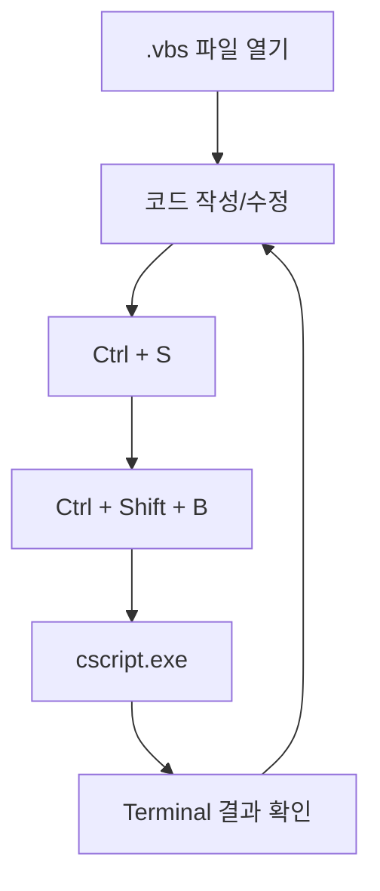

# 스크립트 실행 및 검증

## 1. 목적

이 문서는 구성한 VS Code Task를 이용하여 **VBScript 파일을 실제로 실행하고 현재 활성화된 파일이 정확히 실행되는지 검증하는 과정**을 설명한다.

사전 조건:

- Windows에서 `cscript.exe` 실행 가능
- VS Code Workspace 구성 완료
- `.vscode/tasks.json` 구성 완료

---

## 2. 첫 번째 실행 파일

`hello.vbs`:

```vbscript
Option Explicit

Dim message
message = "Hello VBScript"

WScript.Echo message
```

파일 저장:

```text
Ctrl + S
```

실행:

```text
Ctrl + Shift + B
```

정상 결과:

```text
Hello VBScript
```

!!! success "첫 번째 실행 성공"
    위 결과가 VS Code Terminal에 나타나면 VS Code → Task → `cscript.exe` 연결이 정상이다.

---

## 3. 두 번째 파일로 현재 파일 실행 검증

다음 파일을 생성한다.

```text
loop_test.vbs
```

내용:

```vbscript
Option Explicit

Dim i

For i = 1 To 5
    WScript.Echo "i = " & i
Next
```

저장:

```text
Ctrl + S
```

실행:

```text
Ctrl + Shift + B
```

결과:

```text
i = 1
i = 2
i = 3
i = 4
i = 5
```

이 결과가 나오면 `tasks.json`의 다음 설정이 정상적으로 동작하는 것이다.

```json
"${file}"
```

---

## 4. 현재 파일에 따른 실행 결과

현재 Explorer가 다음과 같다고 가정한다.

```text
vbscript-lab
│
├─ .vscode
│   └─ tasks.json
│
├─ hello.vbs
└─ loop_test.vbs
```

`hello.vbs`를 활성화하고 실행:

```text
Hello VBScript
```

`loop_test.vbs`를 활성화하고 실행:

```text
i = 1
i = 2
i = 3
i = 4
i = 5
```

즉 하나의 `tasks.json`으로 여러 스크립트를 실행할 수 있다.

---

## 5. 기본 학습 실행 흐름

앞으로 모든 예제는 다음 흐름으로 테스트한다.



핵심:

```text
코드 작성
   ↓
Ctrl + S
   ↓
Ctrl + Shift + B
   ↓
결과 확인
   ↓
수정
   ↓
반복
```

---

## 6. `WScript.Echo`

학습용 출력은 기본적으로 다음 방식을 권장한다.

```vbscript
WScript.Echo "Hello VBScript"
```

`cscript.exe`에서 실행하면 Terminal에 출력된다.

```text
Hello VBScript
```

변수 확인:

```vbscript
Option Explicit

Dim name
name = "VBScript"

WScript.Echo "Language = " & name
```

결과:

```text
Language = VBScript
```

---

## 7. `MsgBox`

다음 코드는 Terminal이 아니라 Windows 대화상자를 표시한다.

```vbscript
MsgBox "Hello VBScript"
```

목적에 따라 출력 방식을 구분한다.

### Terminal 출력

```vbscript
WScript.Echo "Result"
```

### Windows 팝업

```vbscript
MsgBox "Result"
```

기본 문법을 반복적으로 검증할 때는 `WScript.Echo`가 더 편리하다.

---

## 8. 조건문 테스트

`condition_test.vbs`:

```vbscript
Option Explicit

Dim score
score = 90

If score >= 80 Then
    WScript.Echo "PASS"
Else
    WScript.Echo "FAIL"
End If
```

실행:

```text
Ctrl + S
Ctrl + Shift + B
```

결과:

```text
PASS
```

---

## 9. 오류 발생 확인

오류 메시지 역시 Terminal에서 확인할 수 있다.

예:

```vbscript
Option Explicit

Dim message
message = "Hello"

WScript.Echo messages
```

`messages`는 선언되지 않았으므로 오류가 발생한다.

`cscript.exe`가 Terminal에 파일명과 줄 번호를 포함한 오류 메시지를 출력한다.

!!! tip "`Option Explicit` 권장"
    학습용 `.vbs` 파일에는 가능하면 항상 첫 줄에 다음을 사용한다.

    ```vbscript
    Option Explicit
    ```

    변수 선언 누락과 이름 오타를 빠르게 발견하는 데 도움이 된다.

---

## 10. 권장 기본 템플릿

새로운 학습 파일은 다음 형태로 시작할 수 있다.

```vbscript
Option Explicit

' ============================================
' 변수 선언
' ============================================

Dim message

' ============================================
' 처리
' ============================================

message = "Hello VBScript"

' ============================================
' 결과 출력
' ============================================

WScript.Echo message
```

실행:

```text
Ctrl + S
Ctrl + Shift + B
```

---

## 11. 권장 테스트 코드 구조

```text
vbscript-lab
│
├─ .vscode
│   └─ tasks.json
│
├─ 01_basic
│   ├─ hello.vbs
│   ├─ variable.vbs
│   ├─ datatype.vbs
│   ├─ operator.vbs
│   ├─ condition.vbs
│   └─ loop.vbs
│
├─ 02_function
│   ├─ function.vbs
│   └─ sub.vbs
│
├─ 03_array_object
│   ├─ array.vbs
│   └─ dictionary.vbs
│
├─ 04_file
│   └─ filesystem_object.vbs
│
├─ 05_error
│   └─ error_handling.vbs
│
└─ 06_com
    └─ wscript_shell.vbs
```

`tasks.json`에서 `${file}`과 `${fileDirname}`을 사용하므로 각 하위 폴더의 현재 파일을 동일한 방식으로 실행할 수 있다.

---

## 12. 실행 검증 완료 기준

다음 세 가지가 모두 성공하면 실행 환경 구성이 완료된 것으로 본다.

- [ ] `hello.vbs`가 `Hello VBScript`를 출력한다.
- [ ] `loop_test.vbs`가 1~5를 출력한다.
- [ ] 현재 열려 있는 파일에 따라 실행 대상이 바뀐다.

이후 문제가 발생하면 [문제 해결 및 운영 기준](troubleshooting_guidelines.md)을 참고한다.
