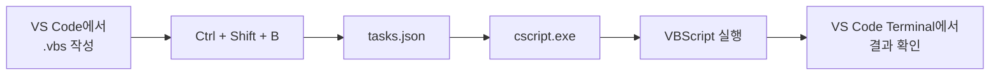
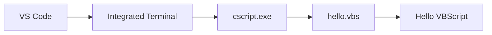
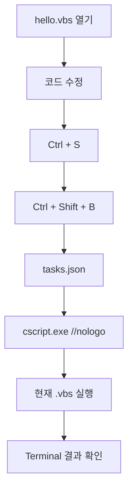
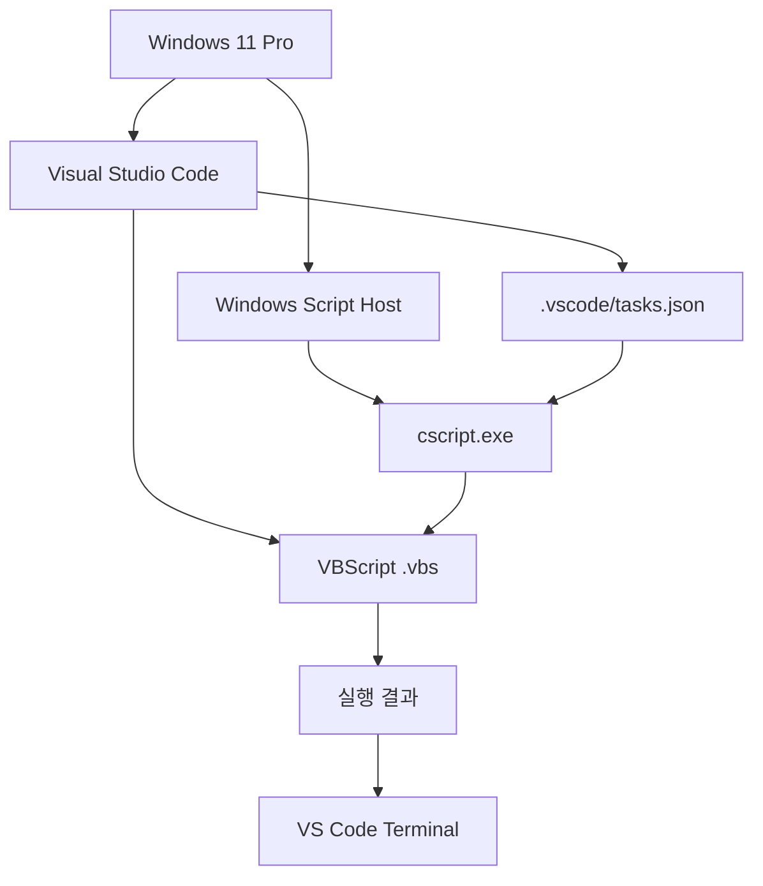

# Windows 11 Pro + VS Code VBScript 실행환경 구성 가이드

## 1. 문서 목적

이 문서는 **Windows 11 Pro 환경에서 Visual Studio Code(VS Code)를 이용하여 VBScript(`.vbs`) 코드를 작성하고 직접 실행하는 개발·학습 환경을 구성하는 방법**을 설명한다.

VBScript는 Java나 Python처럼 별도의 SDK나 인터프리터를 설치해서 사용하는 구조와 조금 다르다. Windows에서는 **Windows Script Host(WSH)** 가 VBScript 실행 환경을 제공하며, 이 문서에서는 그중 콘솔 기반 실행 프로그램인 **`cscript.exe`** 를 사용한다.

최종적으로 다음과 같은 개발 흐름을 구성하는 것이 목표다.



구성이 완료되면 VS Code에서 현재 열어둔 `.vbs` 파일을 다음과 같이 실행할 수 있다.

```text
VBScript 작성
    ↓
파일 저장
    ↓
Ctrl + Shift + B
    ↓
cscript.exe가 현재 파일 실행
    ↓
VS Code Terminal에서 실행 결과 확인
```

---

## 2. 구성 환경

이 문서는 다음 환경을 기준으로 한다.

| 구분 | 환경 |
|---|---|
| 운영체제 | Windows 11 Pro |
| 편집기 | Visual Studio Code |
| 스크립트 언어 | VBScript |
| 파일 확장자 | `.vbs` |
| 실행 환경 | Windows Script Host |
| 실행 프로그램 | `cscript.exe` |
| 실행 결과 확인 | VS Code Integrated Terminal |
| VS Code 실행 방식 | `tasks.json` + `Ctrl + Shift + B` |

!!! note "VBScript 전용 IDE는 필요하지 않다"
    VBScript 실행 자체를 위해 별도의 컴파일러, JDK, Python 런타임과 같은 개발 도구를 설치할 필요는 없다.

    Windows에서 제공하는 Windows Script Host가 VBScript를 실행하며, VS Code는 **코드를 작성하고 실행 명령을 호출하는 편집기** 역할을 한다.

---

## 3. VBScript 실행 구조 이해

### 3.1 Windows Script Host

Windows Script Host(WSH)는 Windows에서 스크립트를 실행할 수 있도록 제공되는 실행 환경이다.

VBScript 파일은 일반적으로 다음 두 프로그램 중 하나를 이용하여 실행한다.

```text
Windows Script Host
│
├─ cscript.exe
│   └─ 콘솔 기반 실행
│
└─ wscript.exe
    └─ Windows GUI 기반 실행
```

### 3.2 `cscript.exe`

`cscript.exe`는 명령행 환경에서 스크립트를 실행한다.

예:

```powershell
cscript.exe hello.vbs
```

학습 환경에서는 실행 결과와 오류 메시지를 VS Code Terminal에서 바로 확인할 수 있기 때문에 **`cscript.exe` 사용을 기본으로 한다.**

### 3.3 `wscript.exe`

`wscript.exe`는 Windows GUI 방식으로 스크립트를 실행한다.

예:

```powershell
wscript.exe hello.vbs
```

`WScript.Echo` 등의 출력이 터미널이 아니라 팝업 대화상자로 나타날 수 있기 때문에 반복적으로 코드를 실행하는 학습 환경에는 상대적으로 불편하다.

따라서 본 가이드의 기본 실행 방식은 다음과 같다.

```text
VS Code
  ↓
cscript.exe
  ↓
현재 .vbs 파일
  ↓
VS Code Terminal
```

---

# 4. 1단계 - Windows 버전 확인

먼저 현재 Windows 환경을 확인한다.

## 4.1 Windows 버전 확인

키보드에서 다음 키를 누른다.

```text
Windows + R
```

실행 창에서 다음 명령을 입력한다.

```text
winver
```

Windows 버전 정보를 확인한다.

예:

```text
Windows 11
Version 24H2
```

또는 PowerShell에서 다음 명령을 사용할 수도 있다.

```powershell
Get-ComputerInfo | Select-Object WindowsProductName, WindowsVersion, OsBuildNumber
```

!!! note "Windows 버전을 확인하는 이유"
    VBScript는 Microsoft에서 사용 중단(deprecated) 기술로 지정되었으며, 최신 Windows에서는 **Feature on Demand(선택적 기능)** 형태로 단계적으로 전환되고 있다.

    따라서 PC마다 VBScript가 이미 사용할 수 있는 상태일 수도 있고, 선택적 기능을 추가해야 할 수도 있다.

---

# 5. 2단계 - VBScript 실행 기능 확인

VS Code 설정에 들어가기 전에 **Windows 자체에서 VBScript가 실행 가능한 상태인지 먼저 확인**한다.

이 단계가 정상이어야 VS Code에서도 실행할 수 있다.

## 5.1 PowerShell 실행

Windows 시작 메뉴에서 다음을 검색한다.

```text
PowerShell
```

일반적인 확인 작업은 관리자 권한 없이 실행해도 된다.

---

## 5.2 `cscript.exe` 존재 여부 확인

PowerShell에서 다음 명령을 실행한다.

```powershell
Get-Command cscript.exe
```

정상적인 경우 다음과 비슷한 정보가 표시된다.

```text
CommandType     Name          Version      Source
-----------     ----          -------      ------
Application     cscript.exe   ...          C:\Windows\System32\cscript.exe
```

추가로 다음 명령도 사용할 수 있다.

```powershell
where.exe cscript.exe
```

일반적인 Windows 설치 환경에서는 다음 경로가 확인된다.

```text
C:\Windows\System32\cscript.exe
```

`wscript.exe`도 확인할 수 있다.

```powershell
where.exe wscript.exe
```

---

## 5.3 `cscript.exe` 실행 확인

다음 명령을 실행한다.

```powershell
cscript.exe //?
```

정상적으로 Windows Script Host 도움말이 표시되면 `cscript.exe` 자체는 실행 가능한 상태다.

!!! tip "여기까지 정상이라면"
    `Get-Command cscript.exe`와 `cscript.exe //?`가 모두 정상적으로 실행되면 우선 다음 단계로 진행해도 된다.

---

# 6. 3단계 - VBScript Feature on Demand 상태 확인

최신 Windows에서는 VBScript가 선택적 기능으로 제공될 수 있으므로 상태를 확인해 두는 것이 좋다.

## 6.1 PowerShell에서 상태 확인

**관리자 권한 PowerShell**을 실행한다.

시작 메뉴에서 `PowerShell`을 검색한 후:

```text
마우스 오른쪽 클릭
    ↓
관리자 권한으로 실행
```

다음 명령을 실행한다.

```powershell
Get-WindowsCapability -Online |
    Where-Object { $_.Name -like "VBSCRIPT*" }
```

환경에 따라 다음과 같은 형태의 결과를 확인할 수 있다.

```text
Name  : VBSCRIPT~~~~
State : Installed
```

`State`가 다음과 같다면 설치된 상태다.

```text
Installed
```

---

## 6.2 VBScript가 설치되어 있지 않은 경우

Windows 설정에서 **선택적 기능(Optional Features)** 을 검색한다.

Windows 빌드에 따라 설정 메뉴의 위치가 달라질 수 있으므로 설정 검색창에서 다음 문자열을 검색하는 것이 가장 확실하다.

```text
선택적 기능
```

또는:

```text
Optional features
```

목록에서 `VBScript`를 검색하고 설치한다.

!!! note "메뉴 위치"
    Windows 11 빌드에 따라 `설정 → 시스템 → 선택적 기능` 또는 이전 빌드에서 다른 위치로 표시될 수 있다.

    메뉴 경로 자체보다 Windows 설정 검색에서 **선택적 기능**을 검색하는 방식을 권장한다.

---

## 6.3 명령으로 설치하는 방법

GUI에서 설치하지 못하는 경우 관리자 권한 PowerShell 또는 명령 프롬프트에서 DISM을 사용할 수 있다.

먼저 상태를 확인한다.

```cmd
DISM /Online /Get-CapabilityInfo /CapabilityName:VBSCRIPT~~~~
```

설치가 필요한 경우:

```cmd
DISM /Online /Add-Capability /CapabilityName:VBSCRIPT~~~~
```

설치 후 다시 확인한다.

```powershell
Get-WindowsCapability -Online |
    Where-Object { $_.Name -like "VBSCRIPT*" }
```

!!! warning "무조건 설치 명령부터 실행하지 않는다"
    먼저 `cscript.exe` 실행 여부와 VBScript Capability 상태를 확인한다.

    이미 정상적으로 설치되어 있다면 다시 설치할 필요가 없다.

---

# 7. 4단계 - Windows에서 VBScript 단독 실행 테스트

VS Code와 연결하기 전에 Windows Script Host가 실제 `.vbs` 파일을 실행할 수 있는지 검증한다.

## 7.1 테스트 폴더 생성

예를 들어 다음 폴더를 생성한다.

```text
C:\dev\vbscript-lab
```

PowerShell을 사용한다면:

```powershell
New-Item -ItemType Directory -Path C:\dev\vbscript-lab -Force
```

폴더 이동:

```powershell
cd C:\dev\vbscript-lab
```

---

## 7.2 첫 번째 VBScript 파일 작성

메모장 또는 VS Code로 다음 파일을 생성한다.

```text
hello.vbs
```

내용:

```vbscript
Option Explicit

Dim message
message = "Hello VBScript"

WScript.Echo message
```

파일 구조:

```text
C:\dev\vbscript-lab
└─ hello.vbs
```

---

## 7.3 PowerShell에서 직접 실행

다음 명령을 실행한다.

```powershell
cscript.exe //nologo .\hello.vbs
```

정상 결과:

```text
Hello VBScript
```

### `//nologo` 옵션

`cscript.exe`를 기본 옵션으로 실행하면 Windows Script Host의 버전 정보가 함께 표시될 수 있다.

```powershell
cscript.exe hello.vbs
```

학습 중에는 실제 출력만 보기 쉽도록 다음 옵션을 사용하는 것이 좋다.

```text
//nologo
```

따라서 기본 실행 명령을 다음과 같이 사용한다.

```powershell
cscript.exe //nologo hello.vbs
```

!!! success "1차 실행 검증 완료"
    다음 결과가 정상적으로 표시되면 Windows의 VBScript 실행 환경은 준비된 것이다.

    ```text
    Hello VBScript
    ```

    이제 VS Code와 연결한다.

---

# 8. 5단계 - Visual Studio Code 설치 확인

이미 VS Code를 사용하고 있다면 이 단계는 간단히 확인만 하고 넘어간다.

VS Code를 실행한다.

메뉴에서:

```text
Help
    ↓
About
```

또는 VS Code Terminal에서:

```powershell
code --version
```

버전이 표시되면 정상이다.

!!! note "VBScript 확장 프로그램은 실행에 필수가 아니다"
    `.vbs` 파일을 `cscript.exe`로 실행하는 데 VS Code 확장 프로그램은 필수가 아니다.

    확장 프로그램은 문법 강조, 자동 완성 등의 편집 기능을 보완하기 위한 선택 사항이다.

    우선은 **추가 확장 프로그램 없이 실행 환경부터 구성**하는 것을 권장한다.

---

# 9. 6단계 - VS Code 작업 폴더 열기

VS Code에서 단순히 파일 하나만 여는 것보다 **폴더를 Workspace로 열어 사용하는 방식**을 권장한다.

VS Code 메뉴에서:

```text
File
    ↓
Open Folder...
```

다음 폴더를 선택한다.

```text
C:\dev\vbscript-lab
```

VS Code Explorer에 다음과 같이 표시된다.

```text
VBSCRIPT-LAB
└─ hello.vbs
```

!!! tip "폴더를 여는 이유"
    이후 생성할 `.vscode/tasks.json` 파일은 현재 Workspace에 대한 실행 설정이다.

    따라서 `.vbs` 파일 하나만 여는 것보다 프로젝트 폴더 자체를 VS Code에서 여는 것이 좋다.

---

# 10. 7단계 - VS Code Terminal에서 실행 확인

VS Code 메뉴에서 Terminal을 연다.

```text
Terminal
    ↓
New Terminal
```

단축키:

```text
Ctrl + `
```

Terminal의 현재 경로가 다음과 같은지 확인한다.

```text
PS C:\dev\vbscript-lab>
```

다음 명령을 실행한다.

```powershell
cscript.exe //nologo .\hello.vbs
```

결과:

```text
Hello VBScript
```

이 단계까지 성공하면 다음 구조가 검증된 것이다.



아직은 직접 명령어를 입력해서 실행하고 있다.

다음 단계에서는 이 명령을 `tasks.json`에 등록하여 단축키로 실행한다.

---

# 11. 8단계 - `.vscode` 폴더 생성

프로젝트 루트에 다음 폴더를 생성한다.

```text
.vscode
```

최종 구조:

```text
C:\dev\vbscript-lab
│
├─ .vscode
│
└─ hello.vbs
```

VS Code Explorer에서:

```text
VBSCRIPT-LAB
├─ .vscode
└─ hello.vbs
```

`.vscode` 폴더에는 **현재 프로젝트에서 사용하는 VS Code 설정**을 저장할 수 있다.

---

# 12. 9단계 - `tasks.json` 생성

`.vscode` 폴더 아래에 다음 파일을 생성한다.

```text
tasks.json
```

구조:

```text
C:\dev\vbscript-lab
│
├─ .vscode
│   └─ tasks.json
│
└─ hello.vbs
```

`tasks.json`에 다음 내용을 입력한다.

```json
{
    "version": "2.0.0",
    "tasks": [
        {
            "label": "VBScript: Run Current File",
            "type": "process",
            "command": "${env:WINDIR}\\System32\\cscript.exe",
            "args": [
                "//nologo",
                "${file}"
            ],
            "options": {
                "cwd": "${fileDirname}"
            },
            "group": {
                "kind": "build",
                "isDefault": true
            },
            "presentation": {
                "reveal": "always",
                "panel": "shared",
                "clear": true
            },
            "problemMatcher": []
        }
    ]
}
```

---

# 13. `tasks.json` 상세 설명

설정을 단순히 복사하는 것보다 각 항목이 어떤 역할을 하는지 이해하는 것이 좋다.

## 13.1 `label`

```json
"label": "VBScript: Run Current File"
```

VS Code에서 표시되는 Task의 이름이다.

명령 팔레트에서 Task를 찾을 때 다음 이름으로 표시된다.

```text
VBScript: Run Current File
```

---

## 13.2 `type`

```json
"type": "process"
```

외부 실행 프로그램을 직접 Process로 실행한다.

이번 환경에서는 다음 프로그램을 직접 실행한다.

```text
cscript.exe
```

---

## 13.3 `command`

```json
"command": "${env:WINDIR}\\System32\\cscript.exe"
```

VBScript를 실행할 프로그램을 지정한다.

`${env:WINDIR}`는 현재 Windows의 Windows 설치 경로를 사용한다.

일반적으로 다음 경로가 된다.

```text
C:\Windows
```

따라서 실제 실행 프로그램은 다음과 같다.

```text
C:\Windows\System32\cscript.exe
```

환경변수를 사용했기 때문에 Windows가 `C:\Windows` 이외의 경로에 설치된 경우에도 대응하기 쉽다.

---

## 13.4 `args`

```json
"args": [
    "//nologo",
    "${file}"
]
```

`cscript.exe`에 전달할 인자다.

실제로 다음과 같은 명령이 실행되는 것과 같은 의미다.

```powershell
cscript.exe //nologo 현재열려있는파일.vbs
```

### `${file}`

VS Code의 `${file}` 변수는 **현재 활성화된 에디터의 파일 전체 경로**를 의미한다.

예:

```text
C:\dev\vbscript-lab\hello.vbs
```

따라서 파일 이름을 `tasks.json`에 고정할 필요가 없다.

다음과 같이 여러 파일을 만들더라도 현재 열려 있는 파일을 실행할 수 있다.

```text
hello.vbs
variable.vbs
condition.vbs
loop.vbs
function.vbs
```

---

## 13.5 `options.cwd`

```json
"options": {
    "cwd": "${fileDirname}"
}
```

실행 시 작업 디렉터리(Current Working Directory)를 현재 `.vbs` 파일이 있는 폴더로 지정한다.

예를 들어:

```text
C:\dev\vbscript-lab\01_basic\file_test.vbs
```

를 실행하면 작업 디렉터리를 다음으로 설정한다.

```text
C:\dev\vbscript-lab\01_basic
```

이 설정은 이후 파일 읽기/쓰기 예제를 학습할 때 특히 중요하다.

---

## 13.6 `group`

```json
"group": {
    "kind": "build",
    "isDefault": true
}
```

현재 Task를 VS Code의 기본 Build Task로 지정한다.

그 결과 다음 단축키를 사용할 수 있다.

```text
Ctrl + Shift + B
```

즉:

```text
Ctrl + Shift + B
        ↓
VBScript: Run Current File
        ↓
cscript.exe
```

구조가 된다.

---

## 13.7 `presentation`

```json
"presentation": {
    "reveal": "always",
    "panel": "shared",
    "clear": true
}
```

실행 결과를 VS Code Terminal에서 표시하는 방법을 지정한다.

### `reveal`

```json
"reveal": "always"
```

실행 시 Terminal을 자동으로 표시한다.

### `panel`

```json
"panel": "shared"
```

동일한 Terminal 패널을 재사용한다.

### `clear`

```json
"clear": true
```

실행할 때 이전 실행 화면을 정리하여 현재 실행 결과를 확인하기 쉽게 한다.

---

# 14. 10단계 - VS Code에서 VBScript 실행

이제 실제로 VS Code에서 `.vbs` 파일을 실행한다.

## 14.1 `hello.vbs` 열기

Explorer에서 다음 파일을 선택한다.

```text
hello.vbs
```

내용:

```vbscript
Option Explicit

Dim message
message = "Hello VBScript"

WScript.Echo message
```

---

## 14.2 파일 저장

반드시 먼저 저장한다.

```text
Ctrl + S
```

!!! warning "저장 후 실행"
    VS Code Task는 디스크에 저장된 파일을 `cscript.exe`에 전달한다.

    코드를 수정했다면 반드시 저장한 뒤 실행하는 습관을 들이는 것이 좋다.

---

## 14.3 실행

다음 단축키를 누른다.

```text
Ctrl + Shift + B
```

처음 설정한 경우 Task 선택 화면이 표시된다면:

```text
VBScript: Run Current File
```

을 선택한다.

`isDefault: true`가 정상 적용되어 있으면 이후에는 바로 실행된다.

---

## 14.4 결과 확인

VS Code 하단 Terminal에 다음 결과가 표시된다.

```text
Hello VBScript
```

이제 다음 흐름이 완성되었다.



!!! success "실행환경 구성 완료"
    `Ctrl + Shift + B`를 눌렀을 때 VS Code Terminal에

    ```text
    Hello VBScript
    ```

    가 출력되면 기본 VBScript 학습 환경 구성이 완료된 것이다.

---

# 15. 11단계 - 두 번째 스크립트로 현재 파일 실행 확인

`tasks.json`이 특정 파일만 실행하는 것이 아니라 **현재 열려 있는 파일을 실행하는지** 확인한다.

다음 파일을 생성한다.

```text
loop_test.vbs
```

내용:

```vbscript
Option Explicit

Dim i

For i = 1 To 5
    WScript.Echo "i = " & i
Next
```

파일을 저장한다.

```text
Ctrl + S
```

그리고 실행한다.

```text
Ctrl + Shift + B
```

결과:

```text
i = 1
i = 2
i = 3
i = 4
i = 5
```

정상적으로 실행된다면 `${file}` 설정도 정상이다.

현재 구조:

```text
C:\dev\vbscript-lab
│
├─ .vscode
│   └─ tasks.json
│
├─ hello.vbs
└─ loop_test.vbs
```

`hello.vbs`를 열고 실행하면:

```text
Hello VBScript
```

`loop_test.vbs`를 열고 실행하면:

```text
i = 1
i = 2
i = 3
i = 4
i = 5
```

가 표시된다.

---

# 16. 권장 학습 프로젝트 구조

VBScript 문법을 단계적으로 학습하면서 테스트하려면 다음과 같이 구성하는 것을 권장한다.

```text
vbscript-lab
│
├─ .vscode
│   └─ tasks.json
│
├─ 01_basic
│   ├─ hello.vbs
│   ├─ variable.vbs
│   ├─ datatype.vbs
│   ├─ operator.vbs
│   ├─ condition.vbs
│   └─ loop.vbs
│
├─ 02_function
│   ├─ function.vbs
│   └─ sub.vbs
│
├─ 03_array_object
│   ├─ array.vbs
│   └─ dictionary.vbs
│
├─ 04_file
│   └─ filesystem_object.vbs
│
├─ 05_error
│   └─ error_handling.vbs
│
└─ 06_com
    └─ wscript_shell.vbs
```

`tasks.json`의 다음 설정 때문에:

```json
"${file}"
```

어느 폴더에 있는 `.vbs` 파일을 열더라도 현재 파일을 실행할 수 있다.

또한:

```json
"cwd": "${fileDirname}"
```

설정으로 인해 해당 스크립트가 위치한 폴더가 작업 디렉터리가 된다.

---

# 17. VS Code에서 권장하는 기본 사용 흐름

앞으로 VBScript 예제 코드를 테스트할 때는 다음 순서를 기본으로 한다.

## STEP 1. `.vbs` 파일 생성

예:

```text
condition.vbs
```

## STEP 2. 코드 작성

```vbscript
Option Explicit

Dim score
score = 90

If score >= 80 Then
    WScript.Echo "PASS"
Else
    WScript.Echo "FAIL"
End If
```

## STEP 3. 저장

```text
Ctrl + S
```

## STEP 4. 실행

```text
Ctrl + Shift + B
```

## STEP 5. Terminal 결과 확인

```text
PASS
```

## STEP 6. 코드 수정 후 반복

```text
코드 작성
   ↓
Ctrl + S
   ↓
Ctrl + Shift + B
   ↓
결과 확인
   ↓
코드 수정
   ↓
반복
```

---

# 18. `WScript.Echo` 사용 권장

학습용 예제의 출력은 가능하면 다음 방식을 사용한다.

```vbscript
WScript.Echo "Hello VBScript"
```

`cscript.exe`로 실행하면 VS Code Terminal에 출력된다.

예:

```text
Hello VBScript
```

따라서 가이드 코드 검증에는 `WScript.Echo`가 편리하다.

---

# 19. `MsgBox`와 차이

다음 코드는 Windows 대화상자를 표시한다.

```vbscript
MsgBox "Hello VBScript"
```

실행하면 Terminal 출력 대신 팝업 창이 표시된다.

따라서 학습 가이드에서는 목적에 따라 구분한다.

### Terminal 결과 확인

```vbscript
WScript.Echo "Result"
```

### Windows 팝업 확인

```vbscript
MsgBox "Result"
```

기본 문법 학습에서는 가능하면 다음 방식을 권장한다.

```vbscript
WScript.Echo
```

---

# 20. VS Code 확장 프로그램에 대한 기준

VBScript를 실행하기 위해 반드시 설치해야 하는 VS Code Extension은 없다.

실행 구조는 다음과 같다.

```text
VS Code
   │
   │ tasks.json
   ↓
cscript.exe
   │
   ↓
VBScript Engine
```

따라서 Extension이 없어도 실행된다.

Extension은 다음 기능이 필요할 때 선택적으로 설치한다.

- VBScript Syntax Highlighting
- 코드 가독성 향상
- Snippet
- 일부 자동 완성

!!! tip "처음에는 확장 프로그램 없이 시작"
    실행 환경을 먼저 정상적으로 구성한다.

    실행이 정상임을 확인한 다음 필요할 경우 VS Code Marketplace에서 VBScript 관련 확장 프로그램을 검토한다.

    이렇게 해야 확장 프로그램 문제와 Windows Script Host 문제를 분리해서 확인할 수 있다.

---

# 21. F5 실행과 `Ctrl + Shift + B`의 차이

VS Code에서 일반적으로 `F5`는 **디버거(Debugger)** 를 실행하는 키다.

VBScript는 VS Code 기본 디버깅 대상이 아니므로 별도 디버거 확장이나 도구 없이 일반적인 언어처럼 `F5` 디버깅을 기대하면 안 된다.

본 학습환경에서는:

```text
F5
```

대신:

```text
Ctrl + Shift + B
```

를 사용한다.

정확한 의미는 다음과 같다.

```text
Ctrl + Shift + B
        ↓
기본 Build Task 실행
        ↓
VBScript: Run Current File
        ↓
cscript.exe
```

!!! note "이 환경의 목적"
    이 구성은 **VBScript의 문법과 실행 결과를 빠르게 반복 검증하는 환경**이다.

    IDE 수준의 Step Debugging 환경을 만드는 것이 기본 목적은 아니다.

---

# 22. 선택 설정 - Task를 명령 팔레트에서 실행

단축키를 사용하지 않고 메뉴에서도 실행할 수 있다.

VS Code에서:

```text
Terminal
    ↓
Run Task...
```

또는:

```text
Ctrl + Shift + P
```

를 누른 후:

```text
Tasks: Run Task
```

검색 후 다음 Task를 선택한다.

```text
VBScript: Run Current File
```

---

# 23. 오류 확인 방법

VBScript 코드에 오류가 있으면 `cscript.exe`가 Terminal에 오류 정보를 출력한다.

예를 들어 다음처럼 잘못 작성했다고 가정한다.

```vbscript
Option Explicit

Dim message
message = "Hello"

WScript.Echo messages
```

`messages` 변수를 선언하지 않았으므로 오류가 발생한다.

Terminal에서는 파일명, 줄 번호와 함께 오류가 출력된다.

이 정보를 이용하여 해당 코드를 수정한다.

!!! tip "`Option Explicit` 사용"
    학습 예제에서는 가능하면 파일 첫 부분에 다음 코드를 사용한다.

    ```vbscript
    Option Explicit
    ```

    변수 이름 오타와 선언 누락을 빠르게 확인하는 데 도움이 된다.

---

# 24. 자주 발생하는 문제

## 24.1 `cscript.exe`를 찾을 수 없는 경우

확인:

```powershell
Get-Command cscript.exe
```

또는:

```powershell
where.exe cscript.exe
```

그리고 실제 파일도 확인한다.

```text
C:\Windows\System32\cscript.exe
```

파일 또는 VBScript 기능이 사용할 수 없는 상태라면 Windows 선택적 기능 상태를 확인한다.

---

## 24.2 VBScript Engine 관련 오류

예를 들어 `.vbs` 스크립트 엔진을 찾을 수 없다는 유형의 오류가 발생한다면 VBScript Feature on Demand 설치 상태를 먼저 확인한다.

```powershell
Get-WindowsCapability -Online |
    Where-Object { $_.Name -like "VBSCRIPT*" }
```

설치되지 않았다면 Windows의 선택적 기능에서 VBScript를 추가하거나, 관리 권한 환경에서 다음 방법을 검토한다.

```cmd
DISM /Online /Add-Capability /CapabilityName:VBSCRIPT~~~~
```

---

## 24.3 `Can not find script file` 오류

예:

```text
Input Error: Can not find script file ...
```

다음을 확인한다.

1. `.vbs` 파일이 저장되었는가?
2. Explorer에서 실제 파일이 존재하는가?
3. 확장자가 정말 `.vbs`인가?
4. 현재 실행 중인 파일이 맞는가?

Windows에서 파일 확장자 숨김 설정 때문에 다음과 같은 파일이 만들어질 수도 있다.

```text
hello.vbs.txt
```

실제 파일 확장자를 확인한다.

---

## 24.4 `Ctrl + Shift + B`를 눌러도 Task가 나오지 않는 경우

다음 구조인지 확인한다.

```text
vbscript-lab
│
├─ .vscode
│   └─ tasks.json
│
└─ hello.vbs
```

특히 다음을 확인한다.

```text
.vscode/tasks.json
```

파일 이름이 다음처럼 되어 있으면 안 된다.

```text
task.json
tasks.js
tasks.json.txt
```

정확히 다음이어야 한다.

```text
tasks.json
```

---

## 24.5 현재 파일이 아닌 다른 파일이 실행되는 경우

`tasks.json`의 `args` 부분을 확인한다.

정상:

```json
"args": [
    "//nologo",
    "${file}"
]
```

파일 이름을 고정하면 안 된다.

예를 들어 다음 구성은 권장하지 않는다.

```json
"args": [
    "//nologo",
    "hello.vbs"
]
```

이렇게 하면 항상 `hello.vbs`만 실행된다.

---

## 24.6 파일 수정 내용이 실행 결과에 반영되지 않는 경우

파일을 저장했는지 확인한다.

```text
Ctrl + S
```

VBScript 실행 파일은 현재 VS Code Editor의 메모리 상태가 아니라 **디스크에 저장된 `.vbs` 파일**을 읽어서 실행한다.

따라서 기본 습관을 다음과 같이 잡는다.

```text
수정
 ↓
Ctrl + S
 ↓
Ctrl + Shift + B
```

---

## 24.7 한글 출력이 이상한 경우

처음 환경 검증은 다음과 같이 영문 문자열로 수행한다.

```vbscript
WScript.Echo "Hello VBScript"
```

영문 출력은 정상인데 한글 문자열만 이상하다면 VBScript 실행 자체의 문제와 **파일 인코딩 또는 콘솔 문자 인코딩 문제를 분리해서 확인**해야 한다.

처음부터 실행환경 문제와 문자 인코딩 문제를 동시에 해결하려고 하지 않는 것이 좋다.

---

# 25. 보안상 주의사항

VBScript는 단순 계산이나 문자열 처리뿐만 아니라 Windows의 파일, 레지스트리, COM 객체 등에도 접근할 수 있다.

예를 들어 이후 다음 객체를 사용할 수 있다.

```vbscript
CreateObject("Scripting.FileSystemObject")
```

```vbscript
CreateObject("WScript.Shell")
```

따라서 출처를 알 수 없는 `.vbs` 파일을 바로 실행하지 않는다.

!!! warning "알 수 없는 스크립트 실행 금지"
    인터넷, 메일 또는 외부 저장소에서 받은 VBScript는 내용을 확인하기 전 실행하지 않는다.

    학습 환경에서는 직접 작성한 테스트 코드 위주로 실행한다.

---

# 26. 학습 가이드 코드의 실행 범위

이 환경에서 모든 종류의 VBScript 관련 코드를 동일하게 실행할 수 있는 것은 아니다.

앞으로 코드 예제를 다음 세 가지로 구분하는 것이 좋다.

## 26.1 순수 VBScript

예:

```vbscript
Dim
If
Select Case
For
Do While
Function
Sub
Array
String
Date
```

실행 환경:

```text
VS Code + cscript.exe
```

직접 실행 가능하다.

---

## 26.2 Windows Script Host / COM 코드

예:

```vbscript
CreateObject("Scripting.FileSystemObject")
CreateObject("WScript.Shell")
CreateObject("Scripting.Dictionary")
```

대부분 Windows 환경에서 직접 테스트할 수 있다.

다만 사용하는 COM Component가 현재 Windows에 실제로 존재해야 한다.

---

## 26.3 특정 솔루션 전용 VBScript

특정 업무 솔루션 또는 화면 개발 도구에서 제공하는 전용 객체, 이벤트, 컴포넌트 API를 사용하는 코드는 일반 `cscript.exe` 환경에서 실행되지 않을 수 있다.

개념적으로 다음과 같이 구분한다.

```text
VBScript 기본 문법
        │
        ├─ VS Code + cscript에서 실행 가능
        │
Windows COM / WSH
        │
        ├─ Windows 환경에서 실행 가능
        │
솔루션 전용 객체/API
        │
        └─ 해당 제품 개발환경 필요
```

따라서 가이드 예제를 검증할 때 **순수 VBScript 코드인지, Windows WSH 코드인지, 제품 전용 코드인지** 구분해야 한다.

---

# 27. 최종 환경 구조

모든 설정이 완료되면 개발환경은 다음 구조가 된다.



파일 구조:

```text
vbscript-lab
│
├─ .vscode
│   └─ tasks.json
│
├─ 01_basic
│   ├─ hello.vbs
│   ├─ variable.vbs
│   ├─ condition.vbs
│   └─ loop.vbs
│
├─ 02_function
│   ├─ function.vbs
│   └─ sub.vbs
│
├─ 03_array_object
│   ├─ array.vbs
│   └─ dictionary.vbs
│
├─ 04_file
│   └─ filesystem_object.vbs
│
└─ 05_com
    └─ shell.vbs
```

실행 방식:

```text
.vbs 파일 선택
    ↓
코드 작성
    ↓
Ctrl + S
    ↓
Ctrl + Shift + B
    ↓
cscript.exe //nologo 현재파일
    ↓
VS Code Terminal 결과 확인
```

---

# 28. 최종 점검 체크리스트

환경 구성을 마친 후 다음 항목을 순서대로 확인한다.

- [ ] Windows 11 Pro 버전을 확인했다.
- [ ] `Get-Command cscript.exe`가 정상적으로 실행된다.
- [ ] `cscript.exe //?`가 정상적으로 실행된다.
- [ ] VBScript Feature on Demand 상태를 확인했다.
- [ ] `hello.vbs` 파일을 생성했다.
- [ ] PowerShell에서 `cscript.exe //nologo hello.vbs` 실행에 성공했다.
- [ ] VS Code에서 프로젝트 폴더를 열었다.
- [ ] VS Code Integrated Terminal에서 `hello.vbs` 실행에 성공했다.
- [ ] `.vscode/tasks.json`을 생성했다.
- [ ] `Ctrl + Shift + B`로 현재 `.vbs` 파일 실행에 성공했다.
- [ ] 실행 결과가 VS Code Terminal에 표시된다.
- [ ] 두 번째 `.vbs` 파일도 동일한 Task로 실행되는 것을 확인했다.

모든 항목이 완료되었다면 **VBScript 기본 문법을 직접 실행하면서 학습할 수 있는 VS Code 환경 구성이 완료된 것이다.**

---

# 29. 가장 먼저 사용할 기본 템플릿

새로운 학습 예제를 만들 때 다음 템플릿으로 시작할 수 있다.

```vbscript
Option Explicit

' ============================================
' 변수 선언
' ============================================

Dim message

' ============================================
' 처리
' ============================================

message = "Hello VBScript"

' ============================================
' 결과 출력
' ============================================

WScript.Echo message
```

실행:

```text
Ctrl + S
Ctrl + Shift + B
```

결과:

```text
Hello VBScript
```

---

# 30. 요약

VBScript를 VS Code에서 실행하기 위해 필요한 핵심 구성은 매우 단순하다.

```text
Windows 11 Pro
    │
    ├─ Windows Script Host
    │      └─ cscript.exe
    │
    └─ Visual Studio Code
           │
           ├─ *.vbs
           │
           └─ .vscode/tasks.json
```

핵심 `tasks.json`:

```json
{
    "version": "2.0.0",
    "tasks": [
        {
            "label": "VBScript: Run Current File",
            "type": "process",
            "command": "${env:WINDIR}\\System32\\cscript.exe",
            "args": [
                "//nologo",
                "${file}"
            ],
            "options": {
                "cwd": "${fileDirname}"
            },
            "group": {
                "kind": "build",
                "isDefault": true
            },
            "presentation": {
                "reveal": "always",
                "panel": "shared",
                "clear": true
            },
            "problemMatcher": []
        }
    ]
}
```

앞으로 기본 실행 흐름은 다음 하나만 기억하면 된다.

```text
코드 작성
   ↓
Ctrl + S
   ↓
Ctrl + Shift + B
   ↓
Terminal 결과 확인
```

---

# 참고 자료

- [Microsoft Learn - cscript](https://learn.microsoft.com/en-us/windows-server/administration/windows-commands/cscript)
- [Microsoft Learn - Resources for deprecated features in the Windows client](https://learn.microsoft.com/en-us/windows/whats-new/deprecated-features-resources)
- [Microsoft Learn - Features On Demand](https://learn.microsoft.com/en-us/windows-hardware/manufacture/desktop/features-on-demand-v2--capabilities?view=windows-11)
- [Microsoft Learn - DISM Capabilities Package Servicing Command-Line Options](https://learn.microsoft.com/en-us/windows-hardware/manufacture/desktop/dism-capabilities-package-servicing-command-line-options?view=windows-11)
- [Visual Studio Code - Integrate with External Tools via Tasks](https://code.visualstudio.com/docs/debugtest/tasks)
- [Visual Studio Code - Variables Reference](https://code.visualstudio.com/docs/reference/variables-reference)
