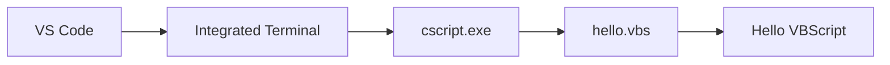

# VS Code 작업 환경 구성

## 1. 목적

이 문서는 Windows에서 VBScript 실행을 확인한 후 **Visual Studio Code를 VBScript 학습용 작업 환경으로 구성하는 과정**을 설명한다.

사전 조건은 다음과 같다.

```text
cscript.exe 정상
        +
hello.vbs 직접 실행 성공
```

아직 확인하지 않았다면 먼저 다음 문서를 진행한다.

[Windows VBScript 실행 기능 확인](windows_vbscript_runtime_setup.md)

---

## 2. VS Code 역할

VBScript 실행 구조에서 VS Code는 실행 엔진이 아니다.


역할을 구분하면 다음과 같다.

| 구성 요소 | 역할 |
|---|---|
| VS Code | 코드 편집, 파일 관리, Terminal, Task 실행 |
| `.vbs` | VBScript 소스 파일 |
| `cscript.exe` | VBScript 콘솔 실행 |
| Windows Script Host | 스크립트 실행 환경 |

---

## 3. VS Code 설치 확인

VS Code를 실행한다.

메뉴:

```text
Help
  ↓
About
```

또는 Terminal에서 다음 명령으로 확인할 수 있다.

```powershell
code --version
```

버전이 표시되면 정상이다.

---

## 4. VBScript Extension은 필수가 아니다

`.vbs` 파일을 `cscript.exe`로 실행하는 데 별도 VS Code Extension은 필수가 아니다.

```text
VS Code Extension 없음
        ↓
.vbs 작성 가능
        ↓
cscript.exe 실행 가능
```

Extension은 다음 기능이 필요한 경우 선택적으로 검토한다.

- Syntax Highlighting
- 코드 가독성 향상
- Snippet
- 일부 자동 완성

!!! tip "처음에는 Extension 없이 시작"
    실행 문제와 Extension 문제를 분리하기 위해 **기본 실행 환경이 정상인지 먼저 확인**한다.

    실행 환경 검증이 끝난 후 필요한 Extension을 추가하는 것이 좋다.

---

## 5. 학습 폴더 열기

Windows 실행 테스트에서 만든 다음 폴더를 사용한다.

```text
C:\dev\vbscript-lab
```

VS Code 메뉴:

```text
File
  ↓
Open Folder...
```

다음 폴더를 선택한다.

```text
C:\dev\vbscript-lab
```

Explorer에서는 다음과 같이 표시된다.

```text
VBSCRIPT-LAB
└─ hello.vbs
```

!!! note "파일이 아니라 폴더를 연다"
    이후 `.vscode/tasks.json`을 Workspace 설정으로 사용하므로 `.vbs` 파일 하나만 여는 것보다 **프로젝트 폴더 전체를 여는 방식**을 사용한다.

---

## 6. VS Code Integrated Terminal 열기

메뉴:

```text
Terminal
  ↓
New Terminal
```

또는 단축키:

```text
Ctrl + `
```

Terminal의 현재 경로를 확인한다.

```text
PS C:\dev\vbscript-lab>
```

경로가 다르면 다음 명령으로 이동할 수 있다.

```powershell
cd C:\dev\vbscript-lab
```

---

## 7. VS Code Terminal에서 실행 확인

다음 명령을 입력한다.

```powershell
cscript.exe //nologo .\hello.vbs
```

결과:

```text
Hello VBScript
```

이 단계가 성공하면 다음 연결이 검증된 것이다.



---

## 8. 현재 단계의 의미

지금까지는 VS Code 안에서 실행하고 있지만 매번 다음 명령을 직접 입력해야 한다.

```powershell
cscript.exe //nologo .\hello.vbs
```

학습 중에는 많은 `.vbs` 파일을 반복적으로 실행하므로 이 방식은 번거롭다.

다음 단계에서는:

```text
Ctrl + Shift + B
```

만 눌러 현재 열려 있는 `.vbs` 파일을 실행할 수 있도록 VS Code Task를 구성한다.

[VS Code 실행 Task 구성](vscode_task_setup.md)

---

## 9. 권장 학습 폴더 구조

처음에는 단순하게 시작한다.

```text
vbscript-lab
│
├─ .vscode
│
└─ hello.vbs
```

학습이 진행되면 다음처럼 확장할 수 있다.

```text
vbscript-lab
│
├─ .vscode
│   └─ tasks.json
│
├─ 01_basic
│   ├─ hello.vbs
│   ├─ variable.vbs
│   ├─ condition.vbs
│   └─ loop.vbs
│
├─ 02_function
│   ├─ function.vbs
│   └─ sub.vbs
│
├─ 03_array_object
│   ├─ array.vbs
│   └─ dictionary.vbs
│
├─ 04_file
│   └─ filesystem_object.vbs
│
└─ 05_com
    └─ shell.vbs
```

파일을 기능별로 나누면 가이드의 예제와 실제 테스트 코드를 대응시키기 쉽다.
