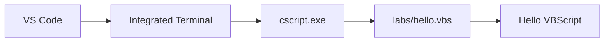

# VS Code 작업 환경 구성

## 1. 목적

이 문서는 Windows에서 VBScript 실행 기능을 확인한 후 **Visual Studio Code를 VBScript 학습용 작업 환경으로 구성하는 과정**을 설명한다.

사전 조건:

```text
Windows Script Host 정상
        +
cscript.exe 정상
        +
VBScript Feature 상태 확인
        +
간단한 .vbs 직접 실행 성공
```

!!! tip "사전 확인"
    아직 Windows의 VBScript 실행 기능을 확인하지 않았다면 먼저 아래 가이드를 진행한다.

    **[Windows VBScript 실행 기능 확인](windows_vbscript_runtime_setup.md)**

---

## 2. VS Code의 역할

VBScript 실행 구조에서 VS Code 자체가 VBScript 실행 엔진은 아니다.


역할을 구분하면 다음과 같다.

| 구성 요소 | 역할 |
|---|---|
| VS Code | 코드 편집, 파일 관리, Terminal, Task 실행 |
| `.vbs` | VBScript 소스 파일 |
| `cscript.exe` | 콘솔 방식의 VBScript 실행 프로그램 |
| Windows Script Host | VBScript 실행 환경 |
| `.vscode/tasks.json` | VS Code에서 실행 명령을 Task로 등록 |

---

## 3. VS Code 설치 확인

VS Code를 실행한다.

메뉴:

```text
Help
  ↓
About
```

또는 Terminal에서 다음 명령으로 확인할 수 있다.

```powershell
code --version
```

버전이 표시되면 정상이다.

---

## 4. VBScript Extension은 필수가 아니다

`.vbs` 파일을 `cscript.exe`로 실행하는 데 별도의 VS Code Extension은 필수가 아니다.

```text
VS Code Extension 없음
        ↓
.vbs 작성 가능
        ↓
Integrated Terminal 사용 가능
        ↓
cscript.exe 실행 가능
```

Extension은 다음과 같은 편집 기능이 필요할 경우 선택적으로 검토한다.

- Syntax Highlighting
- 코드 가독성 향상
- Snippet
- 일부 자동 완성

!!! tip "처음에는 Extension 없이 시작"
    실행 문제와 Extension 문제를 분리하기 위해 **기본 실행 환경부터 정상적으로 구성**한다.

    VBScript 실행을 확인한 후 필요한 Extension을 추가하는 것이 좋다.

---

## 5. 프로젝트 폴더를 Workspace로 열기

본 학습 문서와 실습 코드를 같은 리포지토리에서 관리한다면 프로젝트 루트를 VS Code Workspace로 연다.

예:

```text
C:\projects\vbscript-doc
```

VS Code 메뉴:

```text
File
  ↓
Open Folder...
  ↓
C:\projects\vbscript-doc
```

권장 구조:

```text
C:\projects\vbscript-doc
│
├─ .vscode
│   └─ tasks.json
│
├─ docs
├─ labs
│   └─ hello.vbs
│
└─ mkdocs.yml
```

!!! warning "`.vbs` 파일이나 `labs` 폴더만 열지 않는다"
    이후 생성할 `.vscode/tasks.json`은 **현재 VS Code Workspace의 루트**를 기준으로 인식된다.

    따라서 다음처럼 `labs`만 Workspace로 열면:

    ```text
    C:\projects\vbscript-doc\labs
    ```

    VS Code는 다음 위치에서 Task 설정을 찾게 된다.

    ```text
    C:\projects\vbscript-doc\labs\.vscode\tasks.json
    ```

    본 프로젝트의 Task 설정은 다음 위치에 둘 것이므로:

    ```text
    C:\projects\vbscript-doc\.vscode\tasks.json
    ```

    반드시 **`C:\projects\vbscript-doc` 자체를 Workspace로 연다.**

---

## 6. 실습 폴더 준비

프로젝트 루트 아래에 학습용 스크립트를 저장할 `labs` 폴더를 사용한다.

```text
C:\projects\vbscript-doc
└─ labs
```

첫 번째 테스트 파일:

```text
C:\projects\vbscript-doc\labs\hello.vbs
```

예제:

```vbscript
Option Explicit

Dim message
message = "Hello VBScript"

WScript.Echo message
```

!!! note "`Option Explicit` 사용"
    학습용 VBScript에서는 가급적 파일의 첫 부분에 `Option Explicit`를 사용한다.

    선언하지 않은 변수 사용이나 변수명 오타를 빠르게 찾을 수 있다.

---

## 7. VS Code Integrated Terminal 열기

VS Code 메뉴:

```text
Terminal
  ↓
New Terminal
```

단축키:

```text
Ctrl + `
```

프로젝트 루트를 Workspace로 열었다면 Terminal은 일반적으로 다음과 같은 경로에서 시작한다.

```text
PS C:\projects\vbscript-doc>
```

현재 경로 확인:

```powershell
Get-Location
```

---

## 8. VS Code Terminal에서 `cscript.exe` 확인

VS Code Terminal에서 다음 명령을 실행한다.

```powershell
Get-Command cscript.exe
```

또는:

```powershell
where.exe cscript.exe
```

일반적으로 다음 경로가 확인된다.

```text
C:\Windows\System32\cscript.exe
```

실행 도움말 확인:

```powershell
cscript.exe //?
```

이 명령은 일반 권한 Terminal에서 실행할 수 있다.

---

## 9. VS Code Terminal에서 첫 스크립트 실행

`labs/hello.vbs`를 저장한 후 프로젝트 루트에서 다음 명령을 실행한다.

```powershell
cscript.exe //nologo .\labs\hello.vbs
```

정상 결과:

```text
Hello VBScript
```

이 단계가 성공하면 다음 연결이 검증된 것이다.



!!! success "VS Code Terminal 실행 확인"
    위 결과가 나오면 VS Code 안에서 Windows Script Host를 이용한 VBScript 실행이 정상이다.

---

## 10. 관리자 권한이 필요한 Windows 명령

일반적인 VBScript 작성과 `cscript.exe` 실행에는 관리자 권한이 필요하지 않다.

하지만 다음과 같이 Windows Capability를 확인하는 명령은 관리자 권한이 필요하다.

```powershell
Get-WindowsCapability -Online |
    Where-Object { $_.Name -like "VBSCRIPT*" }
```

본 환경에서는 VS Code 전체를 관리자 권한으로 실행하기보다 **필요한 명령만 `sudo`로 관리자 권한 실행**하는 방식을 사용한다.

```powershell
sudo powershell.exe -NoProfile -Command "Get-WindowsCapability -Online | Where-Object { `$_.Name -like 'VBSCRIPT*' }"
```

정상 결과 예:

```text
Name  : VBSCRIPT~~~~
State : Installed
```

!!! note "관리자 권한 작업의 상세 절차"
    Sudo 활성화, 실행 모드, UAC, PowerShell 따옴표와 `` `$ `` 처리 방법은 Windows 실행 기능 가이드에서 설명한다.

    **[Windows VBScript 실행 기능 확인](windows_vbscript_runtime_setup.md)**

---

## 11. 현재 단계의 의미

현재까지는 VS Code 안에서 VBScript를 실행할 수 있지만 매번 다음과 같은 명령을 직접 입력해야 한다.

```powershell
cscript.exe //nologo .\labs\hello.vbs
```

학습 중에는 여러 `.vbs` 파일을 반복적으로 실행하므로 이 방식은 번거롭다.

다음 단계에서는 현재 활성화된 `.vbs` 파일을 다음 단축키로 실행하도록 Task를 구성한다.

```text
Ctrl + Shift + B
```

!!! tip "다음 가이드"
    위의 설정과 VS Code Terminal 실행 확인을 완료한 경우 아래 링크의 다음 가이드를 진행한다.

    **[VS Code 실행 Task 구성](vscode_task_setup.md)**

---

## 12. 권장 학습 구조

학습이 진행되면 `labs` 아래를 기능별로 확장할 수 있다.

```text
C:\projects\vbscript-doc
│
├─ .vscode
│   └─ tasks.json
│
├─ labs
│   ├─ 01_basic
│   │   ├─ hello.vbs
│   │   ├─ variable.vbs
│   │   ├─ datatype.vbs
│   │   ├─ operator.vbs
│   │   ├─ condition.vbs
│   │   └─ loop.vbs
│   │
│   ├─ 02_function
│   │   ├─ function.vbs
│   │   └─ sub.vbs
│   │
│   ├─ 03_array_object
│   │   ├─ array.vbs
│   │   └─ dictionary.vbs
│   │
│   ├─ 04_file
│   │   └─ filesystem_object.vbs
│   │
│   └─ 05_com
│       └─ shell.vbs
│
├─ docs
└─ mkdocs.yml
```

파일을 기능별로 나누면 가이드 예제와 실제 테스트 코드를 대응시키기 쉽다.
