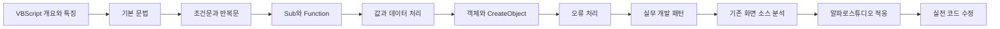
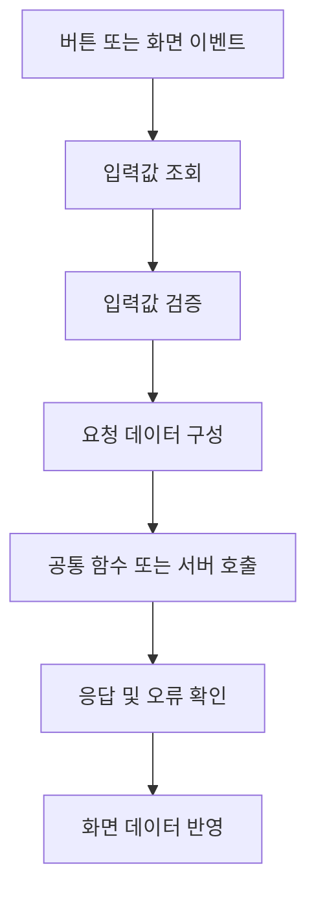

# VBScript 학습 로드맵

## 1. 문서 목적

이 문서는 VBScript를 처음 접하는 개발자가 **기존 금융 시스템의 화면 소스를 읽고, 수정하고, 필요한 기능을 추가할 수 있는 수준까지 빠르게 도달하기 위한 학습 방향과 순서**를 정리한다.

앞 단계에서 Windows 11 + VS Code 기반의 VBScript 실행환경 구성과 테스트는 이미 완료한 것으로 본다.

따라서 이 문서에서는 `cscript.exe`, VS Code Task, `Ctrl + Shift + B` 같은 실행환경 설정을 다시 설명하지 않고 **무엇을 어떤 순서로 학습할 것인지**에 집중한다.

!!! note "학습의 기준"
    목표는 VBScript 언어 자체를 깊게 연구하는 것이 아니다.

    실제 프로젝트에서 기존 화면 코드를 안정적으로 읽고, 처리 흐름을 이해하고, 영향 범위를 판단한 뒤 필요한 코드를 수정할 수 있는 수준에 도달하는 것이 우선이다.

---

## 2. 학습 목표

VBScript 학습의 최종 목표는 단순히 문법을 암기하는 것이 아니다.

다음과 같은 코드를 보았을 때 각각의 문법을 따로 해석하기보다 **전체 처리 의도와 흐름**을 읽을 수 있어야 한다.

```vbscript
Option Explicit

Sub btnSearch_Click()

    Dim accountNo

    accountNo = Trim(txtAccountNo.Text)

    If accountNo = "" Then
        MsgBox "계좌번호를 입력하세요."
        Exit Sub
    End If

    Call SearchAccount(accountNo)

End Sub
```

이 코드는 다음 흐름으로 읽는다.

```text
사용자 버튼 클릭
        ↓
입력값 조회
        ↓
입력값 정리
        ↓
필수값 검증
        ↓
조건 불충족 시 처리 종료
        ↓
정상인 경우 조회 처리 호출
```

즉 학습의 핵심은 **문법 → 코드 → 업무 처리 흐름**으로 연결해서 이해하는 것이다.

---

## 3. 먼저 익혀야 할 핵심 문법

처음부터 모든 문법을 한꺼번에 외우지 않는다.

우선 기존 소스를 읽는 데 자주 등장하는 다음 항목부터 익힌다.

```text
Option Explicit
Dim
Variant

If / ElseIf / Else
Select Case

For / For Each
Do While / Do Until

Sub
Function
Call
Exit Sub
Exit Function

Set
Nothing

Empty
Null
IsNull
IsEmpty

On Error Resume Next
Err
```

!!! tip "학습 우선순위"
    처음에는 **변수 → 조건문 → 반복문 → Sub/Function → 객체 → 오류 처리** 순서로 익히는 것이 좋다.

    문법을 익힌 뒤에는 바로 작은 `.vbs` 파일로 실행해보고, 실제 화면 소스에서 같은 문법이 어떻게 사용되는지 찾아본다.

---

## 4. 전체 학습 흐름



각 단계는 독립적으로 끝나는 것이 아니라 다음 단계의 기반이 된다.

---

## 5. 1단계 - VBScript의 기본 형태 익히기

먼저 VBScript 코드의 기본적인 모양에 익숙해진다.

```vbscript
Option Explicit

Dim customerName

customerName = "KIM"

If customerName <> "" Then
    WScript.Echo customerName
End If
```

Java나 JavaScript와 비교하면 다음 차이가 눈에 띈다.

- 변수 타입을 선언하지 않는다.
- 세미콜론을 사용하지 않는다.
- `{}` 대신 `End If`, `Next`, `End Sub`, `End Function` 등으로 블록을 종료한다.
- 문자열 연결은 일반적으로 `&`를 사용한다.
- 객체 참조를 대입할 때 `Set`을 사용한다.

처음에는 이러한 문법의 모양과 실행 순서에 익숙해지는 것이 중요하다.

---

## 6. 2단계 - 값의 상태를 구분하기

VBScript에서는 다음 값들이 서로 다른 의미를 가진다.

```text
Empty
Null
Nothing
""
```

특히 실제 업무 화면에서는 다음 상황에서 차이가 중요해진다.

- 초기화되지 않은 변수
- DB 조회 결과
- 선택되지 않은 값
- 빈 문자열
- 생성되지 않은 객체
- 서버 응답값

예를 들어 `Null`은 단순한 빈 문자열과 다르므로 다음처럼 별도의 확인이 필요할 수 있다.

```vbscript
If IsNull(value) Then
    ' Null 처리
End If
```

객체가 없는 상태는 `Nothing`으로 확인한다.

```vbscript
If obj Is Nothing Then
    ' 객체가 없는 경우
End If
```

---

## 7. 3단계 - Sub와 Function 이해하기

실무 VBScript는 여러 `Sub`와 `Function`이 서로 호출되면서 동작하는 경우가 많다.

```vbscript
Sub btnSearch_Click()

    If ValidateSearchCondition() = False Then
        Exit Sub
    End If

    Call SearchCustomer()

End Sub
```

```vbscript
Function ValidateSearchCondition()

    If Trim(txtCustomerName.Text) = "" Then
        MsgBox "고객명을 입력하세요."
        ValidateSearchCondition = False
        Exit Function
    End If

    ValidateSearchCondition = True

End Function
```

역할을 구분하면 다음과 같다.

```text
Sub
→ 특정 동작 수행

Function
→ 처리 후 결과값 반환
```

화면 이벤트는 `Sub`, 검증이나 값 변환은 `Function` 형태로 작성되는 경우가 많다.

---

## 8. 4단계 - 객체와 `CreateObject()` 이해하기

VBScript를 실제로 사용하려면 객체 사용에 익숙해져야 한다.

특히 Windows 기반 VBScript에서는 다음 형태의 코드가 자주 등장한다.

```vbscript
Set fso = CreateObject("Scripting.FileSystemObject")
```

```vbscript
Set shell = CreateObject("WScript.Shell")
```

```vbscript
Set dict = CreateObject("Scripting.Dictionary")
```

개념적으로 다음 흐름으로 이해하면 된다.

```text
VBScript
   ↓
CreateObject()
   ↓
COM 객체 생성
   ↓
객체가 제공하는 Method / Property 사용
```

`CreateObject()`는 VBScript가 외부 객체와 연결되는 중요한 관문 중 하나다.

따라서 객체 학습에서는 단순히 함수 이름만 외우지 말고 다음 개념을 함께 이해한다.

```text
CreateObject()
ProgID
Set
Object Reference
Method
Property
Nothing
```

!!! note "`CreateObject()`를 중요하게 보는 이유"
    VBScript 자체의 기본 문법만으로 처리할 수 있는 범위는 제한적이다.

    실제 Windows 자동화나 파일 처리, Shell 기능, Dictionary 등은 COM 객체를 생성하여 사용하는 경우가 많기 때문에 `CreateObject()`와 객체 사용 방식은 실전 코드 이해에 매우 중요하다.

---

## 9. 5단계 - 화면 처리 흐름으로 읽기

실무 화면에서는 개별 문법보다 **전체 처리 순서**가 중요하다.



낯선 함수가 많이 보이더라도 현재 코드가 다음 중 어디에 위치하는지 먼저 판단한다.

```text
이벤트 시작
입력값 수집
검증
호출 준비
서버 호출
응답 처리
화면 반영
오류 처리
```

이렇게 보면 긴 레거시 화면 소스도 훨씬 빠르게 구조를 파악할 수 있다.

---

## 10. 프로젝트 전용 API는 문법과 분리해서 본다

프로젝트 화면 코드에는 VBScript 문법이 아닌 **제품 또는 프로젝트 전용 API**가 함께 등장할 수 있다.

예를 들어 다음과 같은 형태다.

```text
Grid.GetValue(...)
DataSet....
Transaction(...)
공통함수(...)
```

이러한 API가 실제로 존재하는지와 정확한 사용법은 프로젝트 환경과 기존 소스를 확인해야 한다.

!!! important "언어와 플랫폼 API를 구분"
    `If`, `For`, `Function`, `Trim`, `CStr`, `CreateObject` 등은 VBScript 또는 실행환경에서 제공하는 기능이다.

    반면 화면 컨트롤, 데이터셋, 트랜잭션, 서버 호출과 관련된 함수는 특정 개발 플랫폼 또는 프로젝트의 공통 API일 가능성이 높다.

    처음부터 이 둘을 섞어서 외우지 않는다.

---

## 11. 프로젝트 투입 후 가장 먼저 확인할 것

실제 프로젝트 환경에 접근할 수 있게 되면 개발 도구의 모든 메뉴부터 익히려고 하지 않는다.

먼저 다음 항목을 확인한다.

- 화면 스크립트 편집 위치
- 화면 이벤트 함수가 생성되는 방식
- 컨트롤 값 조회 및 설정 방식
- 공통 함수 또는 공통 스크립트 구조
- 서버 호출 방식
- 요청/응답 데이터 구조
- 데이터셋 또는 그리드 접근 방식
- 메시지 및 로그 출력 방식
- 오류 처리 방식
- 디버깅 또는 실행 확인 방법

그리고 가능하면 다음 두 종류의 정상 화면을 확보한다.

```text
정상 동작하는 조회 화면 1개
정상 동작하는 저장 화면 1개
```

!!! tip "기존 정상 화면이 가장 좋은 샘플"
    프로젝트에 투입된 이후에는 정상 동작하는 기존 화면이 가장 현실적인 학습 자료가 된다.

    이벤트 시작점부터 서버 호출, 응답 처리까지 하나의 화면을 끝까지 따라가면서 프로젝트의 공통 패턴을 먼저 파악한다.

---

## 12. 권장 학습 순서

다음 순서로 진행한다.

```text
1. VBScript 개요와 특징
        ↓
2. 변수 / Variant / 연산자 / 문자열
        ↓
3. 조건문 / 반복문
        ↓
4. Sub / Function / 매개변수
        ↓
5. Empty / Null / Nothing / 형 변환
        ↓
6. Object / Set / CreateObject
        ↓
7. 오류 처리
        ↓
8. 실무 개발 패턴
        ↓
9. 기존 화면 소스 분석
        ↓
10. 알파로스튜디오 적응
        ↓
11. 실전 코드 수정 및 실습
```

---

## 13. 학습 완료 기준

초기 학습이 완료되었다고 판단할 수 있는 기준은 다음과 같다.

- [ ] 기본적인 VBScript 코드의 실행 순서를 읽을 수 있다.
- [ ] `Dim`, `If`, `For`, `Sub`, `Function`을 이해한다.
- [ ] `Empty`, `Null`, `Nothing`, `""`의 차이를 구분한다.
- [ ] 객체 참조에 `Set`을 사용하는 이유를 이해한다.
- [ ] `CreateObject()`가 어떤 역할을 하는지 설명할 수 있다.
- [ ] 이벤트 → 검증 → 서버 호출 → 응답 처리의 흐름을 추적할 수 있다.
- [ ] 공통 함수와 화면 내부 함수를 구분하여 추적할 수 있다.
- [ ] 프로젝트 전용 API와 VBScript 문법을 구분할 수 있다.
- [ ] 정상 동작하는 기존 화면을 기준으로 유사 기능을 분석할 수 있다.

!!! tip "다음 문서"
    학습 방향을 이해했다면 VBScript 언어의 특징과 객체 사용 구조를 먼저 살펴본다.

    **[VBScript 개요와 특징](vbscript_overview.md)**
