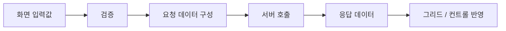

# 기존 VBScript 소스 분석 방법

## 1. 문서 목적

VBScript 기반 레거시 화면을 처음 보면 문법 자체보다 **낯선 공통 함수, 화면 컨트롤, 데이터셋, 서버 호출 API** 때문에 어렵게 느껴지는 경우가 많다.

이때 파일 첫 줄부터 모든 코드를 완벽하게 이해하려고 하면 시간이 오래 걸린다.

대신 **사용자 이벤트를 시작점으로 실제 처리 흐름을 따라가는 방식**으로 분석한다.

```text
사용자 동작
   ↓
이벤트
   ↓
입력값
   ↓
검증
   ↓
요청 데이터
   ↓
서버 호출
   ↓
응답
   ↓
화면 반영
```

---

## 2. 1단계 - 이벤트 시작점을 찾는다

먼저 사용자의 동작과 연결된 이벤트를 찾는다.

조회 버튼을 눌렀다고 가정하면 다음과 같은 이름을 찾는다.

```text
btnSearch_Click
Search_Click
OnSearch
```

예:

```vbscript
Sub btnSearch_Click()

    If ValidateSearchCondition() = False Then
        Exit Sub
    End If

    Call DoSearch()

End Sub
```

이 코드만 보아도 우선 다음 구조를 파악할 수 있다.

```text
조회 버튼 클릭
   ↓
조회조건 검증
   ↓
검증 성공
   ↓
실제 조회
```

처음에는 `ValidateSearchCondition()`과 `DoSearch()` 내부를 바로 들어가지 않아도 된다.

전체 흐름을 먼저 잡는다.

---

## 3. 2단계 - 호출 관계를 한 줄로 적는다

하나의 이벤트에서 호출되는 함수 이름을 순서대로 적는다.

예:

```text
btnSearch_Click
    ↓
ValidateSearchCondition
    ↓
SetRequestData
    ↓
DoTransaction
    ↓
SearchCallback
    ↓
BindGrid
```

실제 프로젝트의 함수명으로 바꾸어 메모하면 긴 코드도 구조가 보이기 시작한다.

!!! tip "소스 분석 메모"
    다음처럼 한 줄 메모를 만드는 습관이 좋다.

    ```text
    조회버튼 → fnValidate → fnSetParam → gfnTransaction → callback → fnBindGrid
    ```

    함수 내부의 모든 코드를 기억할 필요 없이 호출 흐름을 먼저 확보한다.

---

## 4. 3단계 - 함수의 역할을 분류한다

함수 이름과 호출 위치를 보고 역할을 분류한다.

```text
화면 이벤트
화면 내부 처리
입력값 검증
데이터 변환
요청 데이터 구성
공통 유틸리티
서버 호출
Callback
화면 바인딩
오류 처리
```

예:

```text
ValidateSearchCondition
→ 입력값 검증

SetRequestData
→ 요청 데이터 구성

Transaction / Send / Call...
→ 서버 호출 가능성

BindResult / SetGrid...
→ 응답 데이터를 화면에 반영
```

이름만으로 단정하지 않고 구현부를 확인하여 예상과 실제 역할이 맞는지 검증한다.

---

## 5. 4단계 - 프로젝트 공통 함수는 처음에는 블랙박스로 본다

처음부터 공통 프레임워크 내부까지 모두 따라가면 화면의 핵심 흐름을 놓치기 쉽다.

다음과 같이 구분한다.

```text
화면 내부 함수
        ↓
공통 함수
        ↓
서버 호출
```

예를 들어:

```text
gfnTransaction
gfnMessage
gfnGetCode
```

처럼 프로젝트 공통 함수로 보이는 호출이 있다면 처음에는 다음만 기록한다.

```text
함수명
입력값
반환값
호출 목적
```

내부 구현은 실제 수정 또는 장애 분석이 필요한 시점에 들어간다.

!!! note "블랙박스로 본다는 의미"
    공통 함수를 무시한다는 뜻이 아니다.

    첫 번째 분석에서는 **화면 전체 흐름을 먼저 잡고**, 두 번째 분석에서 필요한 공통 함수의 내부를 확인한다는 의미다.

---

## 6. 5단계 - 데이터가 어디서 어디로 이동하는지 추적한다

화면 코드에서는 데이터 이동이 가장 중요하다.



다음 질문을 순서대로 확인한다.

```text
입력값은 어디에서 읽는가?
        ↓
어떤 변수에 담는가?
        ↓
어떤 검증을 하는가?
        ↓
서버에 어떤 이름으로 전달하는가?
        ↓
응답은 어디에 저장되는가?
        ↓
어떤 컨트롤에 표시되는가?
```

---

## 7. 6단계 - 값의 상태를 확인한다

VBScript에서는 다음 값들을 구분해야 한다.

```text
Empty
Null
Nothing
""
```

따라서 조건문을 볼 때 단순히 결과만 보지 말고 **어떤 종류의 값을 검사하는 코드인지** 확인한다.

예:

```vbscript
If IsNull(result) Then
```

```vbscript
If value = "" Then
```

```vbscript
If obj Is Nothing Then
```

DB 결과, 객체, 화면 입력값은 각각 검사 방식이 다를 수 있다.

---

## 8. 7단계 - 객체 생성 지점을 찾는다

소스에서 다음 코드를 만나면 표시해 둔다.

```vbscript
Set fso = CreateObject("Scripting.FileSystemObject")
```

```vbscript
Set shell = CreateObject("WScript.Shell")
```

`CreateObject()`는 새로운 객체를 생성하여 외부 기능을 사용하는 지점이므로 이후 코드의 동작 범위를 이해하는 데 중요하다.

확인할 내용:

```text
어떤 ProgID를 생성하는가?
        ↓
생성된 객체를 어느 변수에 저장하는가?
        ↓
어떤 Method를 호출하는가?
        ↓
어떤 Property를 읽거나 변경하는가?
        ↓
Nothing으로 정리하는가?
```

예:

```vbscript
Set fso = CreateObject("Scripting.FileSystemObject")

If fso.FileExists(filePath) Then
    ' 파일 처리
End If

Set fso = Nothing
```

이 코드는 문법만 읽지 말고 다음 의미로 읽는다.

```text
파일 시스템 객체 생성
        ↓
파일 존재 여부 확인
        ↓
조건에 따라 파일 처리
        ↓
객체 참조 정리
```

---

## 9. 8단계 - 오류 처리 코드를 확인한다

다음 코드가 등장하는지 확인한다.

```vbscript
On Error Resume Next
```

그리고 반드시 다음 코드도 함께 찾는다.

```text
Err.Number
Err.Description
Err.Clear
```

예:

```vbscript
On Error Resume Next

Call DoSomething()

If Err.Number <> 0 Then

    MsgBox Err.Description
    Err.Clear

End If
```

`On Error Resume Next`가 선언되어 있으면 오류가 발생해도 코드가 계속 진행할 수 있으므로 **실제 오류 확인이 어디에서 이루어지는지** 반드시 추적한다.

---

## 10. 9단계 - 화면 API와 VBScript 문법을 구분한다

기존 코드에는 다음 두 종류가 섞여 있다.

```text
VBScript 문법
+
프로젝트 / 화면 솔루션 API
```

VBScript 문법 예:

```text
If
For
Sub
Function
Trim
CStr
Set
CreateObject
```

프로젝트 전용일 가능성이 있는 예:

```text
Grid.GetValue(...)
DataSet....
Transaction(...)
공통함수(...)
```

!!! important "모르는 함수가 모두 VBScript 함수는 아니다"
    인터넷에서 VBScript 문법을 검색해도 나오지 않는 함수가 있다면 프로젝트 공통 함수나 화면 개발 도구의 API일 수 있다.

    함수가 어디에서 정의되었는지 먼저 확인한다.

---

## 11. 화면 하나를 분석하는 권장 순서

실제 화면 하나를 처음 분석할 때는 다음 순서를 사용한다.

```text
1. 화면의 주요 기능을 확인한다.
        ↓
2. 조회/저장 버튼 이벤트를 찾는다.
        ↓
3. 이벤트에서 호출하는 Sub/Function을 기록한다.
        ↓
4. 입력값을 어디에서 읽는지 찾는다.
        ↓
5. 검증 로직을 확인한다.
        ↓
6. 요청 데이터를 어떻게 구성하는지 확인한다.
        ↓
7. 서버 호출 지점을 찾는다.
        ↓
8. Callback 또는 응답 처리 지점을 찾는다.
        ↓
9. 결과가 화면에 어떻게 반영되는지 확인한다.
        ↓
10. 오류 처리와 메시지 처리 방식을 확인한다.
```

---

## 12. 조회 화면과 저장 화면을 각각 하나씩 분석한다

프로젝트 투입 초기에 가장 좋은 학습 방법은 **정상 동작하는 조회 화면과 저장 화면을 각각 하나씩 끝까지 따라가는 것**이다.

### 12.1 조회 화면

주로 다음 구조를 확인한다.

```text
조회 버튼
   ↓
조회조건 검증
   ↓
조회 파라미터 구성
   ↓
서버 조회
   ↓
응답
   ↓
그리드 / 컨트롤 표시
```

### 12.2 저장 화면

주로 다음 구조를 확인한다.

```text
저장 버튼
   ↓
입력값 검증
   ↓
변경 데이터 확인
   ↓
저장 데이터 구성
   ↓
서버 저장
   ↓
성공 / 실패 처리
   ↓
화면 재조회 또는 상태 갱신
```

조회와 저장 흐름을 각각 하나씩 이해하면 다른 화면도 비슷한 패턴으로 분석하기 쉬워진다.

---

## 13. 소스 분석 메모 템플릿

화면을 분석할 때 다음 형식으로 기록할 수 있다.

```text
[화면]
화면명:

[시작 이벤트]
btnSearch_Click

[호출 흐름]
btnSearch_Click
→ ValidateSearchCondition
→ SetRequestData
→ Transaction
→ Callback
→ BindResult

[입력 데이터]
- 계좌번호
- 조회기간

[서버 호출]
- 호출 함수:
- 서비스 ID:
- 요청 데이터:

[응답 처리]
- Callback:
- 결과 데이터:
- 화면 반영:

[공통 함수]
- 함수명:
- 역할:

[객체]
- CreateObject:
- ProgID:
- 사용 목적:

[오류 처리]
- On Error Resume Next:
- Err.Number 확인 위치:

[특이사항]
-
```

이런 메모를 남기면 나중에 유사 화면을 개발할 때 빠르게 참고할 수 있다.

---

## 14. 처음부터 하지 않아도 되는 것

초기 분석 단계에서는 다음 작업을 지나치게 깊게 들어가지 않는다.

- 모든 공통 함수 내부 분석
- 모든 전역 변수의 사용처 분석
- 모든 화면 이벤트 분석
- 사용되지 않는 코드 분석
- 전체 프레임워크 구조 분석

먼저 **주요 업무 흐름 하나를 끝까지 연결하는 것**이 중요하다.

---

## 15. 분석 완료 기준

화면 하나를 분석한 뒤 다음 질문에 답할 수 있으면 기본 구조를 파악한 것이다.

- [ ] 어떤 이벤트에서 처리가 시작되는가?
- [ ] 입력값은 어디에서 읽는가?
- [ ] 어떤 검증을 수행하는가?
- [ ] 어떤 Sub/Function이 순서대로 호출되는가?
- [ ] 공통 함수와 화면 내부 함수를 구분할 수 있는가?
- [ ] `CreateObject()`로 생성하는 객체가 있는가?
- [ ] 서버 호출 지점은 어디인가?
- [ ] 응답은 어디에서 처리하는가?
- [ ] 결과 데이터는 화면 어디에 반영되는가?
- [ ] 오류는 어디에서 처리하는가?

!!! tip "분석의 핵심"
    코드를 처음부터 끝까지 외우는 것이 목표가 아니다.

    **이벤트 → 데이터 → 호출 → 응답 → 화면 반영**의 흐름을 빠르게 찾는 것이 기존 VBScript 화면 소스를 읽는 핵심이다.
