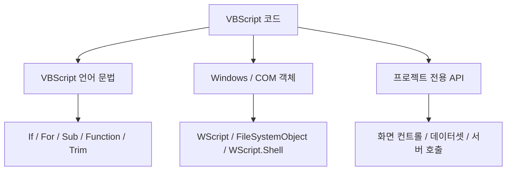

# VBScript 개요와 특징

## 1. VBScript란

VBScript는 Visual Basic 계열의 문법을 기반으로 한 스크립트 언어다.

변수 선언과 제어문이 비교적 단순하고 `Sub`, `Function`, 객체 등을 사용할 수 있으며, Windows 자동화와 과거 웹/업무 시스템의 스크립팅 환경에서 널리 사용되었다.

본 학습에서는 단순한 문법 암기보다 **기존 업무 화면 소스를 읽기 위해 필요한 VBScript의 특징**을 중심으로 이해한다.

---

## 2. VBScript 문법과 실행환경은 구분해서 이해한다

VBScript를 이해할 때 다음 세 영역을 구분하면 좋다.



### 2.1 VBScript 언어 문법

다음은 VBScript 자체에서 익혀야 하는 기본 문법이다.

```text
Dim
If
Select Case
For
Do While
Sub
Function
Array
Trim
CStr
```

### 2.2 Windows 및 COM 객체

실제 Windows 기반 VBScript에서는 다음과 같은 객체가 자주 등장한다.

```text
WScript
Scripting.FileSystemObject
WScript.Shell
Scripting.Dictionary
WMI
COM / ActiveX
```

### 2.3 프로젝트 전용 API

업무 화면 개발 도구에서는 별도의 컨트롤 API, 데이터셋, 공통 함수, 서버 호출 함수 등이 추가로 제공될 수 있다.

이 영역은 실제 프로젝트 환경과 기존 정상 소스를 기준으로 확인해야 한다.

!!! important "언어와 플랫폼을 섞어서 외우지 않는다"
    `If`, `For`, `Function`, `Trim`과 같은 문법과 화면 플랫폼이 제공하는 API는 서로 다른 영역이다.

    처음부터 모두 VBScript 문법이라고 생각하면 기존 소스를 분석할 때 오히려 혼란이 커질 수 있다.

---

## 3. VBScript 코드의 기본 형태

```vbscript
Option Explicit

Dim userName

userName = "Kim"

Sub ShowUser()

    MsgBox "사용자: " & userName

End Sub
```

Java나 JavaScript와 비교하면 다음 특징이 있다.

- 변수 타입을 명시적으로 선언하지 않는다.
- 일반적으로 한 줄 끝에 세미콜론을 사용하지 않는다.
- `{}` 대신 `End If`, `Next`, `End Sub`, `End Function` 등으로 블록을 닫는다.
- 문자열 연결에는 `&`를 주로 사용한다.
- 객체 참조를 대입할 때 `Set`을 사용한다.

---

## 4. `Option Explicit`

`Option Explicit`를 사용하면 변수를 사용하기 전에 `Dim` 등으로 선언해야 한다.

```vbscript
Option Explicit

Dim customerName

customerName = "KIM"
```

다음 코드는 변수명 오타가 있다.

```vbscript
Option Explicit

Dim customerName

customerName = "KIM"
customerNmae = "LEE"
```

`customerNmae`는 선언되지 않았으므로 오류를 확인할 수 있다.

!!! tip "`Option Explicit`를 기본으로 사용"
    변수 타입을 엄격하게 선언하지 않는 VBScript에서는 변수명 오타를 놓치기 쉽다.

    학습 코드에서는 특별한 이유가 없다면 `Option Explicit`를 기본적으로 사용하는 것을 권장한다.

---

## 5. 변수 타입 대신 `Variant`

VBScript의 변수는 일반적으로 특정 타입을 선언하지 않는다.

```vbscript
Dim value

value = 100
value = "ABC"
```

VBScript는 기본적으로 `Variant`를 이용해 값의 형태를 관리한다.

따라서 다음과 같은 값의 상태와 형 변환을 제대로 이해하는 것이 중요하다.

```text
Empty
Null
Nothing
숫자
문자열
날짜
Boolean
Object
```

---

## 6. 문자열 연결은 `&`

문자열을 연결할 때는 `&` 사용을 기본으로 생각하는 것이 좋다.

```vbscript
Dim amount

amount = 10000

WScript.Echo "금액: " & amount & "원"
```

`+`도 일부 상황에서 동작할 수 있지만 숫자 연산과 문자열 연결의 의미가 섞일 수 있다.

!!! tip "실무 습관"
    화면 메시지, 로그 문자열, 출력 문자열을 조합할 때는 `&`를 사용하는 습관을 들인다.

---

## 7. 객체를 사용할 때 `Set`

일반 값의 대입과 객체 참조 대입을 구분해야 한다.

일반 값:

```vbscript
Dim userName

userName = "Kim"
```

객체:

```vbscript
Dim fso

Set fso = CreateObject("Scripting.FileSystemObject")
```

객체 참조를 대입할 때는 `Set`을 사용한다.

객체 참조를 제거할 때는 다음과 같이 사용할 수 있다.

```vbscript
Set fso = Nothing
```

---

## 8. `CreateObject()`가 중요한 이유

VBScript 실전 코드를 이해할 때 `CreateObject()`는 매우 중요한 개념이다.

대표적인 예:

```vbscript
Set fso = CreateObject("Scripting.FileSystemObject")
```

```vbscript
Set shell = CreateObject("WScript.Shell")
```

```vbscript
Set dict = CreateObject("Scripting.Dictionary")
```

구조를 단순화하면 다음과 같다.

```text
VBScript
   ↓
CreateObject("ProgID")
   ↓
COM 객체 생성
   ↓
객체 Reference 획득
   ↓
Method / Property 사용
```

### 8.1 ProgID

`CreateObject()`에 전달하는 문자열은 생성할 COM 객체를 식별한다.

예:

```text
Scripting.FileSystemObject
WScript.Shell
Scripting.Dictionary
```

이러한 문자열을 일반적으로 ProgID라고 한다.

### 8.2 생성된 객체 사용

```vbscript
Option Explicit

Dim fso

Set fso = CreateObject("Scripting.FileSystemObject")

WScript.Echo fso.GetAbsolutePathName(".")

Set fso = Nothing
```

이 코드에서는:

```text
CreateObject()
    ↓
FileSystemObject 생성

Set
    ↓
fso 변수에 객체 Reference 저장

fso.GetAbsolutePathName()
    ↓
객체 Method 호출

Set fso = Nothing
    ↓
객체 Reference 해제
```

흐름으로 이해할 수 있다.

!!! note "`CreateObject()`는 외부 기능으로 연결되는 관문"
    VBScript 자체의 조건문과 반복문만으로는 실제 업무에서 필요한 모든 기능을 처리할 수 없다.

    파일, Shell, Dictionary 등 외부 객체가 제공하는 기능을 사용하기 위해 COM 객체를 생성하는 코드가 자주 등장하므로 `CreateObject()`와 객체 사용 방식은 반드시 익혀야 한다.

---

## 9. Windows 종속성이 강한 이유

VBScript의 `If`, `For`, `Function` 같은 문법 자체와 운영체제 기능은 구분해야 한다.

하지만 Windows 기반 VBScript에서 실제 업무 기능을 구현할 때는 Windows Script Host와 COM 객체를 많이 사용한다.

```text
VBScript 코드
   ↓
Windows Script Host
   ↓
CreateObject()
   ↓
COM / Windows 객체
```

따라서 실제 사용 환경까지 고려하면 VBScript는 Windows 환경과 매우 밀접한 스크립트 기술이라고 이해하는 것이 좋다.

!!! note "실행환경 설명은 별도 가이드에서 관리"
    Windows Script Host, `cscript.exe`, VS Code Task 등 실제 실행환경 구성 방법은 앞 단계의 실행환경 가이드에서 다룬다.

    이 문서에서는 실행 방법을 반복하지 않고 언어와 객체 구조를 이해하는 데 집중한다.

---

## 10. `Sub`와 `Function`

`Sub`는 일반적으로 특정 동작을 수행한다.

```vbscript
Sub ShowMessage()

    WScript.Echo "Hello"

End Sub
```

`Function`은 처리 결과를 반환할 수 있다.

```vbscript
Function Add(a, b)

    Add = a + b

End Function
```

실무 화면에서는 이벤트 처리, 검증, 데이터 가공, 공통 로직 등이 여러 `Sub`와 `Function`으로 나뉘어 연결되는 경우가 많다.

---

## 11. 오류 처리

레거시 VBScript에서 다음 코드를 자주 만날 수 있다.

```vbscript
On Error Resume Next
```

이 설정은 오류가 발생해도 즉시 실행을 중단하지 않고 다음 문장으로 진행하도록 한다.

따라서 함께 등장하는 다음 코드도 확인해야 한다.

```vbscript
If Err.Number <> 0 Then

    WScript.Echo Err.Description

    Err.Clear

End If
```

!!! warning "`On Error Resume Next`를 무조건 따라 쓰지 않는다"
    기존 코드에서 자주 보인다고 해서 모든 코드에 사용하는 것은 좋지 않다.

    오류를 숨길 수 있기 때문에 적용 범위와 `Err.Number` 확인 로직을 함께 봐야 한다.

---

## 12. 프로젝트 화면 코드에서 보는 관점

업무 화면을 분석할 때는 코드를 다음 세 종류로 분류한다.

```text
1. VBScript 문법
2. 객체 / COM / 실행환경 기능
3. 프로젝트 또는 화면 솔루션 전용 API
```

예를 들어:

```vbscript
If accountNo = "" Then
    MsgBox "계좌번호를 입력하세요."
    Exit Sub
End If
```

에서는 `If`, 문자열 비교, `Exit Sub`는 VBScript 문법이다.

반면 프로젝트 화면에서 다음과 같은 코드가 나타난다면:

```text
Grid.GetValue(...)
DataSet....
Transaction(...)
```

실제 의미와 사용법은 제품 또는 프로젝트 표준을 확인해야 한다.

---

## 13. 다음 학습 방향

VBScript의 기본적인 특징을 이해했다면 다음 단계에서는 변수, Variant, 연산자, 문자열, 조건문과 반복문을 실제 코드로 연습한다.

그리고 객체 학습 단계에서는 다음 내용을 중요하게 본다.

```text
Object
Set
Nothing
CreateObject()
ProgID
Method
Property
```

!!! tip "소스 분석도 함께 진행"
    문법을 어느 정도 익힌 후에는 문서를 계속 읽기만 하지 말고 실제 기존 소스를 어떻게 추적할지 함께 익히는 것이 좋다.

    **[기존 VBScript 소스 분석 방법](source_reading_strategy.md)**
