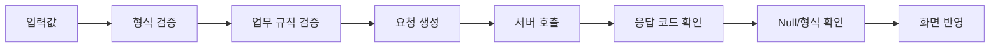

# 안전한 방어 코딩

화면 프로그램은 사용자 입력, 서버 응답, 공통 코드, 화면 상태 등 외부 요인의 영향을 많이 받습니다. 따라서 '정상값만 들어온다'고 가정하기보다 값의 상태를 단계적으로 확인하는 습관이 중요합니다.

## 필수값은 초기에 검사

```vb
accountNo = Trim(txtAccountNo.Text)

If accountNo = "" Then
    MsgBox "계좌번호를 입력하세요."
    Exit Sub
End If
```

## 숫자는 변환 전에 검사

```vb
amountText = Replace(Trim(txtAmount.Text), ",", "")

If Not IsNumeric(amountText) Then
    MsgBox "금액 형식을 확인하세요."
    Exit Sub
End If
```

## Null 가능성이 있는 데이터는 명시적으로 처리

```vb
If IsNull(serverValue) Then
    displayValue = ""
Else
    displayValue = CStr(serverValue)
End If
```

## 예상치 못한 코드값에 Case Else를 둔다

```vb
Select Case status
    Case "01"
        statusName = "정상"
    Case "02"
        statusName = "정지"
    Case Else
        statusName = "알 수 없음"
End Select
```

!!! tip "정상 흐름을 단순하게"
    오류/검증 실패는 함수 앞부분에서 종료하고, 정상 업무 로직은 아래에 직선적으로 남기는 것이 유지보수에 좋습니다.

## 서버 호출 전후의 방어선



각 단계에서 무엇을 검증하는지 분리하면 장애가 발생했을 때 원인을 찾기가 쉬워집니다.
