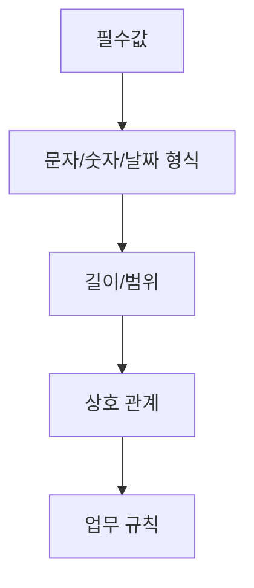

# 입력값 검증

금융 화면에서 입력값 검증은 단순 UX 기능이 아니라 잘못된 거래 요청이 서버로 전달되는 것을 막는 첫 번째 방어선입니다. 검증 로직은 보통 **필수 여부 → 형식 → 범위 → 업무 규칙** 순서로 배치하면 읽기 쉽습니다.

## 검증 순서



## 검증 함수 예시

```vb
Function ValidateOrder()
    Dim amountText
    Dim startDate
    Dim endDate

    ValidateOrder = False

    If Trim(txtAccountNo.Text) = "" Then
        MsgBox "계좌번호를 입력하세요."
        Exit Function
    End If

    amountText = Replace(Trim(txtAmount.Text), ",", "")
    If amountText = "" Or Not IsNumeric(amountText) Then
        MsgBox "금액을 숫자로 입력하세요."
        Exit Function
    End If

    If CDbl(amountText) <= 0 Then
        MsgBox "금액은 0보다 커야 합니다."
        Exit Function
    End If

    If Not IsDate(txtStartDate.Text) Or Not IsDate(txtEndDate.Text) Then
        MsgBox "조회기간을 확인하세요."
        Exit Function
    End If

    startDate = CDate(txtStartDate.Text)
    endDate = CDate(txtEndDate.Text)

    If DateDiff("d", startDate, endDate) < 0 Then
        MsgBox "종료일은 시작일보다 빠를 수 없습니다."
        Exit Function
    End If

    ValidateOrder = True
End Function
```

!!! tip "한 함수에 모든 업무 규칙을 몰아넣지 않기"
    검증 조건이 많아지면 `ValidateRequired`, `ValidateDateRange`, `ValidateAmount`처럼 목적별 함수로 나누고 상위 함수에서 조합하는 방식이 좋습니다.

## 화면 검증과 서버 검증

화면 검증이 있다고 해서 서버 검증을 생략하면 안 됩니다. 화면은 사용자 편의와 조기 오류 방지를 담당하고, 서버는 거래의 최종 유효성을 보장해야 합니다.
