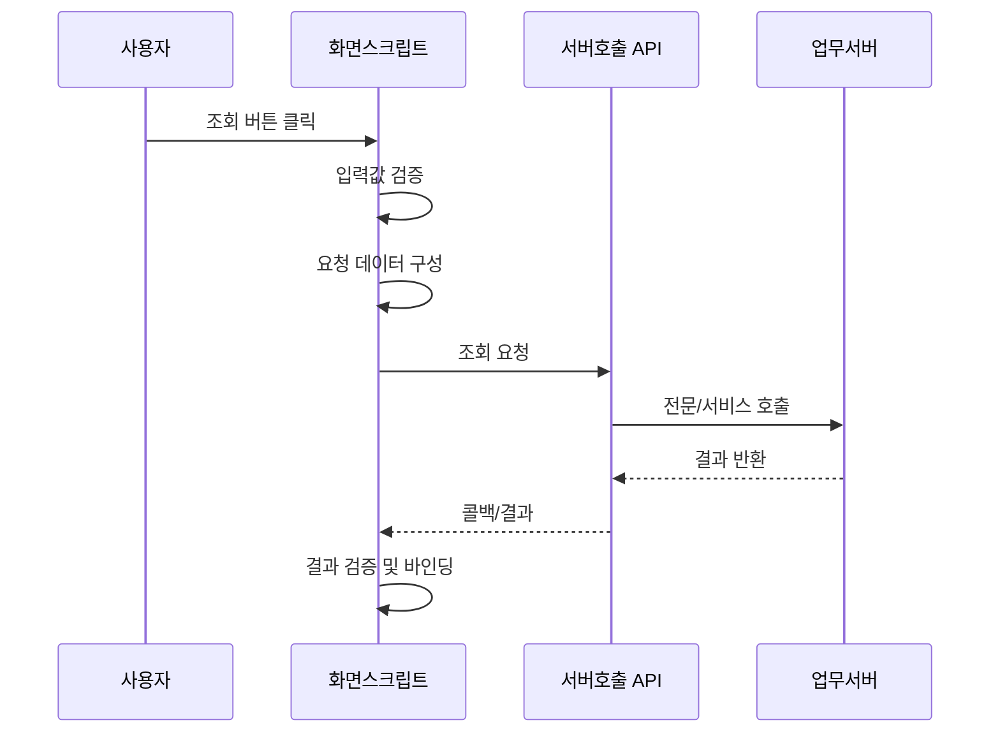

# 조회·저장 처리 패턴

조회와 저장은 금융 화면에서 가장 흔한 처리입니다. 제품별 서버 호출 API는 다르지만, 논리적 단계는 거의 동일합니다. 따라서 처음 보는 프로젝트에서도 이 단계를 기준으로 코드를 분해하면 이해하기 쉽습니다.

## 조회 처리 구조



## 플랫폼 독립적인 의사 코드

```vb
Sub DoSearch()
    Call ClearSearchResult()
    Call SetSearchRequest()
    Call RequestSearchService()
End Sub
```

실제 `RequestSearchService` 내부에서 어떤 프로젝트 공통 거래 함수를 호출하는지를 확인하면 됩니다.

## 저장 처리 구조

저장은 조회보다 검증과 사용자 확인이 더 중요합니다.

```vb
Sub btnSave_Click()
    If Not ValidateSaveData() Then Exit Sub
    If Not ConfirmSave() Then Exit Sub

    Call SetSaveRequest()
    Call RequestSaveService()
End Sub
```

## 응답 처리

응답이 성공했다고 바로 화면 값을 변경하기보다 응답코드와 데이터 존재 여부를 확인합니다.

!!! example "개념적 콜백 처리"
    ```vb
    Sub OnTransactionCompleted(ByVal serviceId, ByVal resultCode)
        If resultCode <> "0" Then
            Call ShowErrorMessage()
            Exit Sub
        End If

        Select Case serviceId
            Case "SEARCH"
                Call BindSearchResult()
            Case "SAVE"
                MsgBox "저장되었습니다."
                Call DoSearch()
        End Select
    End Sub
    ```

!!! important "전용 API 이름은 실제 프로젝트 기준"
    위 예제의 함수명은 구조 설명을 위한 것입니다. 실제 알파로스튜디오 프로젝트에서는 프로젝트 공통 거래 함수와 콜백 규약을 반드시 기존 정상 화면에서 확인해야 합니다.
