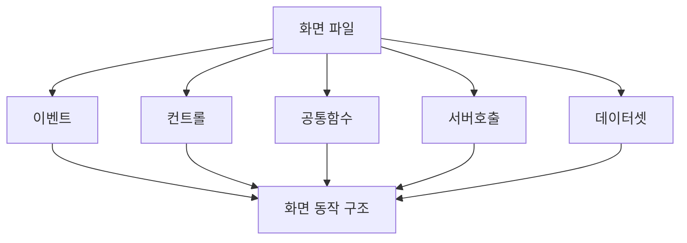

# 알파로스튜디오 적용 접근 방법

이 장의 목적은 제품 전용 API를 외우는 것이 아니라 **프로젝트에 투입된 뒤 실제 화면 소스를 기반으로 알파로스튜디오의 개발 규칙을 빠르게 학습하는 것**입니다.

공개적으로 검증 가능한 제품 전용 기술 문서가 충분하지 않은 상황에서는 특정 메서드나 속성을 추측해서 외우는 것보다, 정상 동작하는 화면을 기준으로 공통 패턴을 추출하는 방식이 가장 안전합니다.

## 가장 먼저 확보할 샘플 화면

가능하다면 아래 네 종류를 확보하세요.

1. 단순 조회 화면
2. 그리드 조회 화면
3. 등록/수정 저장 화면
4. 팝업 또는 화면 간 데이터 전달 화면

이 네 화면만 분석해도 이벤트, 컨트롤 접근, 서버 호출, 데이터 바인딩, 공통 메시지, 오류 처리의 대부분을 볼 수 있습니다.

## 분석 관점

!!! tip "문법과 제품 API를 분리해서 메모"
    예: `Trim`, `If`, `Function`은 VBScript 문법으로, `gfnTransaction`, `Grid.GetCell` 같은 프로젝트 고유 이름은 별도 표로 기록합니다. 이렇게 나누면 무엇을 언어 문서에서 찾아야 하고 무엇을 프로젝트 소스에서 찾아야 하는지가 명확해집니다.
