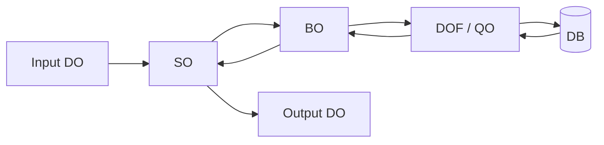
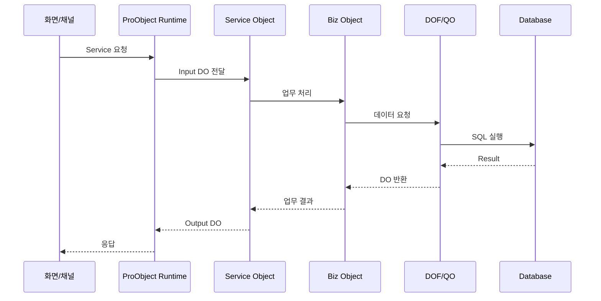

# ProObject 개요

## 1. 학습 목적

이 가이드는 ProObject 기반 프로젝트에 투입되기 전에 프레임워크의 구조와 개발 방식을 파악하기 위한 사전 학습 문서입니다.

ProObject를 처음 접할 때는 Java 코드만 보는 것보다 다음 구조를 먼저 이해하는 것이 중요합니다.

```text
화면 / 외부 채널
      ↓
ProObject Service
      ↓
Service Object(SO)
      ↓
Biz Object(BO)
      ↓
Data Object Factory(DOF) / Query Object(QO)
      ↓
Database / File / 외부 시스템
```

ProObject는 Java 기반이지만 일반적인 Spring MVC 프로젝트와는 개발 모델이 다릅니다. 특히 **EMB(Enterprise Module Bus) 방식의 시각적인 Flow 설계**, Data Object 기반 데이터 전달, ProStudio를 이용한 객체 생성과 조립이 중요한 특징입니다.

!!! note "문서 기준"
    본 문서는 TmaxSoft의 공개 **ProObject 7 Fix#1** 문서를 중심으로 작성한 사전 학습 가이드입니다. 실제 프로젝트의 ProObject 버전과 프로젝트 공통 프레임워크가 다르면 화면, API, 개발 규칙이 달라질 수 있습니다.

---

## 2. ProObject의 역할

ProObject는 기업의 온라인 및 배치 애플리케이션 개발을 위한 프레임워크입니다.

프레임워크가 다음과 같은 공통 영역을 담당합니다.

- 서비스 실행
- 객체 생명주기
- Dependency Injection
- 데이터 변환
- DB/File I/O
- 트랜잭션
- 예외 처리
- 서비스 연동
- 로깅
- Image Log
- 선처리/후처리
- 배치 실행

개발자는 프레임워크가 제공하는 객체 모델과 개발 도구를 사용하여 업무 로직을 구현합니다.

---

## 3. Layered Object Model

ProObject에서는 역할별 객체를 구분합니다.

| 객체 | 의미 | 주요 역할 |
|---|---|---|
| DO | Data Object | 데이터 전달 |
| DOF | Data Object Factory | DB/File I/O |
| QO | Query Object | Query 기반 DB 접근 |
| BO | Biz Object | 재사용 가능한 업무 로직 |
| SO | Service Object | 서비스 실행 흐름 |
| JO | Job Object | 배치 실행 흐름 |

개념적으로 다음과 같습니다.



---

## 4. Spring 개발 경험과 연결해서 이해하기

정확한 1:1 대응은 아니지만 처음 이해할 때는 다음처럼 비교할 수 있습니다.

| 일반 Java/Spring | ProObject |
|---|---|
| DTO / VO | DO |
| DAO / Repository | DOF / QO |
| Service Component | BO |
| Controller + Service 진입 흐름 | SO |
| Batch Job | JO |
| IDE | ProStudio |
| 운영/개발 관리 | ProManager / ProManagerOps |

!!! warning "Spring과 동일하지 않습니다"
    이 표는 개념 이해용입니다. ProObject는 자체 메타데이터, 객체 모델, EMB Flow, 서비스 등록 및 Runtime 구조를 가지고 있습니다.

---

## 5. ProObject에서 가장 중요한 특징

### 5.1 객체 조립 방식

업무를 하나의 거대한 클래스에 구현하기보다 역할별 Object를 만들고 조합합니다.

### 5.2 EMB 기반 Flow

Service Tier와 Business Tier에서 EMB 기반 개발 방식을 지원합니다.

```text
Input
  ↓
[고객 검증 BO]
  ↓
[고객 조회 BO]
  ↓
[계좌 조회 BO]
  ↓
Output
```

이 흐름을 ProStudio의 Object Flow Editor에서 시각적으로 설계할 수 있습니다.

### 5.3 Data Object 중심 데이터 전달

모듈 사이의 데이터는 DO를 중심으로 전달합니다.

### 5.4 Runtime이 공통 기능 관리

객체 생성, 서비스 실행, Transaction, 예외 처리 등은 Runtime이 관리합니다.

---

## 6. 온라인 서비스 기본 흐름



---

## 7. 투입 전에 알아야 할 핵심 질문

다음 질문에 답할 수 있으면 사전 학습의 1차 목표는 달성한 것입니다.

1. DO, DOF, QO, BO, SO는 각각 무엇인가?
2. SO와 BO의 차이는 무엇인가?
3. EMB로 Flow를 그린다는 것은 무엇인가?
4. EMB Node와 Java Source는 어떤 관계인가?
5. Input DO가 DB까지 어떻게 전달되는가?
6. 서비스는 어떻게 생성하고 등록하는가?
7. Transaction은 어떻게 처리되는가?
8. 다른 Service는 어떻게 호출하는가?
9. 오류 발생 시 어떤 로그를 확인하는가?
10. 기존 화면에서 서버 Service를 어떻게 찾아가는가?
