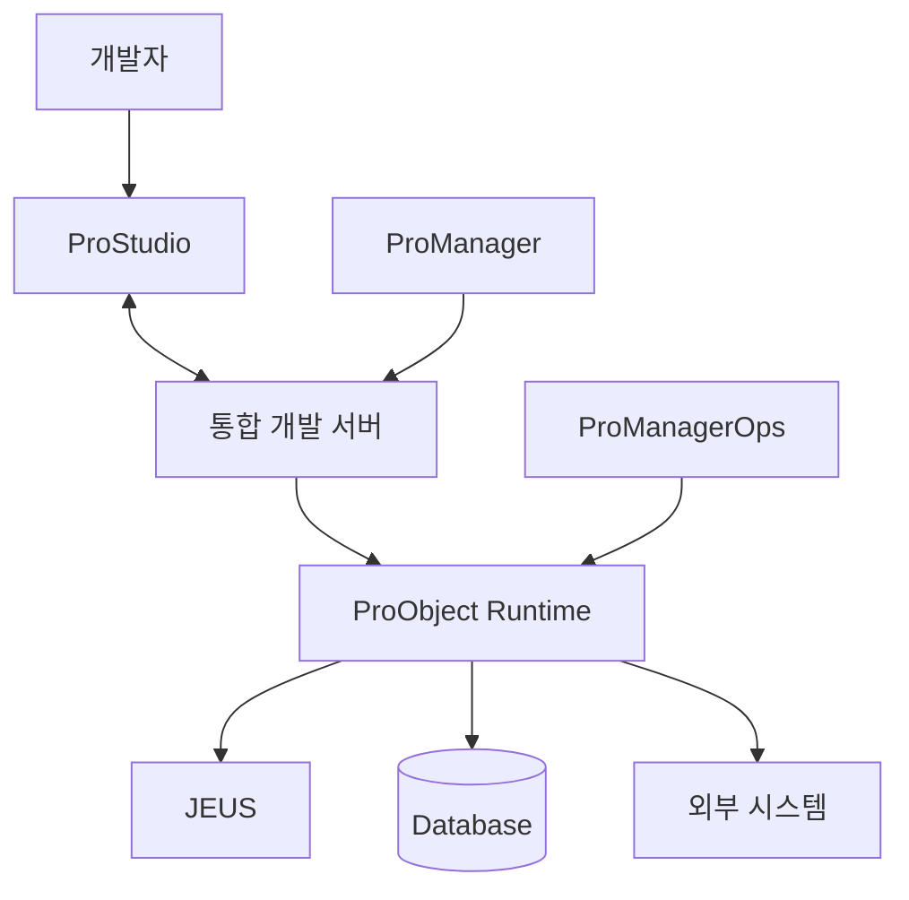

# ProObject 아키텍처

## 1. 전체 구조

ProObject 개발 환경은 크게 개발, 관리, 실행 영역으로 나누어 이해할 수 있습니다.



---

## 2. Service Tier

Service Tier에서는 SO를 중심으로 서비스 흐름을 관리합니다.

공개 문서에서는 EMB 방식으로 SO가 참조하는 BO와 DO를 관리하고, 비즈니스 로직과 프로그램 Flow를 분리하여 업무 흐름을 가시화하는 구조를 설명합니다.

```text
Service Object
 ├─ Input DO
 ├─ BO A
 ├─ BO B
 ├─ 다른 SO
 └─ Output DO
```

---

## 3. Business Tier

Business Tier에서는 BO가 업무 기능을 담당합니다.

ProObject는 BO를 다음 관점으로 사용할 수 있습니다.

```text
BO(Design)
→ EMB Flow 중심

일반 BO
→ POJO Java Source 중심
```

EMB 기반 프로젝트라면 BO(Design)의 비중이 높을 수 있습니다.

---

## 4. Data Tier

Data Tier는 DO를 중심으로 DB/File I/O를 표준화합니다.

```text
BO
 ↓
DOF / QO
 ↓
DB / File
```

DB DOF는 일반적인 DAO와 비슷한 역할을 합니다.

---

## 5. Runtime Engine

Runtime은 다음 영역을 관리합니다.

- Service 실행
- Object Lifecycle
- DI
- Transaction
- Service Call
- Message 변환
- Exception
- Logging
- Image Log
- 선/후처리

따라서 Java Source에 보이지 않는 처리가 Runtime 설정에 의해 수행될 수 있습니다.

---

## 6. 개발자가 보는 아키텍처

실제 개발자는 다음 순서로 접하게 됩니다.

```text
ProStudio
  ↓
Application / Service Group
  ↓
DO
  ↓
DOF / QO
  ↓
BO
  ↓
SO
  ↓
Service 등록
  ↓
Test
```

---

## 7. 프로젝트 투입 후 확인할 환경

- ProObject 버전
- ProStudio 버전
- JDK 버전
- JEUS 버전
- Application
- Service Group
- DB/Datasource
- EMB 사용 범위
- DOF/QO 사용 표준
- 공통 BO
- 공통 선/후처리
- 형상관리/배포 방식
