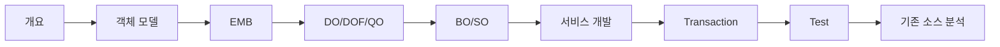

# 사전 학습 로드맵

## 1. 목표

모든 API를 암기하는 것이 목표가 아닙니다.

**정상 동작하는 기존 서비스를 열었을 때 전체 흐름을 읽을 수 있는 상태**를 목표로 합니다.

---

## 2. 추천 순서



---

## 3. 우선순위

| 내용 | 중요도 |
|---|---|
| DO/DOF/BO/SO 역할 | ★★★★★ |
| EMB Flow 읽기 | ★★★★★ |
| Input/Output Mapping | ★★★★★ |
| 서비스 개발 절차 | ★★★★★ |
| DB 접근 | ★★★★★ |
| Transaction/Exception | ★★★★★ |
| ProStudio | ★★★★☆ |
| 서비스 연동 | ★★★★☆ |
| 배포 | ★★★☆☆ |
| Batch JO | ★★★☆☆ |

---

## 4. 가장 좋은 학습 방법

현장에 들어간 후에는 단순 조회 업무 하나를 골라 끝까지 추적합니다.

```text
Alpharo 화면
 ↓
Transaction / Service ID
 ↓
SO
 ↓
EMB Flow
 ↓
BO
 ↓
DOF / QO
 ↓
SQL
 ↓
Output DO
 ↓
화면
```

이 한 사이클을 이해하면 다른 서비스도 빠르게 읽을 수 있습니다.
