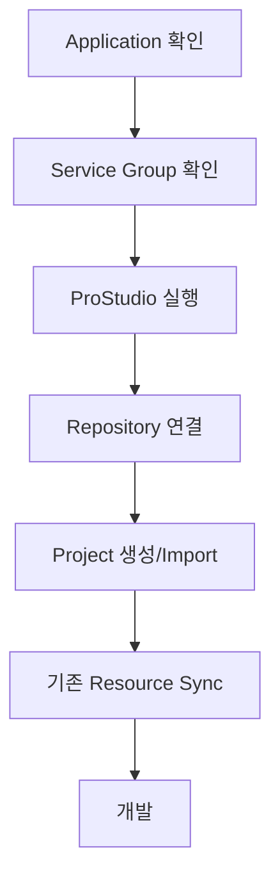

# ProStudio · ProManager

## 1. ProStudio

ProStudio는 ProObject 기반 업무 시스템 개발을 위한 Eclipse 기반 통합 개발 도구입니다.

주요 기능:

- DO 생성/편집
- DOF 생성/편집
- QO 개발
- BO 생성
- SO 생성
- JO 생성
- Object Flow Editor
- Java Source 편집
- Mapping
- Commit
- Test

---

## 2. ProManager

ProManager는 ProObject의 관리 및 테스트 기능을 제공하는 웹 기반 관리 도구입니다.

개발자가 주로 접하는 영역:

```text
Application
Service Group
Meta
Service
Test
TestCase
Resource
```

---

## 3. 기본 개발 준비 흐름



---

## 4. Meta

DO를 구성할 필드는 ProManager의 Meta Dictionary와 연결될 수 있습니다.

예:

```text
논리명       고객번호
물리명       customerNo
Java Type    String
Length       10
Nullable     false
```

ProStudio에서 이 Meta를 검색해 DO에 추가합니다.

---

## 5. 현장에서 먼저 확인할 것

```text
ProStudio Workspace
Repository URL
개발 서버 Host/Port
Application
Service Group
ProManager URL
Git Branch
Build/Deploy 방식
```
