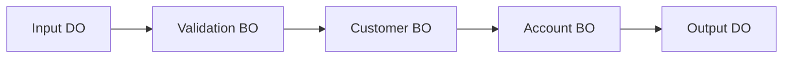

# EMB 개요

## 1. EMB란?

EMB는 **Enterprise Module Bus**입니다.

ProObject 공개 문서에서는 Service Tier와 Business Tier에서 EMB 기반 개발 환경을 제공하며, 비즈니스 로직과 프로그램 Flow를 분리하고 업무 흐름을 가시적으로 표현하는 구조를 설명합니다.

현장에서 말하는 **"EMB로 그린다"**는 표현은 ProStudio의 Object Flow Editor를 이용해 BO, SO 등의 처리 흐름을 시각적으로 설계하는 것을 의미한다고 이해하면 됩니다.

---

## 2. 코드 중심 개발과 비교

일반 Java에서는:

```java
public OutputDO execute(InputDO input) {

    validate(input);

    CustomerDO customer = customerBO.search(input.getCustomerNo());

    AccountDO account = accountBO.search(customer.getCustomerNo());

    OutputDO output = new OutputDO();
    output.setCustomer(customer);
    output.setAccount(account);

    return output;
}
```

EMB에서는 개념적으로 다음 Flow를 구성합니다.



즉 **처리 순서와 객체 간 연결을 그림으로 표현**합니다.

---

## 3. EMB의 장점

- 업무 흐름 가시화
- BO 재사용
- SO와 업무 로직 분리
- Mapping 가시화
- 코드 생성
- 유지보수 시 호출 관계 파악 용이

---

## 4. EMB라고 Java를 안 쓰는 것은 아니다

EMB는 노코드 도구가 아닙니다.

```text
EMB Flow
   +
Generated Java
   +
직접 작성 Java
```

가 함께 사용될 수 있습니다.

Flow에서 표현하기 어려운 로직은 Virtual Module 또는 Java Source 영역에서 처리할 수 있습니다.

---

## 5. EMB 학습 시 가장 중요한 것

처음부터 Palette의 모든 기능을 암기할 필요는 없습니다.

다음 다섯 가지를 먼저 익힙니다.

```text
1. Node가 무엇을 호출하는가?
2. Node 실행 순서는 어떻게 되는가?
3. 입력값은 어디에서 오는가?
4. 결과값은 어디로 Mapping되는가?
5. Flow와 생성 Java Source가 어떻게 대응되는가?
```
