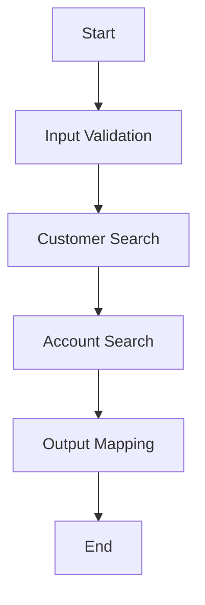

# EMB Designer 화면과 개발 방식

## 1. Object Flow Editor

Object Flow Editor는 Object Module을 조합하여 새로운 Object의 수행 Flow를 설계하는 도구입니다.

BO, SO, JO 개발에 사용됩니다.

---

## 2. 화면을 볼 때 구분할 영역

버전에 따라 화면 배치는 다를 수 있지만 개념적으로 다음 영역을 봅니다.

```text
+-----------------------------------------------------+
| Package Explorer / Object Pool                     |
+------------------+----------------------------------+
| Palette          |                                  |
|                  |        Flow Design Area          |
| BO               |                                  |
| QO               |   [A] → [B] → [C]               |
| Loop             |                                  |
| Assign           |                                  |
| Virtual Module   |                                  |
+------------------+----------------------------------+
| Property / Mapping / Source                        |
+-----------------------------------------------------+
```

---

## 3. Object Pool

이미 만들어진 Object를 찾아 Flow에 추가하는 영역입니다.

예:

```text
CustomerBO
AccountBO
CustomerQO
CommonValidationBO
```

---

## 4. Palette

Flow를 구성하는 기능을 제공합니다.

프로젝트와 버전에 따라 명칭이 다를 수 있지만 다음 종류를 접할 수 있습니다.

- BO
- QO
- Local Method
- Inner Module
- Virtual Module
- Loop Module
- Assign
- 다른 SO 연동

---

## 5. Design Area

업무 실행 순서를 배치합니다.



---

## 6. Property

선택한 Node의 속성을 설정합니다.

예:

```text
Object
Method
Input Parameter
Return
Datasource
Query
Service
Call Type
```

---

## 7. Mapping

Node 실행 전후에 값을 연결합니다.

```text
SO Input.customerNo
        ↓
CustomerBO.search.customerNo
```

결과:

```text
CustomerBO.return.customerName
        ↓
SO Output.customerName
```

---

## 8. Source

Flow에서 생성된 Java Source 또는 관련 코드를 확인합니다.

EMB를 분석할 때는 Design만 보지 말고 Source를 함께 비교하는 습관이 중요합니다.
