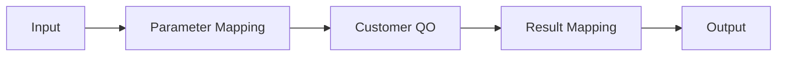

# EMB Node와 Mapping

## 1. Node의 의미

EMB의 Node 하나는 단순한 그림이 아니라 실제 업무 실행 단위를 나타냅니다.

예:

```text
[CustomerBO.searchCustomer]
```

는 Java 관점에서 개념적으로:

```java
CustomerDO customer =
        customerBO.searchCustomer(customerNo);
```

와 같은 호출을 표현할 수 있습니다.

---

## 2. 선할당

Node를 호출하기 전에 필요한 Parameter를 설정합니다.

```text
SO Input
 customerNo
     │
     ▼
[선할당]
     │
     ▼
CustomerBO.searchCustomer(customerNo)
```

개념 Java:

```java
String customerNo = input.getCustomerNo();
CustomerDO customer = customerBO.searchCustomer(customerNo);
```

---

## 3. 후할당

Node 실행 결과를 다음 Object나 Output으로 전달합니다.

```text
CustomerBO Result
 customerName
     │
     ▼
[후할당]
     │
     ▼
SO Output.customerName
```

개념 Java:

```java
output.setCustomerName(customer.getCustomerName());
```

---

## 4. Mapping을 읽는 방법

Mapping을 만나면 다음 세 가지를 찾습니다.

```text
Source
Target
Timing
```

예:

```text
Source : input.customerNo
Target : customerSearch.customerNo
Timing : 호출 전
```

---

## 5. Query Object Node

QO를 Flow에서 사용하는 경우 개념적으로:



SQL:

```sql
SELECT CUSTOMER_NO,
       CUSTOMER_NAME
  FROM TB_CUSTOMER
 WHERE CUSTOMER_NO = :customerNo
```

---

## 6. Mapping 오류 분석

다음 오류를 특히 주의합니다.

```text
Field 이름 불일치
Type 불일치
Null
Array/단건 불일치
Input/Output 방향 오류
후할당 누락
```

Flow는 정상처럼 보여도 Mapping이 잘못되면 서비스 결과가 비어 있거나 Runtime 오류가 발생할 수 있습니다.
