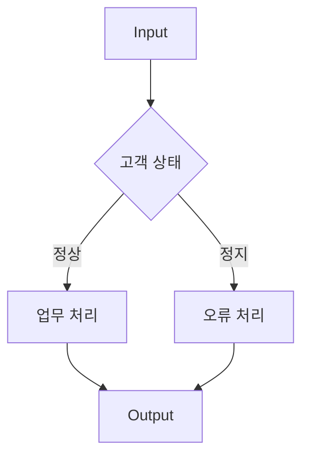
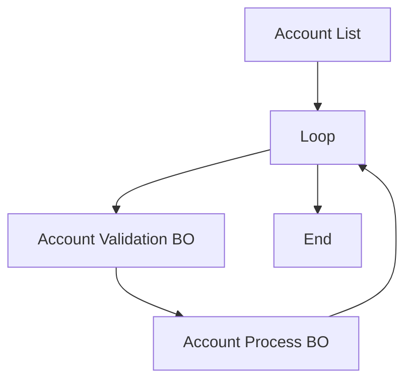

# EMB 조건 · 반복 · 모듈

## 1. Flow 제어

EMB Flow에서는 단순 순차 호출뿐 아니라 조건과 반복을 표현할 수 있습니다.



---

## 2. 조건 처리

Java 관점:

```java
if ("01".equals(customer.getStatus())) {
    processNormal(customer);
} else {
    processError(customer);
}
```

EMB에서는 Flow Statement나 프로젝트에서 사용하는 조건 Module을 통해 분기 구조를 표현할 수 있습니다.

---

## 3. Loop Module

다건 데이터를 반복 처리하는 Flow입니다.



Java 개념:

```java
for (AccountDO account : accountList) {
    validationBO.validate(account);
    processBO.process(account);
}
```

---

## 4. Inner Module

복잡한 Flow의 일부를 내부 Module로 묶어 구조를 단순화하는 데 사용할 수 있습니다.

```text
Main Flow
 ├─ Validation
 ├─ [Account Process Inner Module]
 └─ Output
```

---

## 5. Virtual Module

Flow에 직접 Java 로직이 필요한 경우 사용할 수 있는 영역입니다.

개념:

```java
BigDecimal amount = input.getAmount();

if (amount == null) {
    amount = BigDecimal.ZERO;
}

output.setAmount(amount);
```

!!! tip "분석 시 Virtual Module을 놓치지 마세요"
    EMB 그림만 보면 단순한 Node처럼 보이지만 실제 중요한 업무 로직이 Virtual Module의 Java Source 안에 있을 수 있습니다.

---

## 6. 복잡한 EMB를 읽는 순서

```text
Start
 ↓
큰 분기 확인
 ↓
Loop 확인
 ↓
BO/QO 호출 확인
 ↓
Inner Module 진입
 ↓
Virtual Module Source 확인
 ↓
Output
```

세부 Mapping부터 보지 말고 먼저 전체 Flow를 파악합니다.
