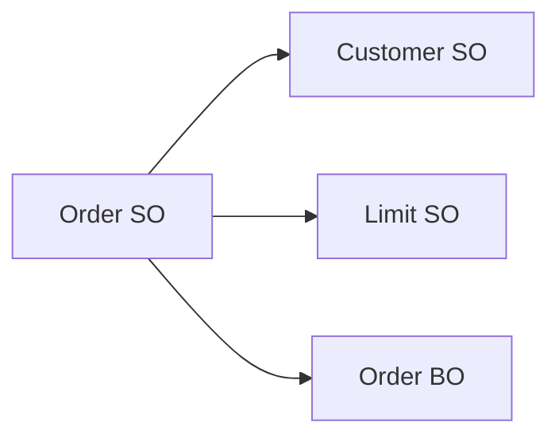

# EMB에서 다른 Service 호출

## 1. Service 간 연동

SO에서 다른 SO를 호출하는 Flow가 존재할 수 있습니다.



---

## 2. 동기 호출

호출 결과를 기다린 뒤 다음 처리를 진행합니다.

```text
Order SO
 ↓
Customer SO 호출
 ↓
응답 대기
 ↓
다음 처리
```

개념 Java:

```java
CustomerOutDO result =
        serviceManager.call(serviceName, input);
```

실제 API Signature는 현장 버전의 Generated Source와 Runtime API를 확인합니다.

---

## 3. 비동기 호출

호출 후 별도의 응답 처리 구조를 사용할 수 있습니다.

개념적으로:

```java
serviceManager.acall(serviceName, input);
```

공개 문서의 Object Flow Editor에서는 SO 연동 방식으로 SYNC, ASYNCREPLY 등의 설정을 설명합니다.

---

## 4. Service Call 분석 포인트

```text
호출 Service
Input Mapping
Output Mapping
SYNC / ASYNC
Timeout
Transaction 연결
Exception 전달
```

---

## 5. Transaction과 Service Call

Service A가 Service B를 호출할 때 두 Service가 같은 Transaction 범위에 참여하는지 확인해야 합니다.

```text
Service A
 ├─ DB Update A
 └─ Service B
      └─ DB Update B
```

B가 실패했을 때 A까지 Rollback되는지 여부는 매우 중요합니다.
