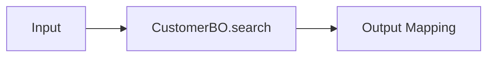

# EMB와 Generated Java Source

## 1. 왜 Source를 같이 봐야 하는가?

EMB는 Flow를 이해하기 좋지만 실제 Runtime에서는 생성된 Java 코드가 수행됩니다.

따라서 분석할 때:

```text
EMB Design
   ↕
Generated Source
```

를 함께 보는 것이 좋습니다.

---

## 2. Flow와 코드 대응 예

EMB:



개념적인 Java:

```java
public CustomerOutDO execute(CustomerInDO input) {

    CustomerDO customer =
        customerBO.search(input.getCustomerNo());

    CustomerOutDO output = new CustomerOutDO();

    output.setCustomerNo(customer.getCustomerNo());
    output.setCustomerName(customer.getCustomerName());

    return output;
}
```

---

## 3. EMB에서 먼저 볼 것

```text
Node 순서
 ↓
Method
 ↓
Input Mapping
 ↓
Return Mapping
```

Generated Source에서:

```text
실제 Method 호출
변수 생성
조건문
반복문
Exception
Service Call
```

을 확인합니다.

---

## 4. Generated Source 직접 수정 주의

Generated Source는 EMB 정의로부터 다시 생성될 수 있습니다.

!!! warning "생성 영역 직접 수정 금지 여부 확인"
    프로젝트에서 Generated Source를 직접 수정하면 다음 Source Generation 때 변경 내용이 사라질 수 있습니다. 반드시 프로젝트 개발 표준에서 사용자 코딩 영역과 생성 영역을 구분해 확인해야 합니다.

---

## 5. 기존 EMB 분석 추천 방법

첫 번째 분석에서는 다음 표를 작성합니다.

| EMB Node | 실제 Object | Method | Input | Output |
|---|---|---|---|---|
| 고객조회 | CustomerBO | search | customerNo | CustomerDO |
| 계좌조회 | AccountBO | search | customerNo | AccountList |
| 결과설정 | Assign | - | Customer/Account | OutputDO |

이렇게 정리하면 복잡한 그림도 Java 개발자 관점에서 빠르게 이해할 수 있습니다.
