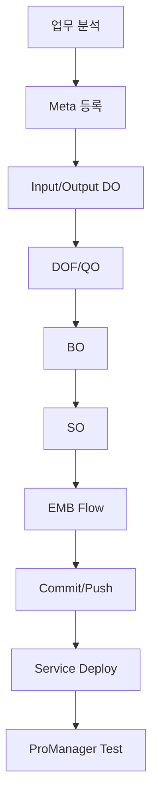
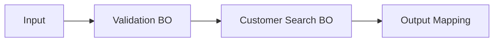

# 온라인 서비스 개발 절차

## 1. 전체 흐름

공개 ProStudio 개발 문서의 절차를 실무 관점으로 정리하면 다음과 같습니다.



---

## 2. 업무 분석

서비스를 만들기 전에 정의합니다.

```yaml
service:
  id: CUSTOMER_SEARCH
  purpose: 고객 기본정보 조회
  input:
    - customerNo
  output:
    - customerNo
    - customerName
    - customerStatus
  database:
    - TB_CUSTOMER
```

위 YAML은 설명을 위한 예시이며 ProObject 설정 형식을 의미하지 않습니다.

---

## 3. Meta 등록

DO에 사용할 표준 필드를 Meta Dictionary에 등록합니다.

---

## 4. DO 생성

```text
CustomerSearchInDO
CustomerSearchOutDO
CustomerDO
```

---

## 5. DOF/QO 생성

```sql
SELECT CUSTOMER_NO,
       CUSTOMER_NAME,
       CUSTOMER_STATUS
  FROM TB_CUSTOMER
 WHERE CUSTOMER_NO = :customerNo
```

---

## 6. BO 개발

```java
public CustomerDO searchCustomer(String customerNo) {

    CustomerDO customer = customerDOF.select(customerNo);

    if (customer == null) {
        throw new RuntimeException("고객이 존재하지 않습니다.");
    }

    return customer;
}
```

---

## 7. SO/EMB Flow



---

## 8. Commit / Deploy

공개 ProStudio 문서에서는 Git Staging에서 관련 Resource를 Commit/Push하고 Jenkins 연동으로 자동 배포하는 예시를 설명합니다.

!!! warning "현장 배포 절차 우선"
    Jenkins 자동 배포 여부와 Branch/승인 절차는 프로젝트마다 다릅니다.

---

## 9. Test

ProManager Test에서 Input을 넣고 Service를 실행합니다.

확인:

```text
Output
Response
Exception
SQL
Log
Execution Time
```
