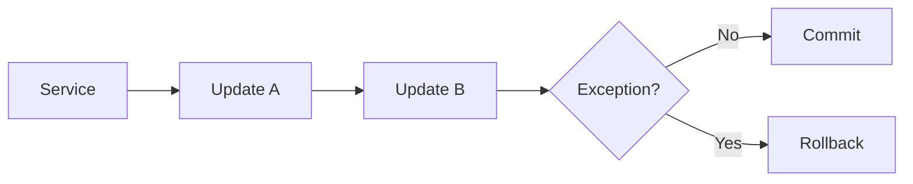

# Transaction · Exception · Log

## 1. Transaction

ProObject Runtime은 서비스 수행 중 예외가 발생하면 Transaction을 Rollback하여 잘못된 데이터가 Commit되는 것을 방지하는 기능을 제공합니다.



---

## 2. Service 간 Transaction

```text
Service A
 ├─ Update A
 └─ Service B
      └─ Update B
```

Service B 실패 시 Service A까지 Rollback할 것인지 Transaction 설정을 확인합니다.

---

## 3. Exception 구분

```text
업무 오류
 ├─ 고객 없음
 ├─ 잔액 부족
 └─ 상태 오류

System 오류
 ├─ DB 오류
 ├─ Null
 ├─ Timeout
 └─ Mapping 오류

연동 오류
 ├─ 상대 시스템 오류
 └─ 전문 오류
```

---

## 4. 로그 레벨

공개 Runtime 문서에는 다음 로그 레벨이 설명되어 있습니다.

```text
SEVERE
WARNING
INFO
CONFIG
FINE
FINER
FINEST
```

서비스별 설정 예시는 properties 형식을 사용합니다.

```properties
SERVICE_CUSTOMER_SEARCH_TIMEOUT=30000
SERVICE_CUSTOMER_SEARCH_LOG_LEVEL=FINE
SERVICE_CUSTOMER_SEARCH_BEFORE_IMAGE_ENABLE=true
```

---

## 5. Image Log

Image Log는 서비스 입출력과 오류 데이터를 저장하여 실패 거래 추적이나 재시도에 활용할 수 있습니다.

개념:

```text
Input
 ↓
Before Image
 ↓
Service
 ↓
Output / Error Image
```

공개 문서의 설정 파일 예:

```xml
<ns4:image-log>
    <ns4:sync-type>SYNC</ns4:sync-type>
</ns4:image-log>
```

실제 namespace와 프로젝트 설정은 현장 파일을 기준으로 확인합니다.

---

## 6. 장애 분석 순서

```text
Service ID
 ↓
GUID / Transaction ID
 ↓
Input
 ↓
EMB Flow
 ↓
BO
 ↓
DOF/QO
 ↓
SQL
 ↓
Exception Root Cause
 ↓
Rollback 여부
```
