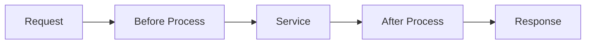

# 서비스 연동과 메시지

## 1. 서비스 요청

ProObject Service는 Runtime에서 요청을 받아 Input Object로 변환한 후 SO를 실행합니다.

```text
Network Message
 ↓
Unmarshalling
 ↓
Input DO
 ↓
SO
 ↓
Output DO
 ↓
Marshalling
 ↓
Network Message
```

---

## 2. 메시지 형식

공개 문서에서 다루는 메시지 유형에는 다음이 포함됩니다.

```text
JSON
XML
FLD
DELIMITER
NONE
```

프로젝트의 실제 전문 형식은 채널 및 인터페이스 표준을 확인합니다.

---

## 3. 선처리 / 후처리

Service 실행 전후에 공통 처리가 개입할 수 있습니다.



예:

- 인증
- 사용자 Context
- 공통 Header
- 권한
- Logging
- 응답 코드
- Image Log

---

## 4. 화면과 연결

Alpharo 화면 분석에서는 다음 흐름을 추적합니다.

```text
Event
 ↓
Transaction 호출
 ↓
Service ID
 ↓
Input Mapping
 ↓
ProObject SO
 ↓
EMB
 ↓
Output
 ↓
Callback
```
