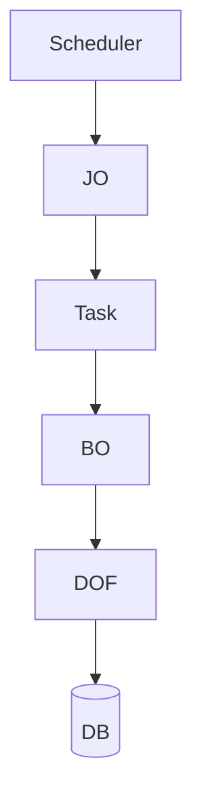

# 배치와 Job Object

## 1. JO

Job Object는 ProObject의 배치 실행 Object입니다.



---

## 2. 배치 개발 모델

공개 ProObject 문서에서는 다음 모델을 설명합니다.

```text
ETL Task
Online Task
Normal Task
```

---

## 3. ETL

```text
Extract
 ↓
Transform
 ↓
Load
```

대량 데이터 처리 단계를 역할별로 분리합니다.

---

## 4. 배치에서 중요한 항목

```text
Commit 단위
처리 건수
재시작 지점
중복 처리
Skip
Retry
대량 SQL
Memory
Timeout
```

---

## 5. 배치 분석

```text
Job
 ↓
Task
 ↓
BO
 ↓
DOF
 ↓
Commit
```

장애 발생 시 마지막 정상 처리 Key와 Commit 위치를 반드시 확인합니다.
