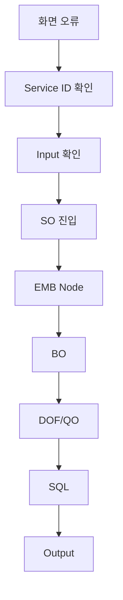

# 테스트와 디버깅

## 1. 테스트 단계

```text
BO 단위
 ↓
SO Service 단위
 ↓
화면 연계
 ↓
통합 테스트
```

---

## 2. Service Test

ProStudio/ProManager를 이용해 SO를 테스트할 수 있습니다.

확인 항목:

```text
Input DO
Output DO
Response
Exception
SQL
Execution Time
```

---

## 3. 오류 추적 순서



---

## 4. EMB 디버깅

EMB에서 오류가 발생하면:

```text
실패 Node
 ↓
Node Method
 ↓
선할당 Mapping
 ↓
실제 Input
 ↓
Generated Source
 ↓
Exception
```

순서로 확인합니다.

---

## 5. DB 오류

```text
Datasource
Schema
SQL
Bind Parameter
Query Timeout
Transaction
```

을 확인합니다.
