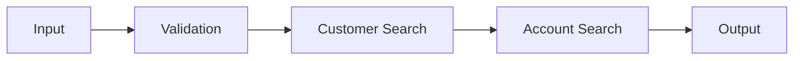

# 기존 서비스 분석 방법

## 1. 첫 분석 대상

처음에는 복잡한 업무를 고르지 않습니다.

추천:

```text
단순 코드 조회
고객 기본 조회
계좌 기본 조회
단순 목록 조회
```

---

## 2. 화면에서 시작

```text
Alpharo Event
 ↓
Function
 ↓
Transaction
 ↓
Service ID
```

---

## 3. Service 정보 기록

```yaml
screen: 고객조회
transaction: TR_CUSTOMER_SEARCH
service: CUSTOMER_SEARCH
application: application-name
service_group: customer
input_do: CustomerSearchInDO
output_do: CustomerSearchOutDO
so: CustomerSearchSO
```

이 YAML은 분석 노트 예시입니다.

---

## 4. EMB 전체 그림 먼저 보기

세부 Node를 클릭하기 전에 전체 Flow를 봅니다.



한 줄로 요약합니다.

> 고객번호를 검증한 뒤 고객과 계좌를 조회하여 결과를 반환하는 서비스.

---

## 5. Node별 분석

```text
Node 1
Object: ValidationBO
Method: validateCustomerNo

Node 2
Object: CustomerBO
Method: searchCustomer

Node 3
Object: AccountBO
Method: searchAccounts
```

---

## 6. Mapping 분석

```text
Input.customerNo
 → CustomerBO.customerNo

CustomerBO.result
 → Output.customer

AccountBO.result
 → Output.accounts
```

---

## 7. SQL 확인

```sql
SELECT C.CUSTOMER_NO,
       C.CUSTOMER_NAME,
       C.STATUS
  FROM TB_CUSTOMER C
 WHERE C.CUSTOMER_NO = :customerNo
```

SQL을 보면 업무 데이터 구조를 빠르게 이해할 수 있습니다.

---

## 8. Generated Source 확인

EMB와 실제 Java 호출 관계를 비교합니다.

```java
CustomerDO customer =
    customerBO.searchCustomer(input.getCustomerNo());

List<AccountDO> accounts =
    accountBO.searchAccounts(input.getCustomerNo());
```

---

## 9. 최종 분석 문서

```text
[화면]
고객조회

[Transaction]
TR_CUSTOMER_SEARCH

[Service]
CUSTOMER_SEARCH

[Input]
CustomerSearchInDO

[SO]
CustomerSearchSO

[EMB]
Validation → Customer Search → Account Search → Output

[BO]
CustomerValidationBO
CustomerBO
AccountBO

[DB]
TB_CUSTOMER
TB_ACCOUNT

[Output]
CustomerSearchOutDO
```
