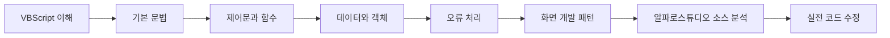

# VBScript 실전 개발 가이드

VBScript를 처음 접하는 개발자가 **금융 SI 화면 개발과 레거시 시스템 유지보수에 필요한 문법과 실무 패턴을 단계적으로 학습**할 수 있도록 구성한 가이드입니다.

이 사이트의 학습 내용은 단순한 문법 암기보다 **기존 화면 소스를 읽고 → 처리 흐름을 이해하고 → 필요한 부분을 안전하게 수정하는 능력**을 만드는 데 초점을 둡니다.

!!! tip "어디서부터 시작하면 되나요?"
    처음 학습하는 경우 상단의 **VBScript 실전 개발 가이드** 메뉴를 선택한 뒤, 왼쪽 메뉴의 **00. 학습 시작 → 학습 가이드**부터 순서대로 진행하는 것을 권장합니다.

## 학습 구성

| 구분 | 학습 내용 |
|---|---|
| 00. 학습 시작 | VBScript 학습 방향, 실습 환경, 기존 소스 읽는 방법 |
| 01. 기본 문법 | 변수, Variant, 연산자, 문자열, 날짜와 숫자 |
| 02. 제어문 | 조건문, 반복문, 배열과 반복 처리 |
| 03. 프로시저와 함수 | `Sub`, `Function`, 매개변수, 스코프 |
| 04. 데이터 처리 | `Null`, `Empty`, `Nothing`, 형 변환, Dictionary |
| 05. 객체 사용 | 객체 참조, `Set`, `CreateObject`, COM 개념 |
| 06. 오류 처리 | `On Error`, `Err` 객체, 방어 코딩 |
| 07. 실무 개발 패턴 | 입력 검증, 화면 이벤트, 조회·저장, 공통 함수 |
| 08. 알파로스튜디오 적응 | 기존 화면 분석, 이벤트와 데이터 흐름 추적 |
| 09. 디버깅 | 로그 추적과 자주 발생하는 오류 분석 |
| 10. 실습 | 기초 문법, 금융 화면, 코드 리딩 실습 |

## 학습 방향

!!! note "가이드의 목표"
    VBScript 언어 자체를 깊게 연구하는 것보다, 프로젝트에서 기존 소스를 빠르게 이해하고 안정적으로 수정할 수 있는 수준에 도달하는 것을 우선 목표로 합니다.
