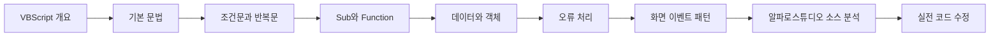
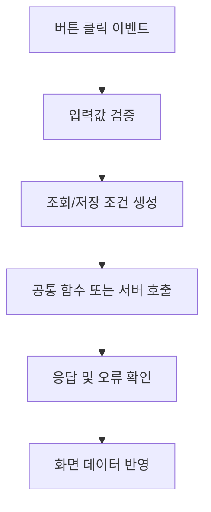

# 학습 가이드

VBScript를 처음 접하면 문법 자체보다 **왜 코드가 이런 형태로 작성되어 있는지**, 그리고 **실제 화면의 이벤트와 업무 로직이 어떤 순서로 연결되는지**가 더 낯설게 느껴질 수 있습니다. Java나 JavaScript 경험이 있다면 세미콜론이 없고, 변수 타입을 명시적으로 선언하지 않으며, `End If`, `End Sub`, `End Function`처럼 블록의 끝을 직접 표시하는 문법이 특히 어색할 수 있습니다.

이 학습 가이드는 문법을 하나씩 암기하는 방식보다 **기존 금융 시스템 화면 소스를 읽고, 수정하고, 신규 기능을 추가할 수 있는 수준까지 빠르게 올라가는 것**을 목표로 합니다.

!!! note "학습의 기준"
    목표는 VBScript 언어 전문가가 되는 것이 아닙니다. 금융 SI 프로젝트에서 기존 코드를 안정적으로 이해하고, 영향 범위를 판단하고, 필요한 로직을 수정할 수 있는 개발자가 되는 것이 우선입니다.

## 1. 이 가이드에서 무엇을 배우는가

레거시 금융 시스템의 화면 소스에서는 다음과 같은 처리들이 반복해서 등장합니다.

- 화면이 열릴 때 초기값을 설정하는 처리
- 버튼이나 입력 컨트롤에서 발생하는 이벤트 처리
- 필수값과 입력 형식을 검사하는 검증 로직
- 조회·저장 전에 서버로 전달할 값을 구성하는 처리
- 서버 호출 전후의 상태 및 반환값 검사
- 조회 결과를 화면 컨트롤이나 데이터 영역에 반영하는 처리
- 공통 함수나 공통 모듈 호출
- 오류 발생 시 메시지를 표시하거나 후속 처리를 중단하는 로직

따라서 본 가이드는 언어 문법을 독립된 지식으로 외우기보다 **실제 화면 개발의 처리 흐름 안에서 문법을 이해하는 방식**으로 구성합니다.

!!! tip "추천 학습 방법"
    처음부터 모든 문법을 외우려고 하지 마세요. `Dim`, `If`, `For`, `Sub`, `Function`, `Set`, `On Error Resume Next`를 먼저 익히고, 실제 프로젝트 화면 소스를 읽으면서 필요한 문법을 하나씩 확장하는 편이 훨씬 효율적입니다.

## 2. 전체 학습 흐름



처음에는 **코드를 읽는 데 필요한 최소 문법**부터 시작합니다. 그 다음 값의 상태와 형 변환을 익히고, `Sub`와 `Function`을 통해 화면 이벤트와 공통 함수의 구조를 이해합니다. 이후 객체, 오류 처리, 화면 개발 패턴까지 확장한 뒤 실제 프로젝트 소스 분석으로 연결합니다.

## 3. 1단계: 먼저 소스를 읽을 수 있어야 한다

처음에는 아래 정도의 코드가 어떤 순서로 실행되는지만 읽을 수 있어도 상당수의 화면 로직을 따라갈 수 있습니다.

!!! example "가장 먼저 읽을 수 있어야 하는 코드"
    ```vb
    Dim customerName
    customerName = "KIM"

    If customerName <> "" Then
        Call ShowCustomer(customerName)
    End If
    ```

이 코드를 문법 단위로만 보면 `Dim`, 대입, `If`, `Call`이 등장합니다. 하지만 실무에서는 다음과 같이 **처리 흐름**으로 읽는 습관이 중요합니다.

1. `customerName`이라는 변수를 준비한다.
2. 변수에 `"KIM"` 값을 넣는다.
3. 값이 빈 문자열이 아닌지 확인한다.
4. 값이 존재하면 `ShowCustomer` 프로시저를 호출한다.

즉, 처음부터 모든 키워드의 세부 규칙을 외우기보다 **변수 준비 → 값 설정 → 조건 검사 → 다음 처리 호출**이라는 흐름을 읽는 것이 먼저입니다.

## 4. 2단계: 값의 상태를 구분한다

VBScript에서는 `Empty`, `Null`, `Nothing`, 빈 문자열 `""`이 서로 같은 의미가 아닙니다. 이 차이는 특히 DB 조회 결과, 선택값, 초기화되지 않은 변수, 객체 참조를 다룰 때 중요합니다.

!!! warning "초보자가 자주 실수하는 부분"
    `If value = "" Then` 하나만으로 모든 '빈 값'을 검사할 수 있다고 생각하면 안 됩니다. DB 결과처럼 `Null`이 들어올 수 있는 값은 `IsNull(value)` 검사가 필요할 수 있고, 객체가 없는 상태는 `Nothing`으로 확인해야 합니다.

이 구분을 제대로 이해하지 못하면 화면에서는 정상처럼 보이더라도 특정 데이터에서만 오류가 발생하거나, 조건식이 예상과 다르게 평가되는 문제가 생길 수 있습니다.

## 5. 3단계: Sub와 Function을 구분한다

VBScript의 실무 코드는 대부분 여러 개의 `Sub`와 `Function`이 연결되면서 동작합니다.

- `Sub`는 특정 **동작을 수행**하는 데 주로 사용합니다.
- `Function`은 계산이나 검증을 수행한 뒤 **결과값을 반환**하는 데 주로 사용합니다.

화면 버튼 이벤트는 `Sub` 형태로 작성되는 경우가 많고, 공통 검증이나 값 변환 로직은 `Function`으로 분리되는 경우가 많습니다.

!!! example "Sub와 Function의 역할 차이"
    ```vb
    Sub btnSearch_Click()
        If ValidateSearchCondition() = False Then
            Exit Sub
        End If

        Call SearchCustomer()
    End Sub

    Function ValidateSearchCondition()
        If Trim(txtCustomerName.Text) = "" Then
            MsgBox "고객명을 입력하세요."
            ValidateSearchCondition = False
            Exit Function
        End If

        ValidateSearchCondition = True
    End Function
    ```

이 예제에서 버튼 클릭 이벤트는 전체 흐름을 제어하고, `ValidateSearchCondition` 함수는 입력값 검증이라는 하나의 책임을 담당합니다.

## 6. 4단계: 화면 처리 흐름을 읽는다

실무 화면을 분석할 때는 개별 함수 이름보다 **화면에서 서버까지 이어지는 흐름**을 먼저 찾는 것이 좋습니다.



낯선 공통 함수가 여러 개 등장하더라도 이 흐름을 기준으로 추적하면 현재 코드가 **입력 단계인지, 호출 준비 단계인지, 서버 호출 단계인지, 응답 처리 단계인지**를 구분할 수 있습니다.

## 7. 학습 완료 후 도달할 목표

학습을 진행한 뒤에는 다음 코드를 보고 단순히 문법만 해석하는 것이 아니라 **전체 처리 의도**를 설명할 수 있어야 합니다.

!!! example "학습 목표 코드"
    ```vb
    Sub btnSearch_Click()
        Dim accountNo
        accountNo = Trim(txtAccountNo.Text)

        If accountNo = "" Then
            MsgBox "계좌번호를 입력하세요."
            Exit Sub
        End If

        Call SearchAccount(accountNo)
    End Sub
    ```

이 코드는 짧지만 실무 화면에서 반복해서 등장하는 핵심 요소를 포함합니다.

- 버튼 클릭 이벤트
- 지역 변수 선언
- 입력 문자열 정리
- 필수값 검사
- 사용자 메시지 표시
- 조건 불충족 시 조기 종료
- 실제 조회 처리를 수행하는 프로시저 호출

궁극적으로는 이런 코드를 보자마자 **사용자 입력 → 검증 → 정상인 경우 조회 호출**이라는 흐름을 빠르게 읽을 수 있어야 합니다.

## 8. 알파로스튜디오 학습으로 연결하기

알파로스튜디오와 같은 전용 화면 개발 도구에서는 프로젝트별 컨트롤 API, 공통 함수, 데이터셋 처리 방식, 서버 호출 규칙이 존재할 수 있습니다. 이런 내용은 실제 프로젝트 표준과 기존 소스를 확인해야 정확하게 알 수 있습니다.

따라서 이 가이드에서는 공개적으로 검증되지 않은 제품 전용 API를 임의로 정의하지 않습니다. 대신 다음 능력을 먼저 만드는 데 집중합니다.

1. 이벤트 시작점을 찾는다.
2. 입력값을 어디에서 읽는지 찾는다.
3. 검증 함수와 공통 함수 호출을 추적한다.
4. 서버 호출 전 데이터를 어떻게 구성하는지 확인한다.
5. 응답 데이터가 화면에 어떻게 반영되는지 확인한다.
6. 동일한 패턴을 가진 기존 정상 화면과 비교한다.

!!! tip "프로젝트 투입 후 가장 좋은 학습 자료"
    실제 프로젝트에 들어가면 문서보다 **정상 동작하는 기존 조회 화면과 저장 화면**이 가장 중요한 참고 자료가 됩니다. 하나의 정상 화면을 기준 화면으로 정하고 이벤트부터 서버 호출, 응답 처리까지 끝까지 추적해보는 것이 효과적입니다.

## 9. 권장 학습 순서

처음부터 모든 문서를 한 번에 읽기보다 다음 순서로 진행하는 것을 권장합니다.

1. **VBScript 이해하기**에서 언어의 특징과 코드 형태를 익힙니다.
2. **기본 문법**에서 변수, Variant, 연산자, 문자열 처리를 익힙니다.
3. **제어문**에서 조건과 반복 흐름을 익힙니다.
4. **프로시저와 함수**에서 `Sub`, `Function`, 매개변수 전달을 익힙니다.
5. **데이터 처리와 객체 사용**에서 `Null`, `Empty`, `Nothing`, `Set`을 구분합니다.
6. **오류 처리**에서 기존 레거시 코드의 오류 처리 방식을 이해합니다.
7. **실무 개발 패턴**에서 화면 이벤트와 조회·저장 구조를 학습합니다.
8. **알파로스튜디오 적응**에서 실제 프로젝트 소스 분석 방법을 익힙니다.
9. 마지막으로 **실습** 문서를 이용해 직접 코드를 읽고 수정합니다.

이 순서대로 진행하면 VBScript 문법을 개별적으로 암기하는 데 그치지 않고, 실제 프로젝트 화면 소스를 분석하는 능력까지 자연스럽게 연결할 수 있습니다.
