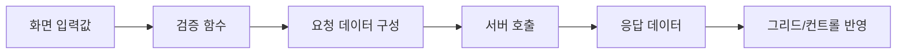

# 소스 읽는 순서

VBScript 레거시 화면을 처음 보면 코드량보다도 낯선 공통 함수와 컨트롤 API 때문에 어렵게 느껴집니다. 이때 처음부터 위에서 아래까지 모든 코드를 이해하려고 하면 시간이 오래 걸립니다. 대신 **이벤트를 시작점으로 흐름을 따라가는 방식**이 효율적입니다.

## 1. 사용자의 동작을 찾는다

조회 버튼을 눌렀다고 가정하면 `btnSearch_Click`, `Search_Click`, `OnSearch`와 같이 클릭 이벤트로 보이는 프로시저를 먼저 찾습니다.

!!! example "이벤트 시작점"
    ```vb
    Sub btnSearch_Click()
        If ValidateSearchCondition() = False Then
            Exit Sub
        End If

        Call DoSearch()
    End Sub
    ```

이 코드만 보더라도 화면 흐름이 "검증 → 조회"라는 것을 알 수 있습니다.

## 2. 함수 이름으로 역할을 추론한다

`ValidateSearchCondition`, `DoSearch`, `SetRequestData`, `BindResult`처럼 이름이 명확하다면 구현부를 보기 전에 역할을 먼저 예상합니다. 그 후 실제 코드와 예상이 맞는지 확인합니다.

## 3. 프로젝트 공통 함수는 일단 블랙박스로 본다

처음부터 공통 프레임워크 내부까지 모두 들어가면 흐름을 놓치기 쉽습니다. 다음처럼 분류하세요.

- 화면 내부 함수
- 공통 유틸리티 함수
- 서버 호출 함수
- 데이터 바인딩 함수

공통 함수의 내부는 실제로 수정하거나 오류를 분석할 필요가 있을 때 들어갑니다.

## 4. 데이터가 어디서 어디로 이동하는지 표시한다



이 흐름을 종이나 메모에 적어두면 코드가 수백 줄이어도 핵심을 놓치지 않습니다.

!!! tip "소스 분석 메모 예시"
    `조회버튼 → fnValidate → fnSetParam → gfnTransaction → callback → fnBindGrid`

    실제 함수명을 위와 같이 한 줄로 적어두면 화면 로직 구조가 빠르게 보입니다.
